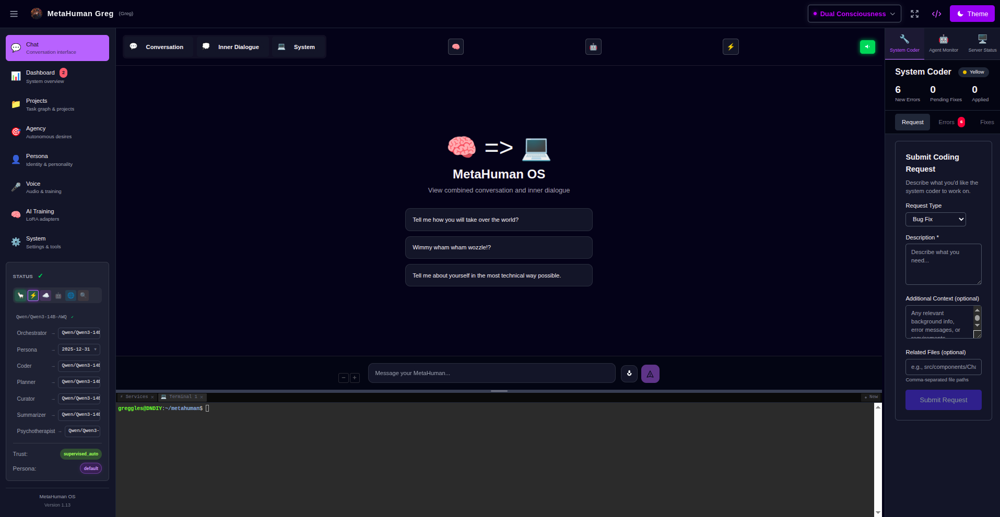

# MetaHuman OS

MetaHuman OS is a local-first operating system for a persistent personal AI identity. It combines a web interface, CLI, memory store, cognitive graphs, autonomous agents, voice tools, model routing, and training pipelines so an AI can keep context, learn from use, and act under explicit trust boundaries.

It is not a single chatbot wrapper. It is a development system for building a digital counterpart: one that can talk with you, maintain an inner dialogue, remember what matters, generate goals, run background work, train adapters from your history, and connect to external environments.



## What It Is For

MetaHuman OS is built for long-running personal AI operation:

- **Conversation**: a chat surface backed by mode-specific cognitive graphs, streaming reasoning events, conversation buffers, memory grounding, and persona voice.
- **Inner life**: separate inner-dialogue streams for reflections, dreams, curiosity, recursive thought, and autonomous memory associations.
- **Memory**: local JSON/profile storage for conversations, episodic events, tasks, summaries, preferences, audio transcripts, and training-ready examples.
- **Learning**: curation, dataset building, LoRA/fine-tune workflows, adapter evaluation, and model activation from the user's own memories and persona data.
- **Agency**: supervised autonomous desire generation, planning, review, execution, outcome review, and goal proposal.
- **Tools**: trust-aware skills for files, tasks, calendar, memory search, shell-safe commands, agents, code changes, and remote/operator escalation.
- **Voice**: local STT/TTS, voice chat, transcript ingestion, Kokoro voices, GPT-SoVITS, RVC, and voice-training workflows.
- **Embodiment**: an in-development environment mode that reads observations from games, simulators, robots, or other surfaces and queues bounded semantic actions.

The design assumption is local ownership. Runtime identity, profiles, memories, logs, generated adapters, browser state, and local agent data are user data, not maintained source.

## Cognitive Modes

Modes are not themes. They change how the system reasons, writes memory, uses agents, and routes actions.

| Mode | What It Is For | Behavior |
| --- | --- | --- |
| **Dual Consciousness** | Full personal mirror mode. Best for normal long-term use when you want the system to learn, remember, and evolve. | Deep memory grounding, proactive agents, full memory writes, training-triggered learning, richer cognitive processing. |
| **Agent Mode** | Command and task mode. Best when you want direct assistance without full autonomous personality drift. | Explicit instruction following, command-oriented memory capture, lighter context, less background autonomy. |
| **Emulation Mode** | Read-only persona mode. Best for demos, safe conversations, or frozen personality snapshots. | No memory writes, no persona mutation, conversational use of existing memory/persona state. |
| **Environment Mode** | Embodied interface mode. Best for experiments where MetaHuman observes and acts in another environment. | Reads bridge observations, builds environment prompts, parses model output into semantic actions, queues adapter-controlled movement/text/interaction. |

## Learning And Training

MetaHuman OS is designed to improve from accumulated local experience rather than only prompt engineering.

The learning path is:

```text
conversation / tasks / memories / transcripts / reflections
  -> memory organization and curation
  -> training dataset export
  -> local or remote LoRA/fine-tune run
  -> adapter evaluation and activation
  -> future responses routed through the updated model stack
```

Training can use profile memories, persona data, conversation history, therapy/persona-generator sessions, cognitive-mode metadata, and curated samples. The training system includes local GPU workflows, RunPod-oriented remote workflows, monthly/recent data splits, adapter builders, adapter merging, evaluation, GGUF conversion, and active-adapter management.

The goal is a rolling personalization loop: the system captures experience as memory, curates it into useful training material, and produces adapters that change how the persona thinks and speaks over time.

## Model And Backend System

MetaHuman OS routes LLM calls through a role-aware model router instead of binding the whole system to one model.

Supported backend paths include:

- **Ollama** for simple local model serving.
- **vLLM** for larger local models and higher-throughput GPU inference.
- **local-models service** for lighter CPU/mobile-friendly model and embedding work.
- **remote/server providers** for connected MetaHuman servers or cloud-backed inference.
- **Big Brother/operator backends** such as Claude Code, Open Interpreter, Codex, Aider, Qwen Code, or Gemini CLI for escalated reasoning and coding workflows.

The router can select models by role: persona, orchestrator, curator, coder, embeddings, training support, and other graph/node responsibilities. This lets one installation use different models for conversation, memory curation, code execution, summarization, and background agents.

## Autonomous System

The `brain/` layer contains agents and services above the core engine. They are not side scripts; they are the background metabolism of the system.

Examples include:

- memory organizer, ingestor, pruner, sync, auto-indexer, and summarizer;
- reflector, dreamer, daydreamer, train-of-thought, curiosity service, and inner curiosity;
- desire generator, desire explorer, desire planner, desire executor, and outcome reviewer;
- curator, night pipeline, training orchestrators, adapter builders, and model utilities;
- transcriber, audio organizer, voice-training helpers, and maintenance/coder agents.

The agency system turns memories, goals, tasks, reflections, and curiosity into supervised desires. Desires can be clarified, planned, reviewed, approved, executed through the operator/tool layer, and later promoted into proposed persona goals.

## Interface And Tools

The main interface is the Astro/Svelte web app in `apps/site`. It provides:

- chat, inner dialogue, voice mode, and live streaming progress;
- memory browser, task management, agency dashboard, model/backend controls, voice workspace, and training UI;
- flow editor for cognitive graph templates and node-based workflows;
- audit stream, agent monitor, system status, terminal/process tools, and security policy controls.

The CLI in `packages/cli` exposes the same local-first system for status checks, memory capture, tasks, agents, Ollama/backend work, and operational scripts.

## Architecture

This is a pnpm monorepo with a strict ownership boundary:

- `apps/*`: interface shells such as the Astro/Svelte web app and maintained mobile shell.
- `packages/core`: engine logic, storage, policy, memory, graph execution, model routing, training APIs, voice APIs, and shared handlers.
- `brain/*`: autonomous agents, services, training jobs, and workers above the engine.
- `packages/cli`: the `mh` command shell.
- `etc/`: configuration and cognitive graph definitions.
- `docs/`: user, technical, audit, and planning documentation.

For the current architecture contract, see:

- [Maintained Source Surface](docs/technical/MAINTAINED_SURFACE.md)
- [Refactor Blueprint](docs/technical/REFACTOR_BLUEPRINT.md)
- [Maintained Source Audit Protocol](docs/technical/AUDIT_PROTOCOL.md)
- [Consolidation Progress](docs/audits/consolidation-progress.md)

## Running It

For normal local use:

```bash
./start.sh
```

For development:

```bash
cd apps/site
pnpm dev
```

For startup details, see [STARTUP.md](STARTUP.md). For installation, setup, usage, configuration, and troubleshooting, start with the [User Guide](docs/user-guide/index.md).

## Development Status

MetaHuman OS is an active research and development repo. The current work is consolidating architecture, hardening API ownership, improving autonomous workflows, expanding learning/training, and prototyping environment-mode embodiment.

Useful checks:

```bash
pnpm -s validate:graphs
pnpm -s audit:graph-executors -- --fail-on-missing
pnpm -s exec tsx scripts/check-architecture.ts --fail-on-stale-baseline
./bin/audit check
```

Some areas are experimental, especially agency, model training, voice systems, operator escalation, mobile parity, and environment adapters. Keep changes scoped, preserve user-data boundaries, and document meaningful behavior changes under `docs/`.

## License

MIT. See [LICENSE](LICENSE).
