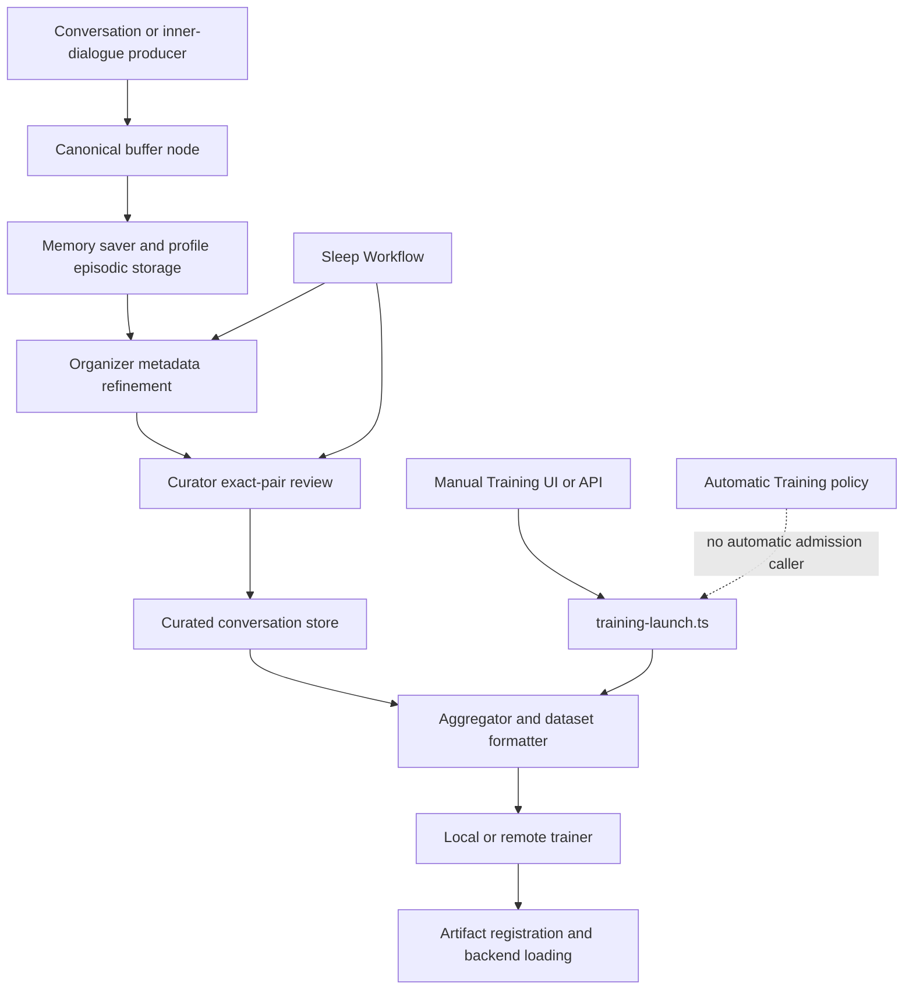
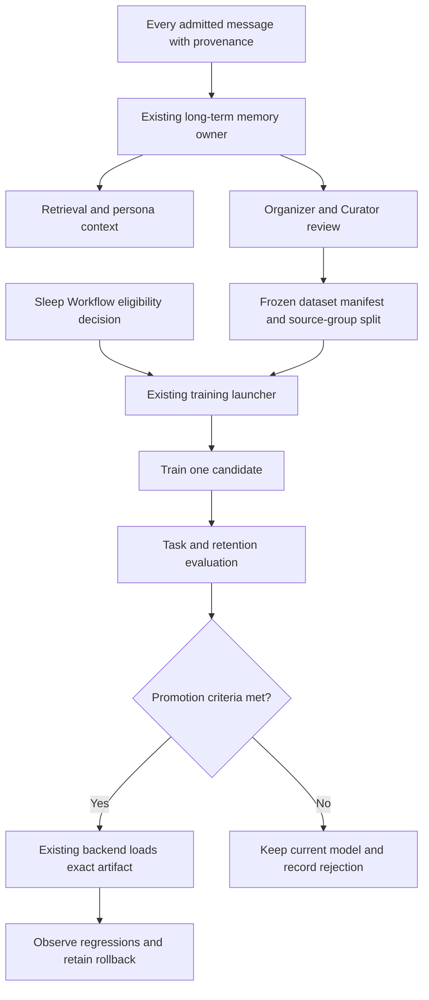

# Conversation learning and model training review

Date: 2026-09-09. Status: review and recommendations; implementation has not started.

Source baseline: `a94fbfddf5cdde7185e92255ff6e3c122929ad67`, plus the existing local worktree changes. Conversation, graph, Agency, and runtime files already contained work by other authors. This review preserves that work. Source references describe the inspected worktree, not necessarily the bundle currently served by the site.

Scope: conversation and inner-dialogue capture, Organizer, Curator, dataset construction, automatic admission, local/remote personalization training, evaluation, and activation. The separate Environment Action Selector training lane was inspected only for reusable practices. No training, model inference, curation, credentialed provider operation, deployment, or hardware action was initiated. Runtime inspection was limited to reads and aggregate metadata; no private conversation text or profile configuration values are reproduced here.

## Recommendation for review

**Keep the existing ownership structure, repair the data and training contracts, and make model promotion depend on evaluation.** The system is partially operational: some messages are still reaching long-term memory. However, the intended automatic journey from each message to a better model is incomplete and has several independent defects.

The most consequential findings are:

1. **There is no automatic training stage in Sleep Workflow.** The Automatic Training UI stores policy and launch settings; no scheduled caller turns that policy into a job.
2. **Refinement is behind, and the stored training corpus contains invalid records.** A profile with current-day memory activity has a substantial Organizer/Curator backlog. Merely enabling a training switch would not resolve it.
3. **Dataset selection and formatting can produce the wrong training signal.** Zero secondary weights can admit secondary samples; dual-mode examples reverse a completed exchange; some model-family paths double-wrap or omit conversational boundaries.
4. **Personalization does not have a complete evaluation-to-promotion gate.** The shared trainer has evaluation features used by the specialist lane, but personalization does not pass an evaluation dataset. Existing activation code can register artifacts without quality evidence, including a recovery branch after training errors.
5. **The local training environment is not a validated launch baseline.** Dependency checks fail, and the shipped 9B BF16 recipe is unsuitable for the inspected single 16 GB GPU without a different memory strategy.

My proposed direction is to save every admitted message, keep its authorship and provenance, update retrieval promptly, and train adapters only from a reviewed, frozen subset. Run the maintenance and readiness review at night; launch a candidate only when enough useful new data and resources are available. Use supervised LoRA/QLoRA as the first repaired baseline, then compare preference learning and distillation on a specific task. Full model fine-tuning and continual self-distillation should remain deliberate experiments until they demonstrate a benefit here.

This recommendation distinguishes **retaining an output** from **endorsing it as a training target**. An incorrect assistant reply, a user's correction, and an imaginative daydream should all remain recoverable, but they should not all teach the model to reproduce their text.

## Evidence and limits

### Current persisted and host evidence

The following is a dated, anonymized snapshot. Counts can change as other processes run. Inspection used the current `getProfilePaths`, `inspectTrainingDataset`, Curator record parser, and training-history parser. These reads did not invoke preprocessing.

| Observation | Evidence | What it establishes |
| --- | --- | --- |
| A profile has recent capture activity | 2,544 readable episodic records; nine dated September 9; latest timestamp September 9 | Some long-term capture is active. It does not prove that every UI message was saved. |
| Organizer backlog | 1,234 records marked organized; 1,310 pending | Refinement has not caught up with storage. |
| Curator backlog | 363 source records marked curated; 2,181 pending | Most stored events have not completed the current review stage. Source-message counts and paired-example counts are different units. |
| Curated-store condition | 363 records: 358 valid, five invalid, 292 accepted/trainable | A historical usable subset exists, but the aggregator rejects a store containing invalid records. |
| Invalid-record categories | Three invalid `userMessage` fields; two invalid `rejectionReason` fields | These are current contract failures, not inferred low model quality. |
| Curation freshness | Latest curated timestamp August 22, 2026 | No later curation is evidenced in this inspected store. The review does not establish why it stopped then. |
| Unpaired pending conversations | 146 pending role groups; 32 lack a user side and 20 lack an assistant side under the current identity grouping | Some records cannot become ordinary paired training examples. Their actual conversational meaning was not reviewed. |
| Other owner-profile coverage | Another accessible profile has 455 unrefined records and no curated store; one owner's storage could not be resolved | This is not an assertion that all profiles have been completely audited. Locked/unavailable storage was not bypassed. |
| Canonical training history | 61 historical launcher logs: parser reports five completed, 37 failed, 19 incomplete; latest recorded start December 31, 2025 | Old runs existed. These legacy log classifications do not verify current trainer compatibility or model quality. None had a modern terminal lifecycle marker. |
| Sleep runtime | Canonical `sleep-state.json` absent | No retained session receipt was available at that location. Absence is not proof that no older maintenance ever ran. |
| Host processes | Site, local-model service, and background services present; no personalization trainer in the inspected Node/Python process list | The app is running; no local training process was observed at that moment. Remote jobs were not queried. |
| GPU | RTX 4080, 16,376 MiB total; 3,314 MiB occupied when queried | Training must share a 16 GB-class device with existing workloads unless resource policy changes. |

The runtime scanner itself has limitations: it counts plain JSON and some counters trust metadata flags. Findings below explain why its readiness totals should not be treated as a complete, encryption-aware reconciliation.

### Validation performed

The focused baseline ran these ten existing test files:

```bash
node --import tsx --test --test-concurrency=2 \
  packages/core/src/conversation-memory-idempotency.spec.ts \
  packages/core/src/inner-dialogue-idempotency.spec.ts \
  packages/core/src/buffer-admission-memory.spec.ts \
  packages/core/src/nodes/curator/curator-contract.spec.ts \
  packages/core/src/training-automation.spec.ts \
  packages/core/src/training-launch.spec.ts \
  packages/core/src/queue/sleep-workflow.spec.ts \
  brain/training/personalization/dataset-pipeline.spec.ts \
  brain/training/personalization/training-window.spec.ts \
  brain/training/personalization/fine-tune-config.spec.ts
```

Six files passed; four failed. Direct reruns established the causes:

- The three buffer/memory files fail on changed-content reuse of an existing admission ID: `Buffer admission ID conflicts with its committed entry`. An identical inner-dialogue replay test passes. The current buffer intentionally checks committed content hashes; older tests expect a changed retry to return the original text. This is contract/test drift requiring resolution, not proof that fresh writes all fail. Preserve immutable message identity when resolving it.
- Curator's functional parsing, pairing, and save-before-mark checks pass: nine tests passed. Its tenth test fails because the bundled mobile Curator graph differs from the canonical graph's scheduler declaration. No mobile code or artifacts were changed.

Additional checks:

- Synthetic execution of the actual extracted sampling function reproduced the zero-weight and unknown-type defects described below.
- Synthetic execution of the actual Python row-formatting functions reproduced duplicate LLaMA instruction markers. Inspection of the Qwen schema plus full-fine-tune concatenation demonstrated the missing role boundary. No model was loaded.
- `venv/bin/python3 -m pip check` failed: `unsloth-zoo 2026.8.3` requires missing `torchao`; `torchaudio 2.4.1+cu121` requires Torch 2.4.1, while Torch 2.8.0 is installed. These are dependency inconsistencies; a trainer import or CUDA training failure was not reproduced.
- `pnpm check:architecture` passed with zero current architecture violations after rerunning outside the sandbox. The initial attempt failed with sandbox `spawnSync git EPERM`.
- `git diff --check` passed. The added report was also checked separately for whitespace errors, source-link targets, and private-data markers.

No production build, package typecheck sweep, authenticated browser submission, agent run, full trainer run, adapter load, or model-quality evaluation was performed. Rebuilding a running production site's output would be inappropriate for this read-only task. Static checks cannot prove those untested layers.

## The current path and its owners



The diagram shows the intended main flow; manual preprocessing invokes Organizer and Curator before aggregation. Curator's current loader does not itself require an Organizer-completed flag.

The current browser entrypoint is [ChatInterface.svelte:769](../../apps/site/src/components/ChatInterface.svelte#L769): it posts `user_message` work to `/api/unified-queue`, then reads the task stream. Its ordinary chat submission carries `kind: 'persona-chat'`; [chat-work-handler.ts:99](../../packages/core/src/queue/chat-work-handler.ts#L99) delegates to `handlePersonaChat` under the request's user context. The direct `/api/persona_chat` route is another thin adapter to that handler. Manual training similarly travels from Training Wizard's `/api/training/launch` request to the shared Core launcher. Automatic Training's status response explicitly reports `triggerInstalled: false` in [its handler:22](../../packages/core/src/api/handlers/training-automation.ts#L22).

| Responsibility | Canonical owner and disposition |
| --- | --- |
| UI/API request handling | `apps/site` transport delegates to Core handlers, especially `persona-chat.ts`. Keep transport thin. |
| Short-term conversation and inner dialogue | `conversation-buffer.ts`, `conversation_buffer`, and `inner_dialogue_buffer`. Keep these owners; buffers are bounded history, not the complete training archive. |
| Long-term message retention | `memory.ts`, `memory_capture`, `inner_dialogue_saver`, and existing dream persistence. Repair missing producer-to-memory coverage here. |
| Metadata refinement | `brain/agents/organizer` and its editable graph, using the Core memory owner. Keep. |
| Training review | `brain/agents/curator`, `etc/cognitive-graphs/curator-mode.json`, Core Curator nodes and contracts. Keep; strengthen provenance and selection semantics. |
| Dataset construction | `brain/training/personalization/dataset-pipeline.ts`, aggregator, formatter, exporter, and current schema owner. Consolidate competing serialization responsibilities. |
| Automatic admission | Sleep Workflow through Work Coordinator; `training-automation.ts` owns readiness and launch preferences. Extend these existing owners. |
| Training process lifecycle | `training-launch.ts` and `training-process.ts`; Brain's personalization runners perform the finite job. Keep one admission path. |
| Training engine | Maintained Python trainers under `docker/runpod-trainer`. Reuse before introducing another framework or process manager. |
| Artifact identity and serving | Core adapters, model registry, and backend loading owners. Separate candidate registration from approved activation. |

The tracked ownership authority explicitly documents the missing automatic trigger in [MAINTAINED_SURFACE.md:125](../technical/MAINTAINED_SURFACE.md#L125). This is an implementation gap consistent with the current authority, rather than a conflict authorizing a second scheduler.

## Findings by owner

### F1 — Sleep Workflow cannot currently train a model

**Priority: P0 for the intended automatic feature. Evidence: source-confirmed.**

Owner: Core scheduling and training admission. [sleep-workflow.ts:32](../../packages/core/src/queue/sleep-workflow.ts#L32) contains six stages: Organizer, Curator, Desire Agent, Dreamer, persona review, and index rebuild. None invokes training. `automaticTrainingLaunchRequest()` prepares a request but has no automatic execution caller in Sleep Workflow or the queue path.

The installed catalog gives Sleep Workflow a time-of-day schedule and allows automatic admission in Semi/Full modes, not Reactive mode: [etc/agents.json:81](../../etc/agents.json#L81). Therefore “nighttime maintenance” also depends on operating mode and the existing authenticated-profile admission rules. A training setting alone cannot establish that the maintenance workflow ran.

Recommended action: later add one explicit, finite training stage through the existing coordinator and launcher contract. Persist its eligibility decision, job identity, terminal result, and evaluation result. A skip must explain why it skipped. Retain existing wake/cancellation behavior, with an explicit policy for safely checkpointing or cancelling a GPU job and cleaning up remote resources. Do not add cron, another interval loop, or a new training service.

Test gap: no current test can prove nightly training because the stage is absent. Acceptance requires one eligible sleep session admitting exactly one job, and ineligible, duplicate, restart, wake, cancellation, and remote-cleanup cases.

### F2 — Whole-store readiness can remain blocked even after a useful curation pass

**Priority: P1 before implementing F1. Evidence: source plus persisted backlog.**

Owners: [training-automation.ts:255](../../packages/core/src/training-automation.ts#L255), [training-dataset.ts:87](../../packages/core/src/training-dataset.ts#L87), and [Curator core:269](../../brain/agents/curator/core.ts#L269).

Readiness requires zero pending organization, zero pending curation, and zero invalid curated records across the inspected store. Sleep processes only 20 Organizer records and one default 20-unit Curator batch. Unpaired messages and negatively reinforced/feedback records can remain uncurated, while the loader deliberately excludes some of them. Those excluded records still count against the broad readiness counters.

Curator also persists its own completion summary as a new inner reflection after marking a batch. Dreaming and other later sleep stages can create more memories after curation. A future training stage appended to the present chain could consequently find fresh pending work even after a successful pass. Simply looping until the entire changing store is empty is not a sound completion condition.

There is another accounting mismatch: “new since last run” means `curatedAt` is later than the previous run's end time. It does not prove the sample was absent from the actual previous dataset. An item curated during a run but omitted from its frozen dataset can be missed by that timestamp rule; recuration can make old content look new.

Recommended action: freeze a bounded eligible source set at a cutoff, record terminal dispositions for every source in that set, and calculate novelty from the last completed dataset manifest. Keep newly arriving messages for the next cycle. Preserve incomplete conversations and operational summaries with explicit dispositions rather than fabricating partners or silently dropping them. Repair the five invalid stored decisions through a separately authorized, provenance-preserving migration/review; do not weaken the parser.

Acceptance: a completed frozen batch is eligible despite later messages, excluded records have visible reasons, actual invalid selected records block, and a failure in a required preprocessing stage prevents dependent training. Note that [advanceSleepWorkflow:164](../../packages/core/src/queue/sleep-workflow.ts#L164) currently advances after either completed or failed stages; training must explicitly check its prerequisites.

### F3 — Successful capture exists, but “every message” is not guaranteed

**Priority: P1. Evidence: source-confirmed coverage gap; some live persistence observed.**

Owners: [persona-chat.ts:738](../../packages/core/src/api/handlers/persona-chat.ts#L738), [conversation-buffer.node.ts:112](../../packages/core/src/nodes/output/conversation-buffer.node.ts#L112), and [memory-capture.node.ts:70](../../packages/core/src/nodes/output/memory-capture.node.ts#L70).

Authenticated conversation graphs normally save user and assistant entries together through a buffer node after response generation, then pass the exact admitted entries to the long-term saver. The standard dual, agent, emulation, and environment graphs have that connection. A failure before the response-dependent buffer node executes can leave the submitted user text absent from episodic memory. Durable graph state may still contain the request; this finding does not claim that every copy is lost from disk. It means the canonical memory-to-training path has not captured that message independently of generation success.

Inner compose behaves differently: [buffer-admission.ts:72](../../packages/core/src/buffer-admission.ts#L72) calls the existing inner buffer and memory saver before generation, and saves the generated reply afterward. Reflector and Train of Thought have explicit long-term saver edges. Daydreamer saves through `dreamer_dream_saver` before publishing to its buffer; the absence of a separate inner saver there is not missing persistence.

The hypothesis that graph occurrence IDs break all conversation pairing was not confirmed. Ordinary graphs admit both roles at the same node occurrence and use a shared prefix. However, standalone assistant outputs from curiosity or result workflows have no same-occurrence user partner and can remain deferred by [source-assembler.ts:125](../../packages/core/src/nodes/curator/source-assembler.ts#L125). A later reply in another graph is not automatically the same training turn.

Recommended action: retain independent user-input and output receipts through the existing capture owners, with a stable conversational turn relationship separate from node-effect identity. Preserve exact committed content; a changed retry is a conflict or a new revision, not permission to rewrite history. Track whether a response completed, failed, or was cancelled. Decide explicitly whether visible partial output is retained as a partial record; exclude it from positive SFT by default.

Acceptance: trace synthetic typed input and inner dialogue through admission, memory persistence, restart/replay, curation, and export. Inject failure before generation and between buffer and memory writes. Reconcile each admitted message to a memory receipt or a visible pending/failed capture. This is a future integration test, not a claim already proved by the current test suite.

### F4 — Sampling can admit generated content that the configuration excludes

**Priority: P1. Evidence: deterministic synthetic reproduction.**

Owner: training dataset composition in [curated-aggregator.ts:93](../../brain/training/personalization/curated-aggregator.ts#L93).

Secondary types are added to `processedTypes` only inside the branch requiring both a positive secondary-weight total and a positive primary count. When that branch is skipped, the later “unmapped” branch includes these same types at 100%. Unknown types are also assumed to be user content. `daydream` is a real persisted memory type and is absent from both explicit lists.

The audit extracted the existing TypeScript function with the TypeScript parser and executed it with synthetic records, without invoking the CLI:

| Synthetic input | Observed output |
| --- | --- |
| One conversation + one inner dialogue; all secondary weights zero | Both selected |
| Inner dialogue only; its secondary weight 1% | Inner dialogue selected despite zero primary records |
| One conversation + one inner dialogue; secondary weight 1% | Conversation only, as the rounded quota is zero |
| One conversation + an unmapped generated type | Both selected |

Composition is also based on memory type rather than target authorship. An Environment conversation is treated as “primary user voice,” even though its training target is an assistant response. Conversely, a user's typed private thought becomes `inner_dialogue` in [inner-dialogue-saver.node.ts:95](../../packages/core/src/nodes/cognitive/inner-dialogue-saver.node.ts#L95), placing it in a secondary category. Ratios therefore do not enforce the advertised human/generated distinction.

Recommended action: repair this function; make zero mean zero, unknown authorship require a decision, and type classification exhaustive. Base target weighting on provenance as well as topic/type. Use a seeded sampler and save selected IDs and counts. The current random-comparator shuffles and final global cap also make selection non-reproducible and can defeat the displayed primary-retention promise.

Disposition: repair the existing aggregator; remove the permissive unknown-as-primary branch. No second sampling service is warranted.

### F5 — Dataset targets mix different learning objectives and lose context

**Priority: P1 design decision before training. Evidence: source-confirmed; quality impact not benchmarked.**

Owner: [curated-aggregator.ts:254](../../brain/training/personalization/curated-aggregator.ts#L254) and [dataset-pipeline.ts:261](../../brain/training/personalization/dataset-pipeline.ts#L261).

For dual-mode records, the aggregator uses the assistant's completed reply as input and the user's preceding message as target. This may reflect an old identity-learning intention, but it is reverse chronological: the input can reveal the answer or details derived from the target. It does not naturally teach the next thing the person would say. Other modes train user-to-assistant behavior. The mode formatter mostly preserves text without making those different objectives explicit in the final model input.

Curator exports one single-turn pair per review unit. Context, source IDs, and cognitive mode exist in intermediate metadata but are not preserved as structured conversations in the final instruction/input/output records. Retrieval context, tool outcomes, and the actual producer model/adapter are not consistently carried into those examples. This weakens reproducibility and can train a model to answer questions without the evidence available during the original exchange.

Recommended action: define the target first. For a helpful personal assistant, train reviewed assistant completions conditioned on the real preceding conversation and relevant evidence. For human-voice emulation, construct chronologically valid human continuations or explicitly authored demonstrations. Do not silently reverse pairs. Keep the distinct purpose in dataset metadata and, where appropriate, explicit task instructions. Preserve source lineage and author identity through export.

The existing role/model router should continue selecting the intended runtime role. Personalization and the system's typed action specialist should retain separate datasets and evaluations; their objectives are different.

### F6 — Chat serialization has competing owners and concrete defects

**Priority: P1 before another training run. Evidence: source plus synthetic reproduction.**

Owners: [schema-manager.ts:98](../../packages/core/src/schema-manager.ts#L98), [dataset-pipeline.ts:246](../../brain/training/personalization/dataset-pipeline.ts#L246), [train_unsloth.py:284](../../docker/runpod-trainer/train_unsloth.py#L284), and [train_full_finetune.py:218](../../docker/runpod-trainer/train_full_finetune.py#L218).

- The TypeScript schema applies model-family wrappers, and the LoRA Python trainer applies another manually constructed chat template. Qwen's current empty wrappers avoid duplication on the normal LoRA path. LLaMA's do not: a synthetic example produced two `[INST]` opens and two closes. The schema also labels this old instruction format as LLaMA3.
- The full-fine-tune Python path concatenates `input + output + EOS`. With the current empty Qwen schema this becomes `SYNTHETIC QUESTIONSYNTHETIC ANSWER<eos>`, without user/assistant roles or even an explicit separator.
- Both family detection and Python auto-template selection have permissive family defaults. A newly selected model can therefore receive an inappropriate format instead of an explicit compatibility error.

Recommended action: preserve structured messages through dataset construction, and give the selected model's tokenizer/chat template one serialization responsibility at the engine boundary. Remove the superseded hand-built wrapper paths when consumers move. Verify the exact template, EOS behavior, reasoning mode, role mapping, truncation, and inference parity for each admitted base model. Do not merely patch the LLaMA string while retaining two formatters.

Acceptance: inspect final token IDs and labels for one-turn, multi-turn, long-context, and tool examples; reject empty targets and examples whose target was entirely truncated. Confirm a training example is rendered consistently when served.

### F7 — Persona context and evaluation controls stop short of the real learner

**Priority: P1. Evidence: source-confirmed wiring gaps.**

Owners: personalization runners and [train_unsloth.py:163](../../docker/runpod-trainer/train_unsloth.py#L163).

The shared Python trainer supports an evaluation dataset, exact message fields, and response-only masking. The separate action-selector lane actually supplies validation data and enables exact-message and response-only settings. Personalization's local launcher supplies only data, config, and output; the remote upload/training command similarly omits a validation dataset. The ordinary defaults do not enable response-only masking. Full fine-tuning explicitly disables best-model selection because it has no evaluation dataset.

The “include persona” setting reaches [lora-trainer.ts:931](../../brain/training/personalization/lora-trainer.ts#L931), which can upload `persona.json`. Neither maintained Python trainer reads that uploaded file. LoRA instead uses per-row `system` when present or its configured/default system prompt, and the personalization exporter does not emit per-row system context. Local training has no corresponding persona-file consumption. Persona can influence Curator's review, but that is different from supplying the intended persona as training context. Installation-specific identity text also remains in shipped defaults.

Recommended action: repair the existing runner-to-engine contract. Carry an intentional, profile-resolved system context into training messages when enabled, make disabled behavior explicit, pass frozen validation data, and apply the chosen target mask. Remove unused persona transfers if they remain unnecessary. Configuration/API tests alone must not claim these controls work at the training tensor layer.

Acceptance: toggling persona inclusion changes the intended rendered context; padding and input/system tokens have the expected ignored labels; at least one target token remains; evaluation runs against held-out source groups; the selected checkpoint and its metrics are recorded.

### F8 — Artifact creation, successful execution, and approved activation are conflated

**Priority: P1 before unattended operation. Evidence: source-confirmed.**

Owners: [lora-trainer.ts:1593](../../brain/training/personalization/lora-trainer.ts#L1593), [full-cycle.ts:387](../../brain/training/personalization/full-cycle.ts#L387), [full-cycle-local.ts:332](../../brain/training/personalization/full-cycle-local.ts#L332), and Core artifact/backend owners.

The remote trainer contains a `finally` branch that creates an Ollama Modelfile and attempts `ollama create` when `training_success` is false but a GGUF exists. This does not turn the summary into success, but it still registers an artifact from a failed run. A later success branch also loads Ollama, while outer personalization runners have their own model-creation logic. The outer LoRA flows call `setActiveAdapter` before their best-effort load has succeeded.

These are distinct risks: an error can leave a loadable artifact, multiple layers own registration, and an “active” record does not prove serving or quality. No personalization task-quality comparison is required before these steps.

Recommended action: retain produced artifacts as candidates, with hashes and the exact base revision. Consolidate registration/loading through the existing Core owners; remove failed-run auto-registration and duplicate outer/inner load responsibilities. Evaluate the candidate against the currently accepted artifact. Promote only after the declared checks, confirm the backend serves the exact candidate, and retain an explicit rollback target. A failed run may preserve recoverable files, but preservation must not imply approval.

Acceptance: failure during training, download, conversion, evaluation, registration, or loading preserves the current active model and reports the real state. A successful optimizer exit alone must not promote a candidate.

### F9 — Local resource and dependency readiness need a real baseline

**Priority: P1 for local training. Evidence: host inventory and failed metadata dependency check.**

Owner: [full-cycle-local.ts:77](../../brain/training/personalization/full-cycle-local.ts#L77), the existing setup entrypoint, and engine configuration.

The launcher selects the repository `venv/bin/python3`. Its installed distributions include Torch 2.8.0, Unsloth/Unsloth Zoo 2026.8.3, Transformers 5.5.0, TRL 0.23.0, PEFT 0.20.0, and bitsandbytes 0.48.2. `pip check` reports the two conflicts listed above. Installed packages alone do not prove that the current trainer imports, constructs a trainer, or takes a CUDA step.

The maintained [training-local.json](../../etc/training-local.json) defaults to a 9B model in 16-bit precision, with 4-bit loading disabled. Nominal 9 billion weights at two bytes each already exceed 16 GiB before activations, adapters, optimizer state, and other processes. This is a sizing inference about that default recipe, not an observed OOM for the user's effective per-run configuration.

The UI's GGUF quantization setting controls the exported inference artifact. Choosing `Q4_K_M` there does not enable 4-bit loading during training; those are separate settings and memory budgets.

Recommended action: define and validate a compatible pinned training environment through the existing launcher/setup path. Avoid changing shared dependencies in place while inference services use them. First compare a smaller instruction model or a supported 4-bit QLoRA recipe under a measured memory budget. Measure peak allocated/reserved VRAM and step throughput on representative sequence lengths. Any new runtime environment must replace the launcher's intended environment explicitly, not become a hidden fallback.

Acceptance: dependency check, import/construction, one synthetic optimizer step, checkpoint reload, and a short offline generation all succeed before a personal-data run. No such optimizer or generation test was authorized or run in this audit.

### F10 — Storage handling and curation policy need to match the learning goal

**Priority: P1 for encrypted profiles; P2 for quality-policy improvements. Evidence: source-confirmed; encrypted runtime not exercised.**

Owners: Core memory storage and Curator. The Organizer uses the memory owner's encrypted record operations. By contrast, [uncurated-memory-loader.node.ts:50](../../packages/core/src/nodes/curator/uncurated-memory-loader.node.ts#L50), the readiness scanner, and the aggregator walk plain `.json` files directly. The Curator marker reads and rewrites paths with plain JSON, and the curated saver writes directly. Core's memory owner recognizes `.json.enc` records. Consequently, application-encrypted episodic files do not have equivalent discovery/curation coverage. A mounted encrypted filesystem is a different case: ordinary JSON I/O on a mounted volume can work.

Recommended action: move Curator discovery and source marking through the existing memory/storage contract and apply the intended encrypted storage policy to curated records and temporary exports. Preserve stable source IDs through decryption and review. Do not add another profile-path resolver. Test both encrypted and ordinary profiles, including locked storage and interrupted writes. Remote export should contain only the approved frozen dataset; uploading an unused full persona file is unnecessary exposure.

Separately, [curator-llm.node.ts:15](../../packages/core/src/nodes/curator/curator-llm.node.ts#L15) uses a general conversational quality prompt. It rejects many artifacts but also discourages limitation statements/refusals, treats short responses broadly as low quality, and asks the model to identify duplication without a corpus-level comparison. It checks plausibility and style, not demonstrated correctness. It can synthesize a prompt and answer for standalone memories. The loader skips negative reinforcement and feedback-tagged records rather than producing a preference dataset.

Recommended action: keep exact source exchanges, distinguish observed facts from hypotheses/dreams, preserve correction/preference signals for appropriate learning objectives, and perform deterministic duplicate/source grouping before model review. Review correct uncertainty, concise answers, valid tool outputs, and appropriate refusals according to the actual task. A fluent reflection should not become factual ground truth solely because Curator accepts it. Human review of a stratified sample should measure Curator errors before automated labels are trusted at scale.

## What current research and tooling suggest

Research was checked online on September 9, 2026, using original papers, the authors' engineering reports, and official framework documentation. Dates below distinguish established methods from recent experiments. Vendor results and research benchmarks are evidence for experiments worth trying, not promised MetaHuman performance. Dynamic documentation, especially `main`, may describe APIs unavailable in this installation's TRL 0.23.0.

| Method | Useful learning signal and tradeoff | Fit for this repository |
| --- | --- | --- |
| Retrieval and maintained persona context | Retrieve relevant facts at inference instead of changing weights for every new fact. Contextual retrieval combines contextualized chunks, lexical matching, semantic retrieval, and optionally reranking. [Anthropic, September 2024](https://www.anthropic.com/engineering/contextual-retrieval) | Best first route for new personal facts, changing preferences, and source-attributed recall. Improve existing memory/index/context owners. It does not itself teach a new behavioral skill. |
| Supervised fine-tuning with LoRA | Learn from reviewed examples while training small parameter updates. September 2025 experiments found adapter capacity, learning rate, batch size, and inclusion of MLP layers materially affected results. LoRA remains relevant. [Thinking Machines: LoRA Without Regret](https://thinkingmachines.ai/blog/lora/) | Recommended first repaired weight-update baseline. The current Qwen3.5 branch already targets attention and MLP layers; other Qwen branches remain attention-only. Tune against development data rather than assuming one rank is universally best. |
| QLoRA | Backpropagate through a frozen 4-bit base into trainable adapters; its main advantage is reducing memory use. It is not a guarantee of faster steps or equal quality for every model. [QLoRA, May 2023](https://arxiv.org/abs/2305.14314) | Strong candidate for the available GPU. Requires a compatible quantization/model stack and measurement with real sequence lengths. |
| Better SFT execution | Official TRL supports structured conversational examples, assistant/completion-only loss, and packing. Correct assistant masks depend on a compatible chat template. [TRL SFT documentation](https://huggingface.co/docs/trl/main/en/sft_trainer) | Repair formatting and labels first; then benchmark packing and supported memory/kernel optimizations. Packing must preserve example boundaries. |
| LoRA variants | PEFT exposes rank-stabilized scaling, DoRA, and initialization approaches such as PiSSA. These change optimization/capacity behavior rather than fixing bad examples. [PEFT LoRA reference](https://huggingface.co/docs/peft/main/package_reference/lora) | Optional controlled ablations after the ordinary LoRA/QLoRA baseline. Confirm export/serving compatibility and measure overhead; do not enable a collection of variants at once. |
| Direct Preference Optimization | Learn that a chosen response is preferred to a rejected response for the same prompt, without building the traditional online RLHF stack. [DPO paper, 2023; revised 2024](https://arxiv.org/abs/2305.18290), [TRL DPO](https://huggingface.co/docs/trl/main/en/dpo_trainer) | Useful for tone, correction-following, and response preferences once explicit comparable pairs exist. A thumbs-down or an unrelated rejected Curator record is not automatically a valid DPO pair. |
| Offline teacher distillation | Generate or review demonstrations with a stronger teacher and train a smaller student on accepted outputs. DeepSeek-R1 reports distillation into smaller models alongside its RL work. [DeepSeek-R1, January 2025](https://arxiv.org/abs/2501.12948) | Practical specialist route: teach a narrowly defined task with independently checked examples. Account for teacher cost and private-data export. Keep generated lineage distinct from human evidence. |
| On-policy distillation | The student generates continuations; a fixed teacher supplies distributional supervision on those continuations. Thinking Machines demonstrated reasoning and personalization experiments; TRL now provides a dedicated trainer. [Thinking Machines, October 2025](https://thinkingmachines.ai/blog/on-policy-distillation/), [TRL Distillation](https://huggingface.co/docs/trl/distillation_trainer) | Promising second-stage experiment for a small specialist or preserving behavior after domain adaptation. More involved than saved-text SFT: requires teacher scoring, compatible tokenization, and generation resources. A text-only API is not automatically sufficient for this exact objective. |
| Self-distillation for continual learning | SDFT uses a demonstration-conditioned version of the model as its teacher. The January 2026 paper, revised August 7, reports better learning/retention than SFT on its evaluated tasks. [SDFT](https://arxiv.org/abs/2601.19897) | Most directly relevant novel experiment for repeated learning from reviewed experiences. Evaluate after a trusted baseline; the paper does not establish that arbitrary inner dialogue is useful supervision. |
| RL with verifiable rewards, including GRPO | Train from scored sampled outputs; useful when a reward really tests task success. Current TRL supports custom reward functions. [TRL GRPO](https://huggingface.co/docs/trl/grpo_trainer) | Consider for typed extraction, code checked by tests, or simulated tool decisions. Usually a poor first choice for subjective personal conversation. Generated rollouts and reward validation add substantial work. |
| Full fine-tuning / domain continued training | Update the base model itself for a sufficiently large, demanding domain adaptation objective. It needs greater memory and introduces broader retention concerns. | Defer for this small, stale, partly invalid personalization corpus. Compare it only if a sound adapter baseline underfits the measured task despite adequate data. |

### Novel does not mean reliably better

There is useful conflicting evidence. A July 2026 study of **SDPO** found faster in-domain specialization in some settings but poorer out-of-distribution generalization, stronger forgetting, and sometimes collapse. It attributes problems partly to unstable dense teacher signals and amplified formatting artifacts. That study concerns SDPO, not an exact replication of every SDFT result; it does challenge the general claim that on-policy self-distillation automatically prevents forgetting. [Denser ≠ Better, July 2026](https://arxiv.org/abs/2607.01763)

For MetaHuman, the implication is an experiment with a fixed base, frozen tasks, human-origin examples, and retained-capability tests. It is not a justification for nightly retraining on everything the current model happened to think.

The 2024 model-collapse study also supplies a reason to preserve original human data and distinguish generated material. Its result concerns indiscriminate recursive training; it does not imply that every use of synthetic data is harmful. Reviewed teacher demonstrations and uncontrolled recycling of a model's mistakes are different data practices. [Shumailov et al., Nature](https://www.nature.com/articles/s41586-024-07566-y)

### Practical efficiency priorities

For this installation, I would prioritize useful training signal per unit of work in this order:

1. Exclude duplicate, ineligible, and unresolved examples deterministically before spending Curator/model calls. Cache the review decision against source content and policy/model revision.
2. Preserve useful context and train the intended continuation. More epochs cannot repair a reversed target or malformed chat boundary.
3. Use a base that already performs the task reasonably well and fits the resource budget. Compare a smaller model with a supported 4-bit adapter recipe before pursuing full fine-tuning.
4. Benchmark representative token lengths, then tune adapter capacity, batch/accumulation, packing, and supported kernels. Report tokens/second, peak VRAM, end-to-end duration, and evaluated task improvement.
5. Curate nightly but train only on sufficient novelty. A reproducible adapter rebuilt from a fixed base plus a reviewed replay subset is a simpler first comparison than an indefinitely chained series of tiny updates.
6. Spend teacher generation/review on failure categories the student actually has. Escalate to DPO, distillation, or RL only when their required labels or verifiers exist.

These are proposed experiment priorities, not measured speedups or a cost quotation. Remote prices, resource availability, and selected model licensing must be checked for the eventual concrete run.

## Proposed repaired learning lifecycle



This is a proposal for extending the existing owners. It is not a new scheduler, memory store, model registry, or autonomous control system.

### Capture and provenance

Within the canonical memory contract, retain the exact admitted content, stable message/turn/session relationships, author/source, timestamps, channel, completion state, and source revision. Where available, retain the producing model/base/adapter and graph/prompt revisions. Keep retrieval/tool evidence as bounded references needed to reconstruct the example. Corrections should reference the earlier record and preserve history.

The archive should distinguish user-authored statements, model outputs, deliberate fictional/reflective content, system progress, and verified external outcomes. “Inner dialogue” here means output deliberately generated and exposed by MetaHuman's local workflows; it does not assume access to undisclosed reasoning inside a hosted model. Save the permitted observable output and useful evidence, rather than designing training around unavailable hidden state.

Allow an explicit exclusion from training without losing the archived message. Propagate later deletion/exclusion into future datasets, retrieval, and lineage records; deleting a source file does not by itself remove influence from an already-trained model. Any desired retraining after deletion must be tracked explicitly.

### Dataset and review contract

Extend the current curated contract and run metadata with the minimum information required for reproducibility:

- Source IDs and hashes, group/turn relationships, authorship, review disposition and rationale, review policy/model version, and eligible learning objective.
- Structured messages and the intended supervised target; verified correction or chosen/rejected relationship when used for preferences.
- Immutable selected IDs, source cutoff, tokenizer/base revision, chat-template hash, sampling seed, configuration, token counts, and content hashes for each run.
- Separate training, development, and final evaluation source groups. Keep every variant of a source in the same partition; isolate the final test set before choosing prompts or checkpoints.

A full frozen manifest can live with the existing run artifacts and curated records. It need not become another active database or registry. The separate action-selector lane already demonstrates source-group folds, exact messages, response masking, external generation/scoring, and withheld evaluation provenance; reuse those practices without merging its corpus into personal data.

### Evaluation and promotion

Begin with the current serving model as the baseline. Add independently authored test prompts and a chronological holdout; an old conversation split at random is vulnerable to near-duplicate leakage. Use the same retrieval context, prompt budget, decoding settings, and tools for baseline and candidate comparisons.

| Evaluation dimension | Evidence required before promotion |
| --- | --- |
| The intended specialized task | A predeclared measure such as exact extraction, tool/schema correctness, or blinded human preference; inspect category-level regressions as well as averages. |
| Personal recall | Correct source-backed answers, acknowledgement of unavailable facts, and adherence to updated facts; compare with retrieval enabled for both models. |
| Voice and preferences | Blinded judgments on held-out prompts, including concise answers and correction-following. Treat an LLM judge as an aid calibrated against human review. |
| Retained capabilities | An unchanged set of general instruction-following, uncertainty, formatting, and prior-task checks across successive updates. |
| Data isolation | No held-out source groups in training; no cross-profile material; no unapproved training sources. |
| Operational behavior | Exact artifact/base/template identity, successful load and inference, memory/latency measurements, cancellation and restart receipts, and working rollback. |

Predeclare the required improvement and tolerated regressions before training. Report the number and independence of examples and uncertainty in preference/accuracy estimates. A small pilot can justify further investigation; it cannot establish broad reliability. Training loss, loss on near-duplicate validation text, and a few attractive sample responses are insufficient promotion evidence.

For any later robot/action specialist, keep evaluation offline or simulated until separately authorized physical tests. Personalization quality does not establish physical safety or permission to execute actions.

## Implementation sequence for approval in a later task

The following are bounded future slices. This report does not implement or authorize them.

| Slice | Existing owners to change | Superseded behavior to remove | Acceptance evidence |
| --- | --- | --- | --- |
| 1. Establish reliable capture and inventory | Conversation/inner producers, canonical buffers and memory savers; Curator source assembly and storage reads | Response-success dependence for user retention; inconsistent discovery/marking paths | Failure/restart/replay integration cases, source-to-memory reconciliation, encrypted/plain profile parity, explicit unmatched dispositions |
| 2. Repair training records | Curator contract/prompt, aggregator, dataset pipeline, existing schema boundary and Python serializers | Unknown-as-primary sampling; zero-weight leakage; unjustified reverse pairing; duplicate chat wrappers; input/output concatenation | Synthetic corpus with known authorship, zero-weight checks, exact rendered tokens/labels, source-group split and deterministic manifest |
| 3. Establish a compatible local pilot | Existing setup/launcher and trainer configuration | Unverified environment/default assumptions; unused persona transfer | Dependency/import/optimizer/reload tests, measured resource budget, one reviewed adapter candidate; active model unchanged |
| 4. Add evaluation and controlled activation | Existing trainer evaluation inputs, run artifacts, Core adapter/model/backend owners | Failed-run auto-registration; duplicate loading; active-before-verified state | Baseline/candidate evaluation, exact served artifact proof, rejected candidate handling and rollback |
| 5. Connect Sleep Workflow | Sleep Workflow, readiness policy, Work Coordinator and shared launcher | Whole-changing-store emptiness and timestamp-only novelty as admission criteria | One eligible job per frozen batch; explicit skip/failure; wake/cancel/restart and remote termination evidence |
| 6. Compare modern methods | Same training and evaluation owners, with one explicitly approved method at a time | Any losing experimental path after the comparison | SFT/QLoRA baseline versus DPO or distillation on identical source groups, with quality, retention, runtime and total cost reported |

Keep the existing source tests strict while resolving their contract drift. Do not normalize a bug by changing expected outputs. Update maintained documentation and any legitimately owned graph copies in the same implementation slice that changes their contracts. Preserve original raw records when migrating historical curation; deletion and recuration require explicit implementation scope.

The first practical review decision is the initial learning target: personal assistant behavior, human-voice emulation, or a named narrow task. My recommendation is **personal assistant behavior with retrieval-backed personal memory**, followed by a separate, measurable specialist experiment. That provides a useful baseline without asking one undifferentiated corpus to teach factual recall, personality, imagined inner dialogue, and action selection simultaneously.

## Unresolved questions and completion boundary

The review establishes source gaps, reproducible dataset defects, current stored backlog, dependency inconsistencies, and test failures. It does **not** establish the specific historical event that stopped curation, the compatibility of a live remote training image, the condition of inaccessible profile storage, or the quality of any current or historical personalized artifact.

No production files, settings, models, datasets, or active services were modified. No code was deleted or consolidated in this review. The only intended repository addition is this report. Future implementation should preserve the documented canonical owners and satisfy the staged acceptance evidence above before claiming that nightly learning works.
