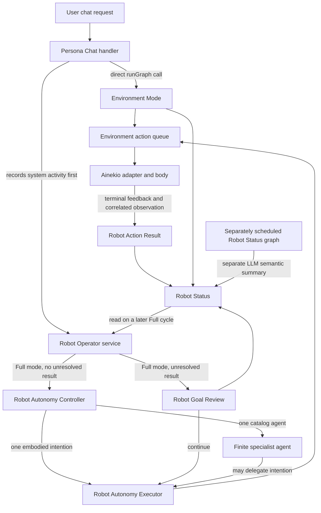
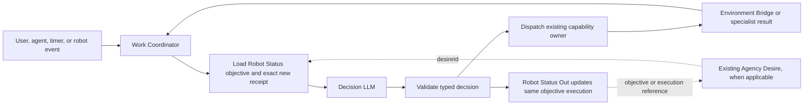
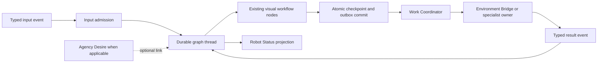

# MetaHuman Robot Autonomy Compared with Long-Running LLM Agent Loops

Status: historical research and spike record, 2026-09-06. The Installation Owner
subsequently authorized end-to-end production implementation, superseding the
spike-only approval boundaries below. Implementation and verification are tracked
in [the progress review](./durable-execution-progress-review.md); historical spike
results are not production-completion evidence.

## Scope and evidence boundary

This report answers one question: why can a general agent harness stay on a
multi-step task while the current MetaHuman robot path often repeats, loses the
objective, speaks without acting, or reinterprets the same situation on every
cycle?

The findings come from:

- the current maintained source and working-tree graph definitions;
- the real user-chat, Robot Operator, Work Coordinator, Environment Bridge,
  action-result, Robot Status, and goal-review entrypoints;
- official documentation or source from OpenAI, Anthropic, Google, Qwen,
  DeepSeek, and LangGraph; and
- the ReAct and Reflexion papers.

The repository already contains a node-by-node source audit in
[full-autonomy-workflow.md](./full-autonomy-workflow.md). That audit is useful
for identifying the intended owners, but it explicitly left live-runtime and
physical behavior pending. This report addresses the larger cross-workflow
control model.

This is source-level evidence. No live server, deployed Site bundle, adapter,
camera, actuator, or physical robot was exercised. The three production-source
files that were already modified when this research began were treated as the
working-tree baseline and were not edited. Reported robot behavior is used only
to identify hypotheses that the source can or cannot support; private runtime
content is not reproduced here.

## Rolling decision record

- **Implementation authorization, 2026-09-07:** Replace the canonical graph runtime,
  integrate the real workflows and existing model router, migrate Coordinator and
  Bridge handoffs, and make Robot Status a projection. Independent review and
  corrections continue within that goal. No second active runtime or firmware
  migration is part of the implementation. Deployment and physical results remain
  separate from isolated software verification.
- **Initial finding, 2026-09-06:** MetaHuman reconstructs one objective across
  several bounded graph invocations instead of continuing one ordered run.
- **Existing-system correction, 2026-09-06:** Agency Desire is already a
  case-file-shaped motivation system, so a second robot-specific `AutonomyRun`
  store is not justified.
- **Execution-owner correction, 2026-09-06:** Stable IDs and a cursor in
  `RobotStatus.task` would improve reconstruction but would not provide native
  checkpoint/resume. Robot Status must be a projection, and a durable generic
  graph thread/checkpointer must own execution continuity.
- **Integration constraints, 2026-09-06:** A compatibility spike must prove the
  checkpoint-to-Work-Coordinator handoff, replay-safe physical dispatch, one
  parent execution across existing graphs, graph/checkpoint versioning, fenced
  body ownership, explicit uncertain outcomes, bounded private-data retention,
  and preservation of the direct emergency-stop path.
- **Compatibility correction, 2026-09-06:** The supplied synthetic matrix
  passed, but independent probes reproduced cancellation, recovery, ordering,
  fencing, reconciliation, version-admission, and node-configuration failures.
  The earlier claim that the hard gates passed is withdrawn. The original
  spike and independent evidence are preserved unchanged; subsequent comparison
  work is separate from that original implementation.
- **Current planning state, 2026-09-06:** Production adoption is blocked.
  The migration map below is a proposal, not approval or proof of compatibility.
  The separate actual-graph/model-router comparison now supplies limited mocked
  integration evidence; it does not resolve the reproduced safety failures.

## Compatibility spike execution log

### Step 0 - authorization, scope, and baseline - 2026-09-06

Status: **complete**.

The Installation Owner authorized the planned work as a continuing goal and
asked that this report remain the rolling execution record. This first phase is
the bounded compatibility spike described below. It does not authorize a second
production graph runtime or a production migration before the spike gates are
proven.

Baseline established before spike work:

- branch `main` at `8b7809fc` (`refactor(agency): consolidate autonomous workflows`);
- no LangGraph package is present in the workspace manifest or lockfile;
- Work Coordinator persists its canonical ledger as profile-independent runtime
  JSON, while no generic graph thread/checkpointer currently owns robot task
  continuation;
- the three existing modified production files—Controller graph,
  Robot-Operator context builder, and its focused spec—belong to prior work and
  will not be overwritten or restored by the spike; and
- this report is currently an untracked audit artifact. No production source,
  dependency, runtime data, profile data, or physical robot state has been
  changed by Step 0.

Canonical owners retained during the spike:

- Core Graph Executor owns current graph semantics;
- Work Coordinator owns finite-work admission and lifecycle;
- Environment Bridge owns physical transport and correlated feedback;
- Robot Operator owns Full-mode timing and admission; and
- the spike is a disposable compatibility harness, not another active owner.

Next evidence: inventory exact graph semantics and owner contracts, record a
sanitized baseline trace, then evaluate LangGraph graph parity and durable
checkpoint behavior in isolation.

### Step 1 - current-runtime semantics and owner-contract baseline - 2026-09-06

Status: **complete**.

Source and validation evidence gathered before building the candidate adapter:

- `pnpm validate:graphs` passed for all 38 maintained graphs;
- `pnpm audit:graph-executors` found 344 registered graph nodes and no missing
  executor;
- `pnpm test:environment-graph` passed all four focused Environment Mode tests;
- Environment Mode has 20 nodes and 51 edges, Robot Autonomy Executor has 22
  nodes and 62 edges, Robot Action Result has 14 nodes and 33 edges, and Robot
  Goal Review has 19 nodes and 31 edges;
- none of those four robot graphs contains an explicit loop edge; the only
  maintained graphs with declared loop edges are Dual Mode and Train of Thought;
  and
- the candidate packages are absent from the repository manifest and lockfile.
  The isolated `/tmp` harness uses `@langchain/langgraph` 1.4.14,
  `@langchain/langgraph-checkpoint` 1.1.5, and
  `@langchain/langgraph-checkpoint-sqlite` 1.0.4 without changing the workspace.

Current scheduler semantics that a replacement must preserve:

- graph validation occurs before execution;
- data edges, control edges, and cross-node activation conditions participate
  in topological ordering, while only edges explicitly marked `loop: true` are
  excluded from the acyclic order;
- data travels only from a completed source over an active edge with a present,
  non-null output; `false`, `0`, and the empty string remain valid values;
- conditional edges and node activation conditions can leave non-selected nodes
  explicitly `skipped`;
- side effects execute serially in topological order; and
- one invocation ends as completed or failed. It has no durable graph thread,
  waiting checkpoint, or result-driven resume position.

Owner-contract findings:

- Work Coordinator already carries `parentTaskId`, `correlationId`, and
  `idempotencyKey`, persists one atomic JSON ledger, and requeues or fails a
  leased item during restart reconciliation;
- its idempotency map covers only nonterminal work. `addTerminal()` deliberately
  removes the key, so retrying an outbox after a task completed can create a new
  work item and the current contract is not a durable admission receipt;
- Environment Bridge derives the physical `actionId` from the Work Coordinator
  item ID, leases one `environment:<sessionId>` resource at a time, and records
  accepted or terminal feedback against that ID;
- environment commands use one attempt. A restart after an unacknowledged
  physical effect therefore cannot safely infer whether retry or failure is
  correct, and the current feedback contract has no explicit `outcome_unknown`
  state;
- resource serialization is not a body-owner fencing token; and
- Active Operator emergency stop already bypasses LLM reasoning: it cancels
  autonomous work, directly enqueues critical stop actions for connected
  sessions, and changes the mode to Reactive. The spike will validate this
  source path without sending a physical command.

Initial dependency/API probe result: a LangGraph `StateGraph` using the SQLite
checkpointer parked at an `interrupt`, closed its database, recreated the saver
and graph, and resumed the same `thread_id` at the waiting node. The preserved
trace was `prepare -> wait -> finish:resumed`. This proves basic persisted
resumption after runtime-object recreation, not yet a separate-process crash or
safe physical handoff.

The package-source review also confirms that an interrupted LangGraph node begins
again from its start on resume. A physical send therefore cannot be placed in
the interrupting node. The SQLite saver writes checkpoints and node pending
writes in separate operations; its `putWrites()` transaction does not include
MetaHuman's JSON queue ledger. Default LangGraph persistence alone cannot supply
the required atomic outbox.

Selected spike design for the next step: a custom SQLite checkpointer transaction
will commit a successful action-planning node's pending writes and an outbox row
together. A relay will use at-least-once delivery into a durable admission
receipt owned and persisted with the Work Coordinator ledger. The relay may then
acknowledge the SQLite outbox. This remains a two-owner protocol, not a fictional
cross-database exactly-once transaction. The spike must prove recovery when it
crashes before either commit and after Coordinator admission but before outbox
acknowledgement.

### Step 2 - isolated durable-thread and physical-boundary spike - 2026-09-06

Status: **failed independent acceptance review; not integrated into production**.

The results below record the original supplied matrix, not a passing acceptance
gate. Independent review reproduced failures outside that matrix (F1–F8),
including dispatch after cancellation and false completion from unrelated
reconciliation. The preservation bundle retains both sets of evidence.

Harness location:
`/tmp/metahuman-langgraph-spike-20260906`. The reproducible entrypoints are
`durable-runtime-spike.mts` and `svelte-flow-parity-spike.mts`. Dependencies,
SQLite databases, fake-body receipts, and run output remain outside the
repository. The final crash-matrix run used
`runs/run-1788733233258-81b0ee58`.

The first implementation exposed and then corrected an important boundary
error. Creating the outbox from LangGraph pending writes protected physical
dispatch, but the Executor planning node ran twice after a post-commit crash.
That would allow a model to produce a different plan. The corrected saver
creates the execution checkpoint, ordered execution events, and deterministic
outbox row in one SQLite transaction. After that change the same crash produced:

- Controller model node: one execution;
- Observer specialist node: one execution;
- Executor planning node: one execution;
- side-effect-free result wait node: two executions, as documented for
  LangGraph interrupt resume;
- Review model node: one execution; and
- physical effect: one execution.

Crash and recovery evidence:

| Forced boundary | Observed recovery |
| --- | --- |
| Process killed inside checkpoint transaction before outbox insert | SQLite rolled back both the `capability_dispatched` event and outbox row; recovery then committed exactly one of each |
| Process killed immediately after checkpoint/outbox commit | The saved Executor subgraph checkpoint resumed without repeating its planning node |
| Process killed after Work Coordinator admission but before outbox acknowledgement | Retried relay returned the persisted receipt and exact same `workItemId` |
| Relay repeated after the Coordinator work item became terminal | The durable admission receipt still returned the original item; the Coordinator ledger contained one work item |
| Process killed after the fake body committed its effect but before Coordinator acknowledgement | Recovery queried the durable body receipt and completed the one Coordinator item without sending again |
| Process killed after graph result processing but before event acknowledgement | Restart observed the result in the same checkpoint, acknowledged the existing event, and did not rerun Review |
| Duplicate physical result delivered | `(executionId,eventId)` returned the existing event and caused no second transition |
| Dispatch possibly happened but no durable body acknowledgement existed | The work terminalized as `outcome_unknown`; the graph parked at `waiting_for_reconciliation` and did not retry the command |
| Older body lease generation submitted after ownership advanced | Fake Bridge rejected it and recorded no additional physical effect |

The completed path maintained distinct opaque IDs for one objective, execution,
event, outbox delivery, Coordinator work item, and physical action. It recorded
eight monotonically ordered events:

1. `objective_started`;
2. `controller_decision`;
3. `specialist_result`;
4. `capability_dispatched`;
5. `user_steering`;
6. unrelated `conversation`;
7. correlated `physical_result`; and
8. `objective_completed`.

All eight were processed once. User steering and unrelated conversation left
the same `objectiveId` and waiting graph position intact. A typed cancellation
ended a separate execution and cancelled its still-pending outbox without
dispatch. A robot-disconnected event left another execution parked at its
result wait with its objective intact.

Objective completion remained separate from action completion. One completed
action carrying current correlated evidence that satisfied the saved success
condition reached `objective_completed`. A second completed physical action
without objective evidence remained `awaiting_next_decision`; it did not mark
the objective complete. The Review decision lives in the model-adapter role,
not a command-name or phrase check.

Controller, Observer specialist, Executor, and Review were compiled as
subgraphs below one parent execution. The SQLite checkpoint namespaces were
distinct child namespaces under the same `thread_id`/`executionId`; none became
an unrelated top-level thread. A forced graph-hash mismatch parked the execution
as `parked_version_mismatch` rather than loading old state into changed topology.

Robot Status was represented only as a projection of the final checkpoint. The
harness deliberately wrote an incorrect objective and lifecycle into that
projection, then reloaded the graph: the authoritative objective and terminal
state were unchanged. Re-projecting repaired the display without using it as
input authority.

The storage probe admitted 64 additional conversation events. The authoritative
event table retained all 68 execution events while checkpoint-visible
conversation remained at four entries and recent event context at 16. The
objective, success condition, pending action, and event cursor remained pinned.
The SQLite file was 856,064 bytes. Visual state contained only an image ID,
content hash, capture time, source action ID, and short verified description;
no raw image or `data:image/` payload was stored.

The candidate remained model-adapter-neutral for three disposable adapters
(`local`, `remote`, and `qwen`), but this is structural evidence only. It did
not invoke MetaHuman's real model router or claim live provider parity.

The original synthetic scheduler comparison passed against the canonical Core Graph
Executor for both sides of a conditional branch, including a valid numeric-zero
data value, explicit skipped nodes, and serial control-edge ordering. The four
target robot graph files were parsed without mutation and retained their source
hashes. This adapter deliberately did not translate explicit loop edges because
the four target robot workflows have none; loop parity remains required before
the canonical executor could be replaced repository-wide.

Isolation exception: importing the canonical Core Graph Executor for that
parity comparison initialized its event-bus client while the local event bus was
running and flushed ten queued probe execution events. The probe did not invoke
a production graph route, admit Coordinator work, call Environment Bridge, or
send a robot command. Future parity runs must isolate the test process and use a
side-effect-free Core import boundary so even trace events remain isolated.

Dependency evidence: the isolated install occupied 104 MB and introduced
LangGraph, LangChain Core, the checkpoint package, the SQLite saver, and native
`better-sqlite3`. The harness installed a second direct `better-sqlite3` version
to implement the custom saver; a production design would need one pinned,
supported version rather than both. No repository dependency was added.

What this step proves:

- the checkpoint/outbox transaction is implementable in one SQLite owner;
- the JSON Coordinator can participate through at-least-once relay plus a
  durable admission receipt in its own atomic ledger;
- physical side effects can remain outside replayed graph nodes;
- separate specialist workflows can share one parent execution; and
- Robot Status need not own or reconstruct task continuity.

What it does **not** prove:

- production integration with the current Queue System, Environment Bridge,
  Robot Operator service, or Ainekio gateway;
- behavior of a real LLM or every configured model provider;
- full translation of all 38 graph topologies, especially explicit loops and
  arbitrary direct graph invocation;
- live emergency-stop transport or physical robot behavior; or
- a final terminal-retention duration and archival policy.

Those are migration gates, not facts to infer from this isolated success.

### Step 3 - adoption decision and production cutover map - 2026-09-06

Status: **complete as a migration design; production migration not started**.

Decision: the candidate is not rejected. The isolated evidence is strong enough
to recommend a separately approved production cutover for the robot-autonomy
slice. It is not strong enough to claim that the deployed system, Environment
Bridge, model providers, or physical robot already have these semantics.

The present and proposed continuation paths are materially different:

```text
CURRENT
fresh graph -> Work Coordinator action -> Bridge result -> Robot Buffer
           -> fresh Action Result graph -> Robot Status snapshot
           -> Full-mode polling -> fresh Goal Review or Controller graph

PROPOSED
typed event -> one durable execution/checkpoint -> committed outbox
            -> Work Coordinator -> Bridge/body
            -> correlated result event -> resume that exact execution
            -> committed review/next decision -> Robot Status projection
```

The proposed path does not use conversation, Robot Buffer, or Robot Status to
reconstruct which objective a result belongs to. Those systems may supply
context or display committed state, but the durable execution remains the
authority.

#### Identity contract

The production contract must keep these identities distinct:

| Field | Meaning and owner |
| --- | --- |
| `objectiveId` | Opaque ID for one instance of an objective. The text “find the keys” is its description, not its ID. Owned by the durable execution. |
| `executionId` | Opaque ID of the resumable graph thread attempting that objective. It remains stable across child graphs and restart. |
| `eventId` | Globally unique ID used to deduplicate one admitted user, system, specialist, observation, or result event. |
| `sequence` | Monotonically increasing position assigned atomically inside one execution. It is the event cursor; a Work Coordinator ID is not. |
| `actionId` | Stable capability invocation ID allocated before queue admission and carried through the Bridge/body result. |
| `deliveryId` | Stable outbox delivery ID used to obtain the same durable Coordinator admission receipt after retries. |
| `workItemId` | ID of the finite Work Coordinator job that transports or executes one dispatch. It does not identify the objective or event stream. |
| `correlationId` | Cross-owner grouping value. For work belonging to a durable robot run it carries `executionId`; it does not replace the more specific IDs above. |

`RobotStatus.task` will contain only projection references and readable state. It
will not allocate these IDs, advance `sequence`, decide which event is new, or
rename an objective.

#### Selected cross-store delivery protocol

There is no claim of an atomic transaction across SQLite and the Coordinator's
JSON ledger. The selected protocol is an outbox with two atomic local commits:

1. The durable graph-session owner commits the successful node output,
   checkpoint, ordered event, and deterministic outbox row in one SQLite
   transaction.
2. A relay calls Work Coordinator with `deliveryId`. Work Coordinator atomically
   persists both the work item and a durable admission receipt in its existing
   ledger.
3. Repeating that admission returns the same `workItemId`, including after the
   item is terminal. The receipt is retained at least as long as its parent
   execution can resume.
4. After receiving that receipt, the graph-session owner marks the SQLite outbox
   row delivered. A crash before this acknowledgement merely repeats the safe
   admission call.
5. Physical dispatch carries the preallocated `actionId` and an increasing body
   fencing generation. The adapter/body returns or can be queried for a durable
   receipt for that exact action.
6. A correlated result is appended once as an execution event and resumes the
   waiting checkpoint. It is never converted into general narrative and then
   rediscovered as task authority.

The relay is not a new scheduler or queue. It is a deterministic adapter owned
by the graph-session boundary, invoked after commit and during the existing
execution engine's startup/recovery pass. The Coordinator remains the only
finite-work queue.

The side-effect rule is strict: a replayable graph node may select and stage a
capability, but it may not send a physical command. Dispatch happens only from a
committed outbox record. The interrupting wait node has no external side effect.
If the body may have acted but no durable receipt exists, the action becomes
`outcome_unknown`; the execution requests observation/reconciliation and does
not infer success or blindly resend.

#### Input and body admission

The runtime admits typed events such as `user_input`, `user_steering`,
`conversation`, `specialist_result`, `physical_result`, `observation_received`,
`connection_changed`, `timer`, and `cancellation`. These are lifecycle facts,
not phrase-specific action rules.

When a body-controlling execution exists, new authenticated user input is
appended to that execution so its LLM can decide whether it is steering,
conversation, a replacement objective, or a separate non-body activity. The
runtime does not silently overwrite the saved objective. With no active
execution, the same input can start one after the existing intent path decides
that durable work is needed. Several cognitive executions may exist, but only
the current fenced body lease can dispatch physical work.

Full autonomy becomes event-driven. A settled action, observation, specialist
result, user event, connection event, or eligible autonomy timer resumes the
Controller execution. The LLM receives current state and the capability catalog
and may continue an objective, choose a specialist, converse, start something
new, or wait. There is no round-robin task rotation, no fixed completion-message
loop, and no Robot Status polling used as a substitute for a result event.

Authenticated emergency stop remains the existing direct safety path to the
Bridge/body owner. It cancels or parks cognitive work as a consequence, but it
never waits for LLM classification. That physical safety exception does not
encode ordinary behavioral choices.

#### One parent execution across editable graphs

For the first production slice, Robot Autonomy Controller is the durable parent.
The existing Controller, Observer/specialist, Robot Autonomy Executor, Action
Result, and Goal Review graph definitions remain editable, specialized graphs,
but compile as child subgraphs with inherited `executionId` and distinct
checkpoint namespaces. A child may also dispatch an external specialist through
Work Coordinator; its typed result must return to the waiting parent execution.

No participating graph may also be launched as an unrelated fresh execution.
The saved graph ID, content hash, checkpoint-schema version, and relevant node
implementation versions are pinned in the checkpoint. A mismatch parks the
execution for an explicit migrate, pinned-code resume, cancel/restart, or manual
decision. It never silently resumes against edited topology.

The current Svelte Flow files and editor remain the authoring authority. The
adapter is one-way at runtime and must preserve saved node properties,
data/control edges, activation conditions, skipped nodes, and output semantics.
The original spike proved two synthetic branch paths only; production cutover must
run trace parity for every graph in this parent before admission is enabled.

#### File-by-file migration and deletion map

This is the proposed production scope requiring separate approval. File names
for new Core modules are provisional until the pre-edit caller audit confirms
the smallest placement; the owner boundaries are not provisional.

| Existing owner or path | Required production change | Superseded behavior removed in the same cutover |
| --- | --- | --- |
| Root `package.json` and `pnpm-lock.yaml` | Add one pinned LangGraph/checkpoint/SQLite dependency set only after approval and native-build verification. | No isolated or duplicate SQLite package version may enter the workspace. |
| `packages/core/src/graph-runtime.ts` | Remain the public Core facade and expose durable start/admit/resume operations for registered durable graphs. | A durable robot graph must never fall back to a fresh `executeGraph()` invocation. |
| New Core graph-session compiler/runtime/store modules | Own Svelte Flow compilation, checkpoint/event state, version pins, transactional outbox, recovery, and terminal retention. Their necessity is the missing responsibility proven in Step 1; they are not a second queue or task store. | Remove any temporary adapter, compatibility switch, or alternate persistence path when the robot slice cuts over. |
| `packages/core/src/graph-executor.ts` | Remains the sole production executor during the experiment. Any approved migration must cover all maintained graph entrypoints, including bounded, looped, and directly invoked graphs. | Final cutover requires parity for every maintained entrypoint and deletion of the old scheduling implementation and its admission wiring. Indefinite coexistence for one-shot graphs is not an accepted end state. |
| `packages/core/src/queue/types.ts`, `unified-queue-manager.ts`, and `queue-persister.ts` | Add a durable `deliveryId -> workItemId` admission receipt to the canonical Coordinator ledger and preserve it through terminal work for the execution retention window. | Replace active-only idempotency as the graph-outbox delivery guarantee; do not add another ledger. |
| `packages/core/src/nodes/environment/send-action.node.ts` and its schema/editor contract | Make the node produce a validated typed action request with a preallocated `actionId`; checkpoint commit stages it in the outbox. | Delete direct `enqueueEnvironmentAction()` side effects and the `feedbackGraph` continuation setting from this replayable node. |
| `etc/cognitive-graphs/environment-mode.json`, `boredom-autonomy-mode.json`, and `boredom-observer-mode.json` | Connect action requests and returned evidence through the durable parent/subgraph contract. | Remove all three `feedbackGraph` re-entry values and Robot Observer cycle metadata used only to launch another graph. |
| `packages/core/src/environment-interface/store.ts` | Preserve Bridge state and transport, but distinguish `actionId` from `workItemId`, carry `executionId`, and persist/query body delivery receipts and fencing generation. | Stop deriving the physical action identity solely from the Coordinator item ID and stop using observation metadata to reconstruct graph ownership. |
| `packages/core/src/api/handlers/environment-bridge.ts` | On terminal feedback, record the transport result and append one correlated typed result event to its owning execution; separately publish narrative/status projections when required. | Remove Robot Buffer admission as the continuation trigger. Keep the authenticated emergency-stop transport path direct. |
| `packages/core/src/buffer-admission.ts` and Robot Buffer graph | Retain Robot Buffer as bounded narrative/history persistence. | Remove any authority to resume or identify an objective from a Robot Buffer entry. |
| `packages/core/src/queue/execution-engine.ts` | Invoke graph-session outbox recovery at its existing recovery boundary, route correlated observations/results to session admission, and execute external specialist work with parent identity. | Remove fresh `runGraph()` re-entry for correlated robot results/observations. Do not create an additional polling service. |
| `packages/core/src/queue/robot-autonomy-trigger-handler.ts` | Start or admit events to the durable Controller parent and dispatch external specialists as correlated work. | Remove fresh Controller, Goal Review, and observation graph invocations plus generated `cycleId`/`RobotObserverCycleMetadata` continuity. |
| `brain/services/robot-operator.ts` | Retain mode ownership and eligibility/timer admission. In Full mode it admits events to or resumes the Controller execution after the previous committed transition settles. | Delete `FULL_RESULT_REVIEWER`, Robot Status goal polling, `nextFullRobotOperatorChild()`, and the one-second active-cycle polling used to discover completion. |
| `packages/core/src/robot-operator.ts` | Retain mode/config/body-activity contracts and expose current durable-execution activity. | Delete `robotGoalNeedsReview()`, `nextFullRobotOperatorChild()`, and obsolete Robot Observer cycle parsing once their last callers are removed. |
| `etc/cognitive-graphs/robot-autonomy-controller-mode.json` | Become the editable durable parent flow: typed event/context, LLM decision, selected child capability, wait/result, review, projection. | Remove separate-dispatch assumptions that end the reasoning run after one selected task. |
| `etc/cognitive-graphs/robot-action-result-mode.json` and `robot-goal-review-mode.json` | Retain their distinct LLM responsibilities as child subgraphs invoked by correlated events in the parent execution. | Remove their independent fresh-run admission paths and any task authority inferred from Robot Status. |
| `etc/agents.json`, `etc/services.json`, agent catalog/monitor descriptors, and `ActiveOperatorDashboard.svelte` | Describe the Controller session and its child activity truthfully. Goal Review may be shown as a child stage, not a separately scheduled agent. | Remove `workflow.robot-goal-review` registration/configuration and its independent schedule controls after the subgraph cutover. |
| `packages/core/src/robot-status.ts` and Robot Status nodes | Project committed execution identity, objective description, lifecycle, last result, and body facts; preserve periodic telemetry ownership. | Remove semantic task creation/continuation from the snapshot writer. A status refresh cannot advance, reopen, or replace an execution. |
| Focused Core/Brain/API tests and architecture checks | Prove one runtime owner, one parent execution, durable result admission, outbox recovery, version parking, bounded storage, direct stop, and removal of every old caller. | Delete tests that assert the superseded polling, `feedbackGraph`, active-only receipt, or independent Goal Review behavior; do not rewrite them merely to accept broken behavior. |
| Cognitive-graph README and technical/audit docs | Document the final owner path and evidence after implementation. | Remove descriptions of Robot Status reconstruction, fresh feedback graphs, and separately scheduled Goal Review. |

This map intentionally does not create `AutonomyRun`, a second case-file folder,
a second Coordinator, a second Bridge, or a second Robot Status system. Agency
Desire remains optional motivation/persistence and can be linked by ID when a
real desire owns the objective; it is not generated for every chat turn or
one-shot movement.

#### Cutover order

1. Obtain explicit approval for the production dependency, public identity and
   feedback contract changes, and the Ainekio fencing/receipt work.
2. Add failing owner-level tests for the acceptance cases before wiring runtime
   admission. Preserve the current passing graph baseline.
3. Implement the session store/compiler and Coordinator durable receipt in Core
   with no production entrypoint selecting the candidate yet.
4. Implement action staging, outbox relay, stable action identity, uncertain
   outcome, and fencing against an isolated Bridge adapter test.
5. Compile every participating robot graph beneath one Controller parent and
   prove trace parity, restart, duplicate, late-result, user-steering,
   conversation, cancellation, disconnect, and version-mismatch cases.
6. Stop the Robot Operator and Coordinator owners, perform one atomic logical
   cutover of all robot-autonomy entrypoints, and remove the superseded
   `feedbackGraph`, polling, fresh-result, and independent Goal Review wiring in
   the same change. Do not run both robot execution paths behind a fallback or
   long-lived feature flag.
7. Project the committed session into Robot Status and update UI/config/docs to
   show the real parent/child lifecycle.
8. Rebuild and restart the canonical services. Validate source, queue recovery,
   real model routing, browser behavior, live Bridge transport, emergency stop,
   and physical effects as separate layers.
9. Complete parity for all remaining graph families and direct callers, then
   remove the old scheduling implementation and wiring. Completion requires
   one production graph runtime for both one-shot and durable graphs; otherwise
   migration remains incomplete and must not be described as the final state.

Rollback must also preserve one owner: stop the affected services, restore the
old code/config/dependency set, and archive or migrate the candidate runtime
database. Never “roll back” by enabling both paths. Executions created under a
new schema must be explicitly migrated, cancelled, or retained for pinned-code
recovery rather than reconstructed from Robot Status.

#### Gate disposition after the spike

| Gate | Disposition |
| --- | --- |
| SQLite checkpoint/event/outbox atomicity | Selected transaction boundaries passed; stale updates and event ordering failed (F3) |
| Coordinator cross-store handoff | Selected receipt cases passed; cancellation eligibility failed (F1), deployed integration unverified |
| Interrupted-node replay safety | Wait contains no physical send; recovery between result checkpoint and review failed (F2) |
| Physical at-most-once effect under tested crashes | Selected crashes passed; dispatch after cancellation and stale-owner acceptance failed (F1, F4) |
| Explicit uncertain physical outcome | Uncertainty recorded; unrelated reconciliation falsely completed the objective (F5) |
| Fenced body ownership | Failed with two owner instances (F4); production contract unverified |
| One parent across Controller, Executor, Observer, and Review | Original used substitutes. Separate follow-on comparison runs actual saved child graphs in one thread through two mocked action/result cycles; same-process resume only |
| Current Svelte Flow semantic parity | Original configuration failure (F7) reproduced. Separate follow-on adapter matches 11 paired actual-graph scenarios; explicit-loop/output-path scheduling and editor round-trip remain unproven |
| Restart, duplicate result, steering, unrelated conversation, cancellation, disconnect, terminal completion | Acceptance failed; intermediate recovery, duplicate steering, cancellation and reconciliation failures (F1–F5) |
| Robot Status as non-authoritative projection | Passed in harness; production writer remains authoritative-looking and unchanged |
| Version mismatch parking | Failed against a changed executable definition (F6) |
| Bounded context and image-reference storage | Synthetic context-growth measurement only; terminal retention and representative visual-task growth unproven |
| Provider neutrality | Original used identical fake adapters. Follow-on comparison exercises unchanged model-router/resolver and profile model settings with mocked provider transport, including a remote-provider selection; no real inference or network proof |
| Emergency stop | Existing direct source path confirmed; no live transport or hardware stop was triggered |

The earlier spike-completion claim is withdrawn. Production migration is blocked
by the reproduced failures and outstanding evidence; it is not the next approved
step. The original source, lockfile, reviewer probes, rerun results, and separate
comparison source/commands are preserved in the independent-review bundle.

### Step 4 - completion audit - 2026-09-06

Status: **original source-validation record; not a passing adoption gate**.

Final repository checks after documenting the spike and cutover map:

- `pnpm validate:graphs`: passed, 38 valid graphs and no invalid graphs;
- `pnpm audit:graph-executors`: passed, 38 graphs, 344 nodes, and no missing
  executors;
- `pnpm test:environment-graph`: passed all four focused tests;
- original synthetic canonical-versus-candidate conditional trace parity: passed;
- durable restart/crash/idempotency matrix: passed in the isolated harness after
  the checkpoint/outbox boundary was corrected;
- report trailing-whitespace check: no findings;
- `git diff --check`: passed; and
- root `package.json` and `pnpm-lock.yaml`: unchanged by the spike.

The only repository file created by this goal is this rolling audit report. The
three tracked production-file modifications present at baseline remain present
and were neither edited nor restored by the spike. The disposable code,
dependencies, databases, ledgers, and fake-body evidence remain under
`/tmp/metahuman-langgraph-spike-20260906` and are not production runtime state.

Follow-on review reproduced the pushed conversation-window regression through
the unchanged History node → Controller context → Model Router path: the user
message remains in the buffer fixture but disappears from controller input
after eight autonomous replies. Commit `464ecf39` changed the graph limit from
0 to 8 and removed the helper that retained the latest user turn. This contradicts
the maintained controller contract; it was investigated, not repaired, in this
review. No production configuration or code was changed by the follow-on work.

No Site build, production graph admission, real provider, browser, live Bridge,
Ainekio adapter, or physical robot was exercised because this phase deliberately
did not migrate production. The one isolation exception was the documented Core
event-bus connection and ten probe trace events during the parity import. The
remaining evidence layers are mandatory if the separate production cutover is
authorized.

## Executive finding

The current system is a collection of valid, conditionally executed graph
pipelines, but it is not one persistent agent loop.

One embodied objective is split across several fresh LLM invocations:

1. a user-facing intent classifier;
2. a user-facing action selector;
3. sometimes a freestyle generator;
4. a Full-mode autonomy controller;
5. another autonomy intent classifier;
6. another autonomy action selector;
7. an action-result evaluator;
8. a goal reviewer; and
9. a separate Robot Status summarizer.

Each model sees a newly reconstructed, bounded projection of several stores.
The robot path does not bind those projections to one stable objective execution
or identify the one newly returned result that the next decision must process.
The system therefore relies on multiple LLMs to reconstruct what is happening
from prose and partial receipts after every boundary.

An important correction to the first version of this report is that MetaHuman
already has a case-file-shaped domain object: the Agency `Desire`, its current
`DesireExecution`, and its per-desire folders. The robot path does not currently
use that lifecycle as its user-task trajectory, but any new robot-specific
`AutonomyRun` case file would overlap it substantially.

A later review identified a second, distinct omission: avoiding a duplicate
semantic case file does not eliminate the need for durable graph execution.
`RobotStatus.task`, Work Coordinator receipts, and bounded buffers cannot resume
the exact graph state that was waiting for an action result. The missing owner is
a generic graph session/checkpointer beneath the visual workflow runtime. That
execution owner is not another memory, Desire, scheduler, or robot status file;
it is the durable continuation mechanism for the existing graphs.

The evidence therefore supports one authoritative, causally ordered objective
execution, but it does **not** require every semantic model role to become one
node or every robot request to become a Desire.

Documented agent harnesses use a different control invariant: the model chooses
a tool, the harness records and executes that tool call, the result is appended
to the same run, and the same executive resumes with that result. A run may use
many model calls, tools, or specialist agents, but it retains one ordered
trajectory and one current task state.

The core problem is therefore not that MetaHuman uses nodes, nor simply that a
local model lacks a special reasoning mode. It is the difference between:

- **reconstructive autonomy**: start a new decision from several lossy
  snapshots after each step; and
- **trajectory-owned autonomy**: append every event to one active run and let
  the executive continue from the result it just caused.

A stronger model can mask gaps by guessing better. It cannot reliably recover
an event that was omitted, distinguish conflicting task authorities, or know
which narrative statement corresponds to a verified action.

## What the current system actually does

### Current control paths



The direct chat handler loads and runs the selected graph itself
([`persona-chat.ts`, lines 222-284 and 397-405](../../packages/core/src/api/handlers/persona-chat.ts#L222-L405)).
It records system activity before that graph begins
([lines 585-600](../../packages/core/src/api/handlers/persona-chat.ts#L585-L600)).
The Robot Operator watches that activity file and the Work Coordinator state
([`robot-operator.ts`, lines 380-399](../../brain/services/robot-operator.ts#L380-L399)).

That creates two admission paths during Full mode:

- direct user graph execution outside Work Coordinator; and
- queued Robot Operator work inside Work Coordinator.

The Robot Operator's mutual-exclusion test only scans queued autonomy work
([`robot-operator.ts`, lines 147-149](../../brain/services/robot-operator.ts#L147-L149)
and [`robot-operator.ts`, lines 303-315](../../packages/core/src/robot-operator.ts#L303-L315)).
It cannot see the direct `runGraph` call. Source structure therefore permits a
Full controller snapshot to be taken while the user graph is still deciding or
before it has persisted the new user objective. This is a confirmed concurrency
gap; whether a particular reported turn hit it requires a live trace.

### Graph inventory

| Graph | Nodes / edges | Model-backed decision calls | Responsibility |
| --- | ---: | ---: | --- |
| Environment Mode | 20 / 51 | 2, plus freestyle when selected | Route a user turn, choose optional speech/action/task state, dispatch |
| Robot Autonomy Controller | 21 / 36 | 1 | Choose one Full-mode catalog task, Executor intention, or no task |
| Robot Autonomy Executor | 22 / 62 | 2, plus freestyle when selected | Route and realize one delegated embodied intention |
| Robot Action Result | 14 / 33 | 1 | Interpret one correlated physical result against the current objective |
| Robot Goal Review | 19 / 31 | 1 | Choose complete, continue, wait, request user, or abandon |
| Robot Status | 10 / 12 | 1 | Infer a semantic situation summary and save the status snapshot |

These are separate graph runs. They do not share an in-memory model trajectory.
The current graph definitions are
[Environment Mode](../../etc/cognitive-graphs/environment-mode.json),
[Controller](../../etc/cognitive-graphs/robot-autonomy-controller-mode.json),
[Executor](../../etc/cognitive-graphs/boredom-autonomy-mode.json),
[Action Result](../../etc/cognitive-graphs/robot-action-result-mode.json),
[Goal Review](../../etc/cognitive-graphs/robot-goal-review-mode.json), and
[Robot Status](../../etc/cognitive-graphs/robot-status-mode.json).

The graph engine itself supports conditional activation and inactive branches
([`graph-executor.ts`, lines 224-276](../../packages/core/src/graph-executor.ts#L224-L276)).
Nodes are not inherently forced to run in a round robin. The problem lies in
what constitutes a run, what persists between runs, and which component is
allowed to decide next.

### One successive physical attempt

The actual handoff for one goal-directed action is:

1. **Select.** Environment Mode or the Executor emits an advertised action or
   generated movement.
2. **Queue.** `environment_send_action` queues the command and attaches the
   configured follow-up graph and cycle metadata
   ([`send-action.node.ts`, lines 127-147 and 215-233](../../packages/core/src/nodes/environment/send-action.node.ts#L127-L233)).
3. **Act.** The adapter claims the command and the body attempts it.
4. **Record terminal transport state.** The action-result endpoint marks the
   Work Coordinator command completed, failed, cancelled, or expired and writes
   the result to Robot Buffer
   ([`environment-bridge.ts`, lines 368-425](../../packages/core/src/api/handlers/environment-bridge.ts#L368-L425)
   and [`store.ts`, lines 733-762](../../packages/core/src/environment-interface/store.ts#L733-L762)).
5. **Return perception.** A correlated adapter observation is persisted and
   admitted as `environment.observation`
   ([`store.ts`, lines 442-474](../../packages/core/src/environment-interface/store.ts#L442-L474)).
6. **Run a new evaluator.** Work Coordinator loads the graph named by the
   correlation metadata and invokes it with the observation and action context
   ([`execution-engine.ts`, lines 309-400](../../packages/core/src/queue/execution-engine.ts#L309-L400)).
7. **Rewrite shared status.** Robot Action Result uses another LLM to decide how
   the result affects the objective and Robot Status Out persists that result.
8. **Schedule another fresh decision.** When queued autonomy work becomes
   terminal, Full mode immediately selects Goal Review for an unresolved result
   or Controller otherwise
   ([`robot-operator.ts`, lines 179-224](../../brain/services/robot-operator.ts#L179-L224)
   and [`robot-operator.ts`, lines 261-283](../../packages/core/src/robot-operator.ts#L261-L283)).

The correlation path is real and useful. Its weakness is semantic continuity:
the action result is not appended to the exact executive context that chose the
action. It is interpreted by a new model, reduced to Robot Status, and later
re-read by another new model.

### What is carried between cycles

| Source | Current bound / behavior | What it proves | Continuity weakness |
| --- | --- | --- | --- |
| `RobotStatus.task` | One structured objective, instruction, selected action, result, and decision | Current task lifecycle as last persisted | A null `taskDecision` preserves an old task but cannot create one for a new objective |
| `RobotStatus.situation.currentGoal/currentIntent` | Separate LLM-authored semantic fields | Narrative situational interpretation | Can disagree with `task`; it is independently inferred |
| Conversation Buffer | Controller loads eight recent non-system messages; system/summary markers are retained | What was said | Repeated autonomous speech can evict the last user turn; statements are not action proof |
| Inner Buffer | Controller loads three recent private entries | Recent reflection | A repeated high-salience idea can influence later choices without describing current work |
| Robot Buffer | Controller loads eight recent entries | Verified bridge action records | It is a bounded projection, not the complete active-run trajectory |
| Environment Bridge | Latest saved observation and capability state | Robot-originated state at its timestamp | A saved frame is not automatically current evidence for a new decision |
| Active desires | Five strongest, then most recent | Current Agency desires | Strong stale desires can repeatedly dominate unrelated decisions |
| Autonomy activity | Ten terminal Controller-selected task receipts | Which selected agent/Executor task finished or failed | Receipts are compact summaries, not full specialist output or a causal event stream |
| Work Coordinator | Queue and terminal work records | Admission and execution state | It is not exposed to the LLM as one ordered objective-specific transcript |
| Robot Observer cycle | Correlation ID and step within a delegated chain | Which transport work is related | A new Controller cycle receives a new ID; it is not a durable objective/run ID |

The exact controller bounds and configured task list are visible in
[`robot-autonomy-controller-mode.json`, lines 37-151](../../etc/cognitive-graphs/robot-autonomy-controller-mode.json#L37-L151).
Conversation pruning retains system messages and only the last configured
number of non-system messages
([`conversation-history.node.ts`, lines 109-124](../../packages/core/src/nodes/context/conversation-history.node.ts#L109-L124)).
Active desires are sorted by strength and recency before the limit is applied
([`active-desires.node.ts`, lines 27-50](../../packages/core/src/nodes/agency/active-desires.node.ts#L27-L50)).

The autonomy activity node is useful but deliberately lossy. It retains selected
fields from the decision, dispatch, action queue, or objective evaluation and
then supplies at most ten terminal records
([`autonomy-activity-history.node.ts`, lines 37-118 and 215-243](../../packages/core/src/nodes/robot-operator/autonomy-activity-history.node.ts#L37-L243)).
This answers the earlier queue-history question: Full autonomy receives a
compact subset of terminal receipts, not the complete right-panel queue history
and not a cursor saying which result is the new event for this decision.

### Existing case-file and run-state systems

MetaHuman already has several persistent state shapes. They are not
interchangeable:

| Existing owner | Actual responsibility | Retention behavior | Suitability for an embodied objective |
| --- | --- | --- | --- |
| Conversation, Inner, System, and Robot Buffers | Recent narrative or evidence streams | One profile file per stream; configurable bounds, hard maximum 500 entries | Useful context, but not an objective ledger |
| Episodic Memory | Searchable long-term experiences and typed tool metadata | Individual event files; no general age-based pruning found in the maintained owner | Recall and learning, not live task control |
| Task Memory | User projects, dependencies, priority, and status | Individual active/completed/deleted task files | Too little action/result state |
| Work Coordinator | Admission and lifecycle of concrete work items | One ledger with active work and 200 terminal receipts by default | Correct execution owner and correlation source, but not the semantic objective owner |
| Robot Status | Current body facts, latest action, one structured task, semantic situation, and eight prior snapshots | One atomically replaced snapshot | Correct current dashboard/projection; too lossy to be a full trajectory by itself |
| Agency Desire | Autonomous intention, evidence, lifecycle, plans, reviews, executions, completion criteria, milestones, and scratchpad | One folder per desire with no active retention worker found | Already a semantic case file, but not currently the robot user-task execution path |
| Response Buffer | One selected-card interaction and its Desire snapshot | One file per interaction; cleanup/archive functions exist but have no maintained caller | Literal case-file pattern for cards only; not a robot objective owner |
| Sleep Runtime | One resumable staged sleep session | One current session plus ten recent sessions | Good bounded run-state precedent, but deliberately sleep-specific |

The buffer bounds are owned by
[`conversation-buffer.ts`, lines 71-83](../../packages/core/src/conversation-buffer.ts#L71-L83),
Work Coordinator retains bounded terminal work in
[`unified-queue-manager.ts`, lines 86-106 and 339-346](../../packages/core/src/queue/unified-queue-manager.ts#L86-L106),
and Robot Status replaces one snapshot while retaining eight history summaries
([`robot-status.ts`, lines 5-6 and 403-437](../../packages/core/src/robot-status.ts#L5-L6)).

The Agency overlap is substantial. `Desire` already includes a durable ID,
source and immutable evidence, lifecycle stage, plan and review history,
current and historical executions, user critique, outcome reviews, completion
criteria, milestones, and a scratchpad
([`agency/types.ts`, lines 562-713](../../packages/core/src/agency/types.ts#L562-L713)).
Its folder contract stores a manifest plus separate scratchpad, plan, review,
and execution files
([`agency/types.ts`, lines 358-441](../../packages/core/src/agency/types.ts#L358-L441)).
Creating a second folder tree containing the same concepts would violate the
repository's one-owner rule unless Agency were first proven unsuitable.

Agency is not nevertheless a drop-in robot-task owner. Its maintained meaning
is an **autonomous motivated intention**, not every task or command. The Desire
Generator tells the model not to create a Desire for transient commands already
being fulfilled and only reads conversation when Desire Agent is intentionally
run
([`desire-generation.node.ts`, lines 48-64](../../packages/core/src/nodes/agency/desire-generation.node.ts#L48-L64)
and [`desire-generator/core.ts`, lines 541-577](../../brain/agents/desire-generator/core.ts#L541-L577)).
New user-request candidates normally begin below the common activation threshold,
and approved Desire plans execute through the configured escalation backend,
whose defaults are Claude Code with Codex fallback—not through the robot
Environment workflow
([`desire-strength.ts`, lines 29-82](../../packages/core/src/agency/desire-strength.ts#L29-L82),
[`agency/config.ts`, lines 68-109](../../packages/core/src/agency/config.ts#L68-L109), and
[`desire-executor.node.ts`, lines 120-218](../../packages/core/src/nodes/agency/desire-executor.node.ts#L120-L218)).

It also lacks the precise causal fields needed by the robot path today:
`DesireExecution` has no execution ID, event ID, parent event, Work Coordinator
correlation, sequence, or processed-event cursor
([`agency/types.ts`, lines 817-838](../../packages/core/src/agency/types.ts#L817-L838)).
Scratchpad append derives the next filename from the manifest, writes the event,
then separately updates the manifest; it is not presently an atomic event-ledger
append
([`agency/storage.ts`, lines 677-727](../../packages/core/src/agency/storage.ts#L677-L727)).
The configured Desire retention periods are validated and exposed in settings,
but a maintained runtime consumer that enforces them was not found. Manual
deletion removes the manifest while intentionally preserving subdirectories as
an audit trail
([`agency/storage.ts`, lines 141-194](../../packages/core/src/agency/storage.ts#L141-L194)).
Thus adopting Desire as the objective owner would also require an explicit
retention, compaction, concurrency, and deletion policy.

The correct conclusion is narrower than either “add `AutonomyRun`” or “use
Desire unchanged”: reuse the current owners and add one stable objective/execution
identity across them. Only if embodied objectives must share the full Agency
lifecycle should Agency be deliberately generalized and the overlapping Robot
Status task authority migrated into it. That would be an approved product and
domain redesign, not a small repair.

### The advertised autonomy choices

The Controller does not receive only unexplained command names. The task node
loads Agent Catalog names, descriptions, handlers, availability, priorities,
and tags
([`task-catalog.node.ts`, lines 20-88](../../packages/core/src/nodes/robot-operator/task-catalog.node.ts#L20-L88)).
The parser repeats those descriptions in the model's JSON schema
([`autonomy-controller-parser.node.ts`, lines 55-99](../../packages/core/src/nodes/robot-operator/autonomy-controller-parser.node.ts#L55-L99)).

The current graph configures **12**, not 18, choices:

`robot-autonomy-executor`, `boredom-observer`, `boredom-movement`,
`boredom-reflection`, `reflector`, `daydreamer`, `curiosity`,
`curiosity-researcher`, `inner-curiosity`, `train-of-thought`, `desire-agent`,
and `mood`.

The canonical defaults are defined in
[`autonomy-task-options.ts`, lines 3-24](../../packages/core/src/nodes/robot-operator/autonomy-task-options.ts#L3-L24).
Runtime availability can reduce that set further. Repeated selection of one
choice is therefore not explained by an absent catalog alone. It is more
consistent with repeated near-identical input snapshots, an unresolved task,
high-salience repeated narrative/desire text, or lossy task results.

### Goal authority is split

Robot Status contains both a structured `task` and a semantic `situation` with
`currentGoal` and `currentIntent`
([`robot-status.ts`, lines 52-108 and 118-135](../../packages/core/src/robot-status.ts#L52-L135)).

Environment workflows update `task` only when an LLM supplies a non-null
`taskDecision`; otherwise the previous structured task is preserved
([`out.node.ts`, lines 134-210](../../packages/core/src/nodes/robot-status/out.node.ts#L134-L210)).
The separately scheduled Robot Status graph asks an LLM to infer semantic goal
and intent from recent conversation, robot history, active desires, and prior
status. Its deterministic source facts do not replace `task`, so `saveRobotStatus`
preserves the previous one
([`context-builder.node.ts`, lines 245-286](../../packages/core/src/nodes/robot-status/context-builder.node.ts#L245-L286)
and [`robot-status.ts`, lines 403-437](../../packages/core/src/robot-status.ts#L403-L437)).

This is not one canonical goal representation. A turn can produce:

- no structured task but a prose `currentGoal`;
- a structured task and a stale or contradictory semantic goal;
- a completed task with recent conversation still describing it as active; or
- a new user instruction recorded in conversation while Full mode has already
  taken a snapshot of the old task.

### Model-call amplification

The node design multiplies inference cost before one physical result can inform
the next action.

| Path segment | Model calls |
| --- | ---: |
| User Environment turn | intent routing + action/response selection = 2 |
| Off-script body movement | +1 movement generation |
| Full Controller decision | 1 |
| Controller-to-Executor realization | intent routing + action selection = 2 |
| Executor off-script body movement | +1 movement generation |
| Correlated Action Result | 1 |
| Unresolved Goal Review | 1 |
| Periodic Robot Status update, when admitted | 1 |
| Specialist agent | at least its own model work; some then delegate to Executor |

After the first physical attempt, an unresolved objective can require Goal
Review, Executor routing and selection, Action Result, and optional freestyle
generation before the next attempt is understood: four or five model calls
around one action. This is independent of model speed and explains why a
powerful local model can keep the GPU busy while the robot appears stalled.

## Why the reported failure modes emerge

### 1. The system preserves snapshots, not an active trajectory

The Controller context builder does a substantial amount of good work: it
separates narrative conversation from verified action history, projects Robot
Status, includes Environment Bridge facts, and exposes task meanings
([`context-builder.node.ts`, lines 393-489](../../packages/core/src/nodes/robot-operator/context-builder.node.ts#L393-L489)).

But every Controller call reconstructs this package from independent stores.
There is no monotonic event cursor such as “the last decision called tool X;
this exact tool result is the new fact; now decide step N+1.” The model must infer
that causal relationship from timestamps, correlation fragments, and prose.

### 2. User and autonomous work can observe different moments

Direct chat execution does not enter the same serialized robot-autonomy lane.
Full mode can wake from the activity write before Environment Mode saves the
user's task. This can make the robot appear to ignore a new request even though
both workflows individually executed as designed.

### 3. Every semantic boundary can alter the objective

The user selector authors task state, Action Result reinterprets it, Goal Review
reinterprets it again, and Robot Status separately summarizes the situation.
Strict JSON validation catches malformed output, but it cannot guarantee that
several independent model calls retain the same semantic objective.

### 4. Completion and the next action belong to different minds

Action Result is explicitly forbidden from selecting the next action. Goal
Review determines task outcome or the next high-level intention. The Executor
then separately determines how to realize that intention. This separation is
clean at the node level but breaks the tight reasoning/action/observation loop:
no single executive sees its own choice, consequence, and verification in one
continuing context.

### 5. Terminal work is treated as a reason to decide again

In Full mode, completion of the current queued chain immediately arms another
Controller or Goal Review pass. A Controller choice of `none`, a conversational
response, or a completed specialist task does not park a durable run. The next
near-identical snapshot can therefore produce another near-identical response.
This is the source-level mechanism behind repeated idle/completion speech; the
model's wording is not hardcoded, but the immediate re-entry is.

### 6. Narrative can become a feedback amplifier

Autonomous response text is saved into conversation. Conversation is then
supplied to later decisions. Repeating one idea makes that idea increasingly
prominent, while the eight-message window can remove the older user request.
Separately, the top five desires are repeatedly supplied by strength. A phrase
such as a persona-alignment theme can therefore become self-reinforcing without
being hardcoded in the Controller prompt.

### 7. Physical evidence arrives asynchronously and through another graph

The Controller starts from saved bridge state with `currentVisualEvidence:
false`
([`robot-autonomy-trigger-handler.ts`, lines 111-145](../../packages/core/src/queue/robot-autonomy-trigger-handler.ts#L111-L145)).
Current images can be selected only when their provenance matches the current
decision or latest action result. That is appropriate evidence discipline, but
it means the executive often must choose an Observer/capture path before it can
reason from a new image. When the result returns, a different model sees it.

### 8. Specialist results are not guaranteed to return as complete evidence

Finite agents run through Work Coordinator. The next Controller receives a
compact receipt, while any conversational output can arrive through a separate
buffer. A specialist can therefore finish useful work without returning one
typed, causally linked result that the parent executive must process.

## How documented LLM agent systems differ

The products and frameworks below are not identical, and public material does
not reveal every hosted implementation detail. They nevertheless share a
control pattern that matters here.

### OpenAI Codex and Agents SDK

OpenAI describes the Codex agent loop as: query the model; if it emits a tool
call, execute it; append the output to the original prompt; query the model
again; repeat until the model emits a final assistant response. A single user
turn may contain many such iterations, and prior messages and tool calls remain
part of the conversation
([OpenAI, “Unrolling the Codex agent loop”](https://openai.com/index/unrolling-the-codex-agent-loop/)).

The OpenAI Agents SDK documents the same invariant: the runner calls the
current agent, executes tool calls, appends results, and reruns the loop; a
handoff changes the active agent and input within that loop rather than starting
an unrelated reconstruction
([OpenAI Agents SDK, “Running agents”](https://openai.github.io/openai-agents-python/running_agents/)).

### Anthropic and Claude agent harnesses

Anthropic describes an agent as an augmented LLM using tools, retrieval, and
memory, with the LLM dynamically directing its own tool use
([“Building effective agents”](https://www.anthropic.com/engineering/building-effective-agents)).
Its context-engineering guidance recommends the smallest high-signal context
and warns against prompts filled with edge-case rules
([“Effective context engineering for AI agents”](https://www.anthropic.com/engineering/effective-context-engineering-for-ai-agents)).

For work crossing context windows, Anthropic reports that compaction alone is
not sufficient: agents need structured progress artifacts that let the next
session continue known work rather than rediscover it
([“Effective harnesses for long-running agents”](https://www.anthropic.com/engineering/effective-harnesses-for-long-running-agents)).
Anthropic's newer managed-agent description separates a session—the append-only
record of what happened—from the harness loop and the execution environment
([“Scaling Managed Agents”](https://www.anthropic.com/engineering/managed-agents)).

### Google ADK and Gemini CLI

Google ADK makes an `Event` the atomic occurrence for user input, model output,
tool calls/results, and state deltas. The Runner commits each event to the
Session before the same invocation resumes, and one invocation can contain
multiple agents, model calls, and tools
([Google ADK, “Runtime Event Loop”](https://github.com/google/adk-docs/blob/main/docs/runtime/event-loop.md)).
Its Session maintains chronological events and a state scratchpad specifically
for details such as task progress
([Session](https://adk.dev/sessions/session/) and
[State](https://adk.dev/sessions/state/)).

Gemini CLI's official session documentation says it saves prompts, model
responses, tool inputs and outputs, and available reasoning summaries so a
session can be resumed with its prior context
([Gemini CLI session management](https://github.com/google-gemini/gemini-cli/blob/main/docs/cli/session-management.md)).

### Qwen Agent

Qwen Agent's official example maintains a message list, appends each user input,
runs the agent, and extends that same history with the agent response. Its
function-calling agents supply tools to the model
([Qwen-Agent](https://github.com/QwenLM/Qwen-Agent)). Its context manager
truncates only when needed and attempts to preserve valid dialogue/tool-call
structure rather than selecting unrelated excerpts
([Qwen Agent context management](https://qwenlm.github.io/Qwen-Agent/en/guide/core_moduls/context/)).

### DeepSeek

DeepSeek's model API is explicitly stateless: the caller must append prior
assistant output and new input and send the accumulated messages on the next
request
([DeepSeek multi-round conversation](https://api-docs.deepseek.com/guides/multi_round_chat)).
This is important: using a DeepSeek or Qwen model does not itself create agency
or continuity. The harness must preserve them.

DeepSeek's open harness uses an append-only typed session-event log as the
single source of truth and derives the model-visible history from that log
([DeepSeek Harness sessions](https://github.com/deepseek-ai/deepseek-harness/blob/master/docs/subsystems/session.md)).

### Stateful graph frameworks and research

Node graphs are compatible with this design. LangGraph checkpoints state by
thread at graph steps and supports resuming the same thread
([LangGraph persistence](https://docs.langchain.com/oss/javascript/langgraph/persistence)).
The missing feature in MetaHuman is not visual nodes; it is a durable shared
thread/run whose state and events survive each tool boundary.

The ReAct paper formalizes the useful pattern: interleave reasoning and action
so reasoning can update plans while actions gather new environmental evidence
([ReAct](https://arxiv.org/abs/2210.03629)). Reflexion shows that structured
verbal feedback retained across attempts can improve later trials
([Reflexion](https://arxiv.org/abs/2303.11366)). Both depend on returning the
result to a coherent future decision, not merely generating more prose.

## Side-by-side architecture

| Concern | Current MetaHuman path | Documented agent-loop pattern | Consequence |
| --- | --- | --- | --- |
| Unit of continuity | One graph execution or scheduler cycle | One run/session/invocation across many tool steps | MetaHuman repeatedly rediscovers the task |
| State authority | Conversation, inner, robot buffer, Robot Status task, Robot Status situation, bridge, desires, receipts | Ordered event log plus explicit run state/scratchpad | MetaHuman can present conflicting or differently aged facts |
| New information | Reconstructed snapshot with no required event cursor | One appended event/tool result | Model may not know what changed since its last decision |
| Tool result | New result graph interprets it | Same executive resumes after result commit | Causal link is weakened at the most important boundary |
| Goal | Optional selector output plus independently inferred semantic goal | Explicit active-run state, preserved until terminal | Goal creation and completion can appear inconsistent |
| Delegation | Queued specialist plus compact later receipt | Handoff/agent-as-tool result returns to parent run | Useful specialist evidence can be lost or separated from its cause |
| Scheduling | Terminal cycle immediately causes a fresh Full decision | Active run continues on result; parked run resumes on event/timer | Idle or completion text can repeat indefinitely |
| Context control | Several fixed windows assembled on every graph | Stable task state + newest event + relevant retrieved context | Repeated narrative can crowd out the initiating instruction |
| Completion | Separate result evaluator and goal reviewer | Executive decides after seeing tool/evaluator result | More calls and more semantic handoffs per attempt |
| Concurrency | Direct chat graph and queued Full work are separate paths | One serialized event lane per agent/run | User input can race an autonomous snapshot |
| Graph role | Several DAGs each ending after one semantic phase | Stateful graph or loop checkpoints one run | Node clarity is retained without losing continuity |

## Why attaching a general agent to the bridge can feel better

If Codex, Claude, Gemini, Qwen Agent, or DeepSeek Harness were given the
Environment Bridge as a set of tools, a typical search would look like:

1. receive “find the object” once;
2. choose a camera capture or preset movement;
3. receive that exact image/action result in the same run;
4. update the plan from the new evidence;
5. choose the next tool;
6. declare completion when the requested condition is observed.

The harness would not need to recreate the task from recent chat, a semantic
status summary, and a compact queue receipt after each physical step. That is
the principal architectural advantage. A larger model may also perceive images
or choose strategies better, but model quality comes after the harness has
delivered the correct evidence and preserved the objective.

This does not mean an external agent would be physically flawless. Camera
quality, first-person geometry, asynchronous motion, body capabilities,
transport errors, and actuator limits still matter. It means failures would be
returned to the same decision trajectory, making adaptation possible.

## Superseded proposal: correlate fresh executions through Robot Status

> **Decision update:** This section records the earlier proposal and is retained
> as history. It is not the current recommendation. It improves reconstruction
> but does not provide a durable graph thread, checkpoint/resume, ordered event
> history, or atomic result processing. Do not implement execution authority in
> `RobotStatus.task` before the durable graph runtime is proven.

The earlier proposed repair was to preserve the specialized graphs and current
domain owners while giving one embodied objective a stable identity across all
of them. It correctly rejected a new robot-specific `AutonomyRun` directory and
another scheduler, but assigned too much continuity responsibility to a status
projection.



The graph topology can remain a series of one-pass workflows. The required
invariant is that every relevant pass carries the same objective and execution
identity, consumes one identified new result once, and records the resulting
state before another decision. Work Coordinator already supplies work IDs,
`parentTaskId`, `correlationId`, and idempotency keys
([`queue/types.ts`, lines 152-200](../../packages/core/src/queue/types.ts#L152-L200)).
The repair should use those fields instead of inventing a parallel ledger.

### Canonical objective execution

For a multi-step embodied objective, the existing structured state needs:

- stable `objectiveId` and `executionId` values;
- robot/user owner, source, mode, lifecycle state, and timestamps;
- the model-authored objective and success condition;
- current plan or next intention, without requiring a rigid predefined plan;
- constraints and user corrections;
- the newest Work Coordinator item and parent/correlation chain;
- attempted actions, specialist calls, physical results, and current visual
  evidence already retained by their existing owners;
- unresolved uncertainties;
- terminal decision and completion evidence; and
- `lastProcessedWorkItemId` or an equivalent cursor for the next decision.

`RobotStatus.task` is the existing current-state projection and should gain the
stable references rather than a second status object. Work Coordinator remains
the work ledger. Environment Bridge returns the same correlation. The verified
Robot Buffer remains physical evidence. If the objective was intentionally
created from an Agency Desire, `desireId` links that execution to the existing
Desire folder and meaningful results may be appended to that scratchpad. A
standalone motion or ordinary conversation does not need a Desire or durable
objective.

### Shared state does not require one model node

The evidence proves that Controller, Executor, Action Result, and Goal Review
need one authoritative state and causal identity. It does not prove that all
four must be replaced with one model call. They may remain separate editable
graphs initially if each:

- loads the same objective/execution references;
- processes one specifically identified new event or result;
- writes its decision before successor work is admitted;
- never silently replaces the objective; and
- never reruns solely because the same snapshot still exists.

The relevant decision model should receive a concise policy, current objective
state, newest result, physical facts, and descriptions of the capabilities it
may select. Depending on the workflow, those capabilities include:

- concise outward speech;
- a preset robot action;
- freestyle generation when no preset describes the intended effect;
- image capture or visual observation;
- memory retrieval;
- Observer, Movement, Reflection, Daydream, Curiosity, Desire, Mood, or another
  enabled Agent Catalog capability;
- complete, wait, request user help, abandon, or start a genuinely new
  self-directed objective.

These are capabilities, not hardcoded decisions. The LLM decides from context.
Validators should enforce only truthful schemas, advertised capability
admission, and correlation—not phrase matching, command preference, retry
choice, response wording, or a forced activity.

Only after this shared-state repair is measured should model roles be combined
to reduce latency or semantic drift. A single resumable executive remains a
valid later option, not a conclusion established by the current evidence.

### Specialized nodes remain specialized

A clear graph can use nodes with one job each:

| Node | Sole responsibility |
| --- | --- |
| Trigger Input | Read the newly admitted user, timer, agent, or robot event |
| Robot Objective In | Load `RobotStatus.task` and its stable references |
| New Work Result In | Load the exact unprocessed Work Coordinator receipt |
| Robot Facts In | Load deterministic Bridge/body/status facts |
| Capability Catalog | Describe currently available robot and agent tools |
| Context View | Assemble raw high-signal data for this decision |
| Decision LLM | Decide optional speech, lifecycle state, and/or next capability |
| Decision Parser | Validate the typed model result |
| Capability Dispatch | Submit the selected existing tool owner |
| Robot Status Out | Persist the same objective/execution state and cursor |
| Conversation/TTS Out | Persist and render only model-authored outward speech |

Image selection, memory search, freestyle generation, physical dispatch, and
specialist agents remain their own nodes/tools. The Context View does not make
decisions, and the Decision LLM does not perform transport or persistence.

### Existing owners and authority

The redesign does not require replacing working foundations:

- Work Coordinator remains the single admission/execution owner.
- Environment Bridge remains the transport and physical correlation owner.
- the advertised robot command catalog remains the body capability authority;
- Agent Catalog remains the authority for available specialist tasks;
- graph execution remains the editable flow-chart runtime; and
- Robot Status remains the compact current objective and body-state projection;
  and
- Agency Desire remains the case file for Agency-owned intentions, with an
  optional reference from a robot objective when the two are genuinely the same
  objective.

Robot Status's optional LLM-authored situational prose can remain, but it must
not independently create, rename, complete, or resurrect the structured task.
Agency also must not independently reinterpret every robot request as a Desire.

### Context policy

The decision model should not receive one giant undifferentiated prompt. Use:

1. a short stable role and tool-use contract;
2. active objective/execution state and success condition;
3. the newest event or tool result;
4. current body/bridge facts and verified visual evidence;
5. concise correlated work and result history; and
6. persona, desires, conversation, or long-term memory only when relevant.

Persona and unrelated desires should be labelled influences, not
higher-authority task state. General conversation should remain narrative
context, not the ledger of whether a physical action occurred. When compaction
is needed, preserve the objective, user corrections, completed steps, failed
attempts, unresolved questions, and newest evidence as structured state.

### Asynchronous physical work

The decision chain must pause after dispatching a physical tool. Action
acceptance is not completion. The correlated terminal result and any resulting
image update the same execution before the appropriate decision graph runs.
TTS can be another non-blocking output and need not impose a crude fixed
cooldown.

In Full mode, a completed or parked objective does not justify replaying the
same result. A meaningful new event, an explicitly scheduled autonomy heartbeat,
or a changing condition can begin another decision. Continuous autonomy is
preserved because the LLM may choose a new task or agent; repetition is not
manufactured by treating every terminal queue item as new information.

## Architecture options

### Option A: repair lineage across current owners — superseded stabilization

Keep Controller, Executor, Action Result, and Goal Review. Add stable objective
and execution identity to `RobotStatus.task`, propagate one Work Coordinator
correlation through dispatch and result, and give each decision the exact
unprocessed receipt plus a cursor.

- Benefit: no new store, scheduler, or runtime; preserves graph editing and
  existing ownership; directly fixes missing causality.
- Cost: retains several model boundaries and bounded history.
- Use: historical stabilization proposal only. Do not implement it before the
  durable execution owner; it would preserve reconstructive autonomy.

### Option B: generalize Agency Desire into the objective owner

Deliberately broaden Agency from autonomous motivations into a shared objective
domain, make `DesireExecution` the correlated embodied attempt, and migrate the
overlapping Robot Status task authority into a projection of it.

- Benefit: reuses the repository's most complete case-file structure and can
  unify cross-agent, long-running objectives.
- Cost: changes the meaning, admission, activation, executor, retention, and UI
  behavior of Agency; using it unchanged would delay or misroute user commands.
- Use: only after explicit product approval and a migration that removes the
  competing objective authority. Do not bolt robot events onto Agency as a
  second active path.

### Option C: consolidate model roles after measurement

Once shared identity and event delivery are correct, compare the existing
multi-graph path with a resumable Controller that receives tool/results directly.

- Benefit: may reduce model calls, latency, and semantic drift.
- Cost: larger migration and a risk of turning a clear flow chart into an
  over-broad executive contract.
- Use: an evidence-driven optimization, not a prerequisite for continuity.

### Option D: external harness as an evaluation reference

Expose the same bridge capabilities to one existing agent harness and compare
task traces against MetaHuman.

- Benefit: quickly tests whether trajectory continuity explains the gap.
- Cost: becomes a competing production owner if retained.
- Use: bounded evaluation prototype only; do not add it as a permanent second
  runtime path.

## Superseded migration sequence

This sequence is retained to show the earlier plan. It is superseded by the
compatibility-spike and migration plan below and must not be used for production
implementation.

1. **Capture a baseline.** Record sanitized event traces and model-call timing
   for representative tasks. Do not tune prompts first.
2. **Define objective admission.** Keep conversation and standalone actions out
   of persistent objective state. Distinguish a bounded multi-step robot task
   from an intentionally admitted Agency Desire without phrase-specific rules.
3. **Extend the current contract.** Add stable objective/execution references,
   completion criteria, and a processed-result cursor to `RobotStatus.task`.
   Do not create a new directory or scheduler.
4. **Reuse coordinator identity.** Carry the execution reference as Work
   Coordinator `correlationId`, preserve `parentTaskId`, and include the same
   identity in Environment Bridge dispatch and feedback.
5. **Return results to their parent.** Make physical feedback and every
   specialist result available as the exact next unprocessed receipt before
   another decision.
6. **Link Agency only when applicable.** If an objective is already owned by an
   Agency Desire, carry `desireId` and append meaningful lifecycle evidence to
   that existing folder. Do not create a Desire for every sentence or one-shot
   motion.
7. **Preserve graph roles initially.** Controller, Executor, Action Result, and
   Goal Review can remain specialized while sharing the same identity and
   state. Measure whether later consolidation improves latency and outcomes.
8. **Remove superseded paths in the same change.** Replace and remove the direct
   `runGraph` admission bypass once Environment turns enter the coordinated
   lane; remove immediate snapshot-driven Full re-entry and independent
   semantic goal owners only when their callers have migrated. Environment
   Mode's user-facing capability is retained through the new admission path.
9. **Define lifecycle management.** Before reusing Agency as a broader owner,
   implement and validate its configured retention, compaction, concurrent
   append, and full-deletion semantics.
10. **Measure before prompt tuning.** Only after the data path is coherent should
   model, prompt, context size, or sampling changes be evaluated.

This sequence attempted to follow the repository's single-owner rule, but it did
not identify a durable execution owner. The current plan below preserves that
rule while moving authority out of Robot Status.

## Current recommendation: durable graph execution beneath the visual workflows

The production target is a single persistent graph execution thread. Existing
Svelte Flow graphs remain the authoring system; the execution runtime saves and
resumes their state across model, specialist, and physical-action boundaries.
`RobotStatus.task` is a projection of that state, not its owner.

This is deliberately different from adding another robot case-file system. The
repository already has Agency Desire for durable motivations. The missing
responsibility is generic graph checkpointing: the same capability documented
by established agent runtimes for continuing a run after a tool call,
interruption, or process restart.



The invariant is:

> Every tool call, robot command, observation, user correction, specialist
> result, and lifecycle decision is appended to the execution that caused or
> admitted it, and that same execution resumes from its saved checkpoint.

### Canonical ownership

| Component | Sole responsibility after migration |
| --- | --- |
| Visual cognitive graph | Editable reasoning nodes, data edges, and conditional paths |
| Graph thread/checkpointer | Authoritative execution state, ordered events, pending work, and resume position |
| Work Coordinator | Admission, leasing, retries, cancellation, and terminal state for one finite work item |
| Environment Bridge | Physical transport and correlated robot feedback/observations |
| Robot Status | Readable projection of current body state and any execution involving the robot |
| Conversation, inner, and robot buffers | Bounded narrative/context views, not execution authority |
| Episodic memory | Long-term retrieval across executions |
| Agency Desire | Optional persistent motivation or objective source, not a requirement for every request |

There must be only one production owner for graph execution. A LangGraph-backed
path and the current executor must not remain active beside each other. Neither
Robot Status nor Desire may independently advance the same graph execution.

### Identity and event ordering

| Field | Meaning |
| --- | --- |
| `objectiveId` | Opaque identifier for one objective instance. Repeating the same request tomorrow normally creates a different ID. |
| `executionId` | One resumable attempt or trajectory pursuing that objective. For the spike, one execution maps to one graph `thread_id`. |
| `eventId` | Unique identifier for one input, decision, call, result, observation, correction, cancellation, timeout, or terminal transition. |
| `sequence` | Monotonically increasing event position within an execution. This is the consumption cursor. |
| `checkpointVersion` | Compare-and-set version of the materialized execution state. |
| `workItemId` | One Work Coordinator job. Many work items can belong to one execution. |
| `actionId` | One physical command and its feedback. It may deliberately equal the environment-command work item ID when they are the same operation. |
| `correlationId` | Grouping identity propagated through coordinator and bridge records. The simplest default is the owning `executionId`; it is not an event cursor. |
| `parentEventId` | Optional causal link from a result or successor decision to the event that produced it. |

An intentionally Agency-owned objective may also carry `desireId`.
`objectiveId` is not automatically a Desire ID. Ordinary conversation and a
standalone one-action command do not require an Agency Desire.

### Authoritative checkpoint and bounded context

The active checkpoint should contain:

- objective and execution IDs, objective text, success condition, origin,
  lifecycle state, and timestamps;
- checkpoint version and last processed event sequence;
- current graph position and pending nodes;
- the exact pending tool, specialist, or physical action when waiting;
- user corrections, constraints, and unresolved uncertainties;
- structured outputs needed to resume without rerunning successful nodes;
- selected current physical and visual evidence; and
- terminal outcome and completion evidence when finished.

This active state cannot live only in bounded chat, Robot Status history, or
Work Coordinator terminal history. Model context may be compacted, but the
objective, success condition, pending action, user steering, newest unprocessed
event, and completion evidence remain pinned in the checkpoint. Execution events
remain durable until terminal completion and an explicit retention policy allows
compaction or archival.

Robot Status is updated only from committed checkpoint state. It may display
objective and execution references, lifecycle, pending action, and a concise
summary, but it does not own the event cursor or make lifecycle transitions.

### Atomic and idempotent transition

The future execution owner needs one operation equivalent to:

```text
applyExecutionTransition(
  executionId,
  expectedCheckpointVersion,
  eventId,
  eventSequence,
  checkpointUpdate,
  outboundWork
)
```

The desired logical transition must:

1. enforce uniqueness of `(executionId, eventId)` and monotonic sequence;
2. compare the expected checkpoint version;
3. append the event and persist any successful node output;
4. update the checkpoint and `lastProcessedSequence`; and
5. record successor work in a transactional outbox with a stable idempotency
   key.

That is not automatically one physical transaction in the current system.
Work Coordinator persists its own JSON ledger atomically
([`queue-persister.ts`, lines 1-39](../../packages/core/src/queue/queue-persister.ts#L1-L39)),
while the proposed spike would use a separate SQLite checkpoint database. A
LangGraph checkpointer cannot commit both stores atomically by itself. The spike
must compare and select exactly one handoff design:

1. store the outbox row in the checkpoint database transaction, then have a
   narrow relay submit committed rows to the existing Work Coordinator;
2. move the relevant coordinator records into the same transactional database,
   which is a larger persistence migration; or
3. use a deliberately specified two-phase handoff with a persisted dispatch
   intent, stable durable idempotency, and recovery reconciliation.

The relay in option 1 would transport already committed work; it must not become
another scheduler or decision owner. Any selected design needs one named owner,
failure-state semantics, a deletion map for what it supersedes, and evidence
that a crash at every boundary neither loses work nor admits a duplicate effect.
The current coordinator's idempotency map suppresses only a matching active work
item and releases the key after terminal completion
([`unified-queue-manager.ts`, lines 167-188 and 339-346](../../packages/core/src/queue/unified-queue-manager.ts#L167-L188));
that behavior is not by itself a durable dispatch ledger.

Retrying an already committed event returns its existing receipt. A competing
stale checkpoint update fails without changing state. Work Coordinator admits
the outbox item idempotently, and the physical adapter must deduplicate a retried
`actionId`.

Distributed physical effects cannot honestly be promised as literally exactly
once. The correct contract is at-least-once delivery plus idempotent consumption
and dispatch, a persisted `waitingForActionId`, and durable pending node writes.
That produces effectively-once behavior without turning a failure into apparent
success.

### Interrupt-safe physical action boundary

LangGraph resumes an interrupted execution by restarting the interrupted node
from its beginning, so code before `interrupt()` runs again
([LangGraph interrupts](https://docs.langchain.com/oss/javascript/langgraph/interrupts)).
An action node shaped as `send physical command -> interrupt` is therefore
unsafe even when checkpointing works.

The adapter must enforce this boundary instead:

```text
decide action
  -> atomically commit pending action and outbox intent
  -> dispatch that committed action idempotently
  -> checkpoint dispatched/waiting state
  -> enter a side-effect-free wait or interrupt
  -> append the correlated result event
  -> resume at the next decision node
```

No physical send may occur in a node prefix that replay will execute. If the
robot may have acted but its acknowledgement was lost, the durable result is
`outcome_unknown`, not success, failure, or an automatic retry. The next
decision receives that uncertainty and can request a fresh observation or
another reconciliation action. The current Environment feedback contract has
no such terminal type
([`types.ts`, lines 289-296](../../packages/core/src/environment-interface/types.ts#L289-L296)),
so production adoption would require a deliberate contract migration rather
than silently mapping uncertainty to an existing result.

### Input admission and body ownership

Durable execution does not decide what an incoming message means. Admission
must keep semantic judgment with the LLM while making lifecycle effects typed:

- every user, agent, timer, bridge, and system input enters as an event with
  origin and correlation;
- the intent LLM may classify ambiguous input as conversation, steering an
  active objective, starting a new objective, or cancellation;
- the runtime applies the typed decision without hidden phrase matching;
- a typed cancellation or emergency-stop event reaches the active execution and
  body owner immediately;
- multiple objectives may exist, but only one execution may hold the physical
  body lease at a time; other objectives remain parked or non-physical;
- Curiosity or another autonomy agent affects an active objective only through
  an explicitly correlated selection/result and cannot silently replace it; and
- unrelated conversation can continue without replacing the active objective.

Current per-session environment resources serialize admitted commands with a
single concurrent holder
([`store.ts`, lines 601-650](../../packages/core/src/environment-interface/store.ts#L601-L650)
and [`unified-queue-manager.ts`, lines 268-330](../../packages/core/src/queue/unified-queue-manager.ts#L268-L330)).
That is useful queue admission, but it does not fence an old process or adapter
that wakes after its lease expires. The eventual body-owner contract needs an
increasing `bodyLeaseGeneration`; the final accepting Bridge/adapter boundary
must reject a command from an older generation after a newer owner is active.
The compatibility spike may prove that contract with a stub. Changing the
Ainekio adapter protocol or firmware is a separate cross-subsystem change and is
not authorized by this report.

MetaHuman already has a direct emergency path: Active Operator cancels autonomy
work and calls `enqueueConnectedEnvironmentStops()` without asking an LLM
([`mode-controller.ts`, lines 95-104](../../packages/core/src/active-operator/mode-controller.ts#L95-L104)).
That direct safety path must remain independent of model execution. A hardware
or authenticated emergency event must use it and be tested separately from
semantic requests such as changing or cancelling an objective. Preserving this
owner boundary is not a phrase-specific behavior rule.

These are lifecycle and concurrency guarantees, not forced behavioral choices.
The LLM remains free to speak, use a preset, generate freestyle motion, capture
an image, retrieve memory, invoke a specialist, continue, complete, wait, ask
for help, abandon, or start another self-directed objective.

### Cross-graph execution topology and versioning

Controller, Executor, specialist, action-result, and review workflows are
currently separate graph invocations. Giving each one an unrelated LangGraph
thread would preserve the existing fragmentation under new names. The spike
must compare three representations: subgraphs under one parent execution,
callable child graphs that return correlated results to that parent, and a
compiled parent graph. It must select the smallest representation that preserves
the editor's specialized workflows while maintaining one authoritative parent
`executionId` and ordered event sequence.

Every durable checkpoint must identify the executable definition it belongs to:

- graph ID and immutable graph version or content hash;
- checkpoint schema version; and
- node implementation version where a behaviorally incompatible node change
  cannot be identified by the graph hash alone.

The spike must prove one explicit policy for a paused execution whose workflow
changes: resume a pinned available version, run a declared checkpoint migration,
cancel and start a new execution, or park for manual intervention. It must never
silently resume old state against a different topology.

### Durable storage and visual evidence

Checkpoint persistence must use the profile-resolved, remote-unsafe runtime-data
owner and an explicit retention policy. Active and waiting execution state
cannot be evicted. Terminal executions may be compacted or removed only under a
declared policy that preserves required audit and recovery evidence.

Raw camera frames and full repeated model transcripts should not be copied into
every checkpoint. Durable state should retain references such as `imageId`,
profile-resolved path or content hash, `capturedAt`, source `actionId`, and a
short verified description. The spike must measure database growth across a
real multi-step visual search, including restart and duplicate-result cases,
and document what private data is stored, compacted, archived, or deleted.

### Specialized workflow nodes

The durable runtime does not justify god nodes. A graph can retain nodes with
one visible responsibility:

| Node | Sole responsibility |
| --- | --- |
| Typed Event Input | Admit one new user, agent, timer, bridge, or system event |
| Execution State In | Load the exact checkpoint and newest unprocessed event |
| Robot Facts In | Load deterministic current Bridge/body facts |
| Relevant Context In | Retrieve only selected conversation, memory, persona, Desire, or activity context |
| Capability Catalog | Describe currently executable robot and specialist capabilities |
| Decision LLM | Decide optional speech, lifecycle state, and/or next capability |
| Decision Parser | Validate the typed model result |
| Checkpoint Commit | Persist the decision, state transition, and pending work atomically |
| Capability Dispatch | Submit the committed outbox item to its existing owner |
| Result Event Input | Append a correlated physical or specialist result to the waiting thread |
| Robot Status Projection | Update the readable snapshot from committed state |
| Conversation/TTS Out | Persist and render only model-authored outward speech |

Image selection, memory search, freestyle generation, physical transport, and
specialist agents remain separate nodes or tools. Context nodes do not decide,
the LLM does not persist or transport, and Robot Status does not advance a run.

### Model-visible context

Each decision should receive:

1. a short stable role and tool-use contract;
2. the authoritative checkpoint and success condition;
3. the exact newest unprocessed event or result;
4. current body/bridge facts and verified visual evidence;
5. concise correlated execution events; and
6. conversation, memory, inner dialogue, persona, and desires only when selected
   as relevant context.

Task state and physical receipts remain typed. They are not converted into prose
and then treated as equivalent to user instructions. Capability descriptions
must be neutral and must not bias the model toward a particular motion, agent,
or outcome.

## Executed design step: bounded LangGraph JS compatibility spike

The authorized activity was an isolated compatibility investigation, not a
production migration. LangGraph was the closest documented candidate because it
supports TypeScript state graphs, thread-scoped checkpoints, pending writes, and
resume semantics. The procedure and acceptance gate below were executed in the
disposable harness; Steps 2 and 3 record the evidence and disposition. LangGraph
is still not a MetaHuman dependency, so adding it to production requires explicit
Installation Owner approval.

Use one real representative workflow: a multi-step visual search such as finding
an object. The spike must answer:

- Can the current Svelte Flow graph schema be compiled or adapted to a LangGraph
  `StateGraph` without changing the saved graph or editor format?
- Do current data/control edges, conditional routing, skipped-node semantics,
  validation, and persisted node settings retain their meaning?
- Can existing specialized node executors be reused?
- Can a lightweight local SQLite checkpointer restore the exact thread after a
  process restart?
- Which checkpoint/outbox handoff design can recover across the separate
  SQLite and Work Coordinator persistence boundaries without losing or
  duplicating work?
- Can Environment Bridge action/result correlation resume the exact waiting node
  without repeating physical dispatch?
- Can all participating workflows operate as one parent execution rather than
  unrelated per-graph threads?
- What happens when a paused execution's graph, checkpoint schema, or node
  implementation has changed?
- Can a stale body owner be fenced, an acknowledgement-loss case become
  `outcome_unknown`, and emergency stop still bypass model execution?
- Can the existing model router keep local, Qwen, DeepSeek, OpenAI, and other
  configured providers interchangeable?
- What latency, checkpoint-write cost, and storage growth does synchronous
  durability add at action/result boundaries?
- How much of `graph-executor.ts` and its maintained callers would be replaced?
- Which result-review, re-entry, receipt-reconstruction, and task-authority paths
  become obsolete and must be deleted?

The spike must be isolated from deployed runtime admission. It should produce a
compatibility report, measured traces, and a file-by-file migration/deletion map.
It must not add execution fields to Robot Status or leave a second active graph
executor.

### Compatibility-spike procedure

1. **Capture the existing baseline.** Trace one object-search workflow through
   admission, model selection, movement/image dispatch, bridge feedback, result
   review, Robot Status, and Full-mode continuation. Record IDs, actions, model
   calls, latency, and reconstruction or duplicate behavior.
2. **Define isolated state.** Use opaque `objectiveId`, `executionId`, `eventId`,
   monotonic `sequence`, `checkpointVersion`, pending action, success condition,
   and terminal state. Do not use a Work Coordinator ID as the event cursor.
3. **Build a one-way graph adapter.** Translate the representative Svelte Flow
   path into the candidate runtime without changing graph JSON or the editor UI.
   Compare subgraph, correlated child-graph, and compiled-parent representations
   so all participating workflows remain in one parent execution.
4. **Use persistent checkpointing.** Configure an isolated local SQLite
   checkpointer with synchronous durability at physical action/result boundaries.
   Persist graph/hash, checkpoint-schema, and required node versions.
5. **Prove the cross-store handoff.** Implement and measure the smallest of the
   three candidate checkpoint/outbox designs. Crash before and after every
   checkpoint, outbox, relay, enqueue, and receipt boundary.
6. **Reuse real owner contracts.** Exercise Work Coordinator-shaped admission,
   Environment Bridge-shaped actions/results, current node executors, and the
   existing model router. Do not create replacement queues or bridge services.
7. **Prove replay-safe resumption.** Commit the action and outbox intent before
   dispatch, keep the interrupt/wait node free of physical side effects, append
   the result as one event, and resume after the send boundary. Replaying any
   interrupted node must not repeat the physical command.
8. **Exercise physical uncertainty and fencing.** Reject commands carrying a
   stale body-lease generation. When dispatch may have succeeded but its receipt
   is lost, commit `outcome_unknown` and reconcile rather than retry blindly.
9. **Exercise failure boundaries.** Restart before dispatch, after dispatch,
   after result arrival, during model execution, and before successor admission.
   Deliver duplicate, late, and unrelated results, then test a version mismatch
   against the chosen graph/checkpoint policy.
10. **Exercise input routing.** Add a user correction, unrelated conversation,
   cancellation, autonomous specialist result, and competing body request as
   typed events without phrase-specific policy. Verify the existing direct
   emergency-stop path independently of the LLM and active checkpoint.
11. **Measure parity and cost.** Compare conditional behavior, outputs, model
   calls, latency, checkpoint growth, private-data retention, restart recovery,
   and duplicate physical effects. Store references rather than repeated image
   blobs.
12. **Write the migration map.** Identify what remains, what is replaced, every
   obsolete path to delete, the durable storage owner, projection changes,
   dependency impact, and the removal/rollback procedure.

### Spike acceptance gate

| Scenario | Required result |
| --- | --- |
| Movement dispatch | Execution parks with a durable checkpoint and exact pending `actionId` |
| Result arrival | The same `executionId` resumes at the correct next node |
| Process restart | The objective and graph position restore without reconstruction from conversation |
| Duplicate result | The existing committed receipt is returned; no second transition or action occurs |
| Cross-store crash boundaries | Each boundary recovers to one safely pending or admitted work item; none is lost or duplicated |
| Interrupt resume | Restarting an interrupted node cannot repeat its physical side effect |
| Crash after dispatch | Restart does not accidentally send the physical command again |
| Lost acknowledgement | The action becomes `outcome_unknown` and requires reconciliation rather than blind retry |
| Body-owner turnover | The Bridge/adapter rejects an older fencing generation |
| User correction | One ordered steering event updates the active execution durably |
| Unrelated conversation | Conversation continues without silently replacing the objective |
| Robot disconnect | The execution enters a recoverable waiting state with its objective intact |
| Success observed | One explicit terminal transition is committed with completion evidence |
| Robot Status read | Status accurately projects the thread and cannot advance or rename it |
| Specialist handoff | The exact specialist result returns to its parent execution |
| Cross-graph handoff | Controller, Executor, specialist, action result, and review retain one parent `executionId` |
| Editor round trip | Existing graph JSON and visible conditional topology remain unchanged |
| Version mismatch | The declared pin, migrate, restart, or manual policy runs; old state never enters a changed topology silently |
| Emergency stop | Authenticated stop reaches the body owner without waiting for an LLM or resumable graph |
| Storage retention | Active state remains durable; terminal retention is bounded and raw visual data is not copied per checkpoint |
| Provider substitution | Supported model providers continue through the current model router |

Adoption may be recommended only if all scenarios pass and the migration yields
one smaller production execution path. A successful spike still requires
explicit Installation Owner approval before production dependency or runtime
changes.

The cross-store handoff, replay-safe physical boundary, and single parent
execution across the existing graphs are hard gates. Failure of any one rejects
production adoption even if the remaining demonstrations pass.

If the spike fails, remove its isolated dependency and artifacts, record the
failure, and use the evidence to decide whether the current canonical executor
should implement equivalent checkpoint semantics. Do not retain a dormant
alternate runtime “just in case.”

### Production migration after separate approval

1. Establish the graph session/checkpointer as the sole execution owner in the
   canonical engine layer.
2. Route typed inputs and correlated tool/action results to the owning thread.
3. Implement the spike-selected checkpoint/event/outbox handoff and durable
   pending writes; do not assume a cross-store transaction exists.
4. Migrate one parent execution end-to-end across every participating workflow
   and prove restart, version mismatch, duplicate-result, uncertain-result,
   fencing, emergency-stop, and physical-dispatch behavior before expanding
   scope.
5. Project committed execution state into Robot Status; only then add execution
   references to `RobotStatus.task` for display and lookup.
6. Link Agency Desire only for objectives it already owns deliberately.
7. Migrate remaining eligible workflows while preserving specialized visual
   nodes and provider-neutral model routing.
8. Remove superseded graph execution, snapshot reconstruction, immediate
   re-entry, duplicate result review, and competing task-authority code in the
   same change that removes each path's last maintained caller.
9. Validate source, build, architecture, restart recovery, external bridge
   integration, and physical behavior as separate evidence layers.
10. Tune prompts, model roles, or context sizes only after execution flow is
    coherent and measured.

## Acceptance evidence for a future implementation

Use scenario-level traces, not phrase-specific checks:

| Scenario | Required evidence |
| --- | --- |
| Conversational question | One coherent optional response; no physical tool unless the LLM chooses one for contextual reasons |
| Preset request | Matching advertised preset, one dispatch, correlated completion, no duplicate replay |
| Off-script gesture | Executive determines no preset fits, invokes freestyle once, receives its result |
| Find an object | Objective identity persists across capture/movement attempts; new images reach the same execution; observation of the object can complete “find” without silently changing it to “retrieve” |
| Find a person and speak | Observation, movement, and speech remain one objective with ordered evidence |
| Action failure | Failure is appended and the executive may adapt, ask, wait, abandon, or try something else |
| Low battery or offline body | Current telemetry is visible when relevant; the LLM chooses how it affects the task without a canned response |
| User correction or cancellation | The typed input is appended once to the owning thread and applied to its next checkpoint |
| Full-mode idle | The executive can select any available agent/task or wait; identical completion speech does not self-amplify |
| Restart/resume | The same execution checkpoint, graph position, pending action, and newest unprocessed event are restored without reconstructing them from Robot Status or conversation |

Measure at least:

- task completion and false-completion rate;
- consecutive duplicate tool/action rate;
- goal creation, overwrite, loss, and resurrection rate;
- stale-image or unsupported physical-claim rate;
- model calls per physical attempt;
- user-input-to-first-decision and result-to-next-decision latency;
- specialist-result delivery to the parent run; and
- agreement between Robot Status, the active objective execution, any linked
  Desire, and physical receipts.

## What not to use as the primary repair

- phrase-specific command checks;
- forced action, response, retry, or repeat restrictions;
- a random or round-robin autonomy selector;
- a fixed cooldown standing in for action completion;
- trimming conversation history while leaving task ownership fragmented;
- a larger monolithic prompt listing every observed failure;
- another semantic router or status file beside the existing owners;
- a second per-run or case-file directory beside Agency Desire;
- a stronger model as a substitute for missing state; or
- a second production agent runtime beside Work Coordinator.

Those approaches can hide individual symptoms while preserving the loss of
causal task continuity.

## Bottom line

MetaHuman already has most required capabilities: conditional graphs, a queue,
physical correlation, command descriptions, camera evidence, Robot Status,
persona, memory, desires, specialist agents, and model-backed decisions. The
problem is how those capabilities are assembled across time.

The next architecture should not teach fresh LLM calls to reconstruct the same
task more carefully, put execution authority into Robot Status, or add a
robot-specific `AutonomyRun` case-file system. It should provide one durable
graph thread/checkpoint owner beneath the existing visual workflows. Work
Coordinator, Environment Bridge, Robot Status, buffers, memory, and optional
Agency Desire then retain their specialized roles around that execution rather
than competing to define it.

Historical spike conclusion: the bounded experiment demonstrated selected
checkpoint and handoff cases, not production readiness. Independent review
subsequently reproduced continuity and dispatch defects. The Installation Owner
has since authorized end-to-end implementation; the production runtime and
workflow migration are now tracked in the [progress review](./durable-execution-progress-review.md).
The design keeps LLM action selection free while making continuity, event
ordering, result delivery, restart recovery, and physical idempotency properties
of the runtime instead of prompt-dependent guesses.
