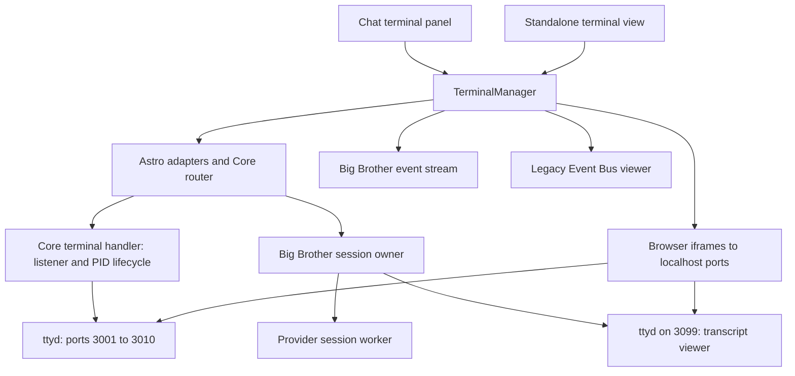

# System terminal integration review

Date: 2026-09-15. Status: implementation complete; see the repair outcome below.

## Repair outcome

The findings below describe the pre-refactor checkout. Its source citations are
historical path/line records, not links to the current implementation.

The surviving owner is [Core Terminal](../../packages/core/src/terminal/runtime.ts),
registered through [the Terminal agent](../../brain/services/terminal.ts).
[The terminal UI](../../apps/site/src/components/terminal/TerminalPanel.svelte)
is loaded on demand. See the [user guide](../user-guide/using-metahuman/chat-interface.md#system-terminal)
for controls and persistence semantics.

| Finding | Repair |
| --- | --- |
| F1: raw localhost transport | Owner-authenticated same-origin API; private mode-0600 service socket; stream session revalidation. |
| F2: listener mistaken for session | Agent-owned node-pty sessions and bounded headless screen snapshots survive UI disposal. |
| F3: false successful cleanup | Verified Linux session termination, retained receipts and failed-session state, retryable closes, offline recovery. |
| F4: late initialization | No mount-time shell creation; abortable requests and disposed-controller guards. |
| F5: overlapping providers | Single provider reservation before asynchronous work; direct provider execution in the agent. |
| F6: unhandled spawn errors | Error listeners precede PID-dependent logic; missing-executable regression coverage. |
| F7: stale state and failed reconnect | State/screen events carry session identity; explicit reconnect and honest failure messages. |
| F8: resurrected debug socket | Authenticated debug SSE disposed on unmount; internal event bus bound to loopback and browser origins rejected. |

Removed ttyd and its bundled binary, iframe rendering, port allocation/PID-file
inference, automatic shell/log creation, legacy tab restoration, duplicate Big
Brother visibility streams, transcript polling worker, retired terminal API
routes and terminal-port configuration. The independent debug page remains a
real consumer, with its transport repaired.

Validation includes 22 terminal/transport/UI regressions, provider parsing,
UI-controller lifetime tests, Agent Monitor validation, security routes,
architecture checks, typechecks, and the Site build. The browser component is
checked separately against fixture responses. These checks do not claim that a
live installation has been restarted or that an external provider completed a
real user task. The implementation is Linux-specific for verified process
ownership. Boot startup and automatic restart default to off.

### Open Interpreter retirement

The Installation Owner subsequently authorized removing Open Interpreter after
inspection found historical execution attempts but no current service or recent
task execution. Removed its Python server and dependency manifest, dedicated
virtual environment (about 795 MiB locally), start/stop scripts, Core adapter and
backend, status API, UI controls and polling, event definitions, exports, and
configuration. The interpreter-only `/api/llm/proxy` routes and configuration were
also removed; the separate remote-client `/api/llm/chat` handler remains.

Big Brother retains its existing backend registry. Saved or requested unsupported
providers now fail explicitly instead of falling through to another provider.
The old Big Brother `ollama` and `openai` aliases were removed; normal model
providers are unaffected. Settings reject unsupported provider values and show
an unavailable saved selection so the owner can choose its replacement. Profile
settings and historical logs were preserved. Concurrent initialization now waits
for all retained backends to register before selection.

Validation after retirement: five isolated provider-selection regressions plus
the provider parser checks, 22 terminal lifecycle/transport/UI regressions, Core,
Brain, CLI and Site typechecks, 14 security-route checks, zero architecture
violations, Site build, reference search, and `git diff --check`. Tests used
isolated fixtures and did not invoke an external provider. Full workspace
`pnpm verify`, live browser validation, and an application restart were not run.

## Original review conclusion

The terminal needs lifecycle and transport repairs before a visual refactor.
The application currently treats a terminal server's listening port as though
it identifies a persistent shell session. Browser mounting, shell lifetime,
process ownership, authentication, and displayed state consequently disagree.
Big Brother has a distinct, documented session owner worth preserving, but its
concurrent admission and UI reconciliation also need repair.

The most consequential problems are:

1. Terminal connections bypass the application's authenticated transport.
2. Hiding or navigating away from the UI can terminate the interactive shell.
3. Failed stop operations can erase both the tab and the process ownership record.
4. Pending initialization can create terminals and subscriptions after unmount.
5. Concurrent Big Brother requests can both enter the single-session launch path.

## Scope and evidence

Reviewed the current worktree based on commit `b57d2058`, including existing
changes in the integration files. This is not a review of the clean commit alone.
The terminal component and its principal Core owners had no pre-existing diffs;
nearby chat, navigation, router, policy, and build files contained other work.
Those changes were inspected where they intersected this review and preserved.

Authority: [maintained surface](../technical/MAINTAINED_SURFACE.md),
[refactor principles](../technical/REFACTOR_BLUEPRINT.md),
[architecture](../technical/ARCHITECTURE.md), and
[audit protocol](../technical/AUDIT_PROTOCOL.md). The applicable architecture
checker rules and empty guardrail baseline were read. No repository-wide audit
or implementation was undertaken.

Coverage was line-by-line for `TerminalManager.svelte`, `terminal.ts`,
`big-brother-session.ts`, their terminal event adapter, session worker/backend
adapter, and the focused terminal tests. Larger chat, navigation, auth,
connection-pool, startup, shutdown, and event-bus owners were inspected at their
terminal integration boundaries. Their unrelated responsibilities are outside
this review. The Event Bus viewer's connection lifecycle was also reviewed.

Evidence levels used below:

- **Source:** a concrete path through the current implementation.
- **Isolated reproduction:** current TypeScript/component script logic evaluated
  with mocked process, filesystem, browser lifecycle, HTTP, and socket boundaries.
  These probes do not constitute a rendered Svelte or operating-system test.
- **Dependency source:** the bundled `bin/ttyd --help` reports
  `1.7.7-40e79c7`; the corresponding upstream protocol implementation was checked.

No live terminal spawn, kill, cleanup, provider execution, service restart,
profile inspection, or deployment was performed. No production source changed.

## Current ownership and entrypoints

| Surface | Current responsibility and integration |
| --- | --- |
| Chat terminal toggle | Mounts/unmounts `TerminalManager`; Big Brother escalation can reveal it automatically. |
| Standalone terminal view | `CenterContent` renders it for `#view=terminal`; the current main navigation has no terminal item. |
| Core router / Astro routes | Owner-only list, spawn, status, cleanup, and kill; Big Brother status, control, and events also require owner access. |
| `api/handlers/terminal.ts` | Allocates ten ports, spawns ttyd, stores PID files, discovers owned listeners, and signals them on close. |
| `big-brother-session.ts` | Owns provider execution, worker, transcript, terminal, cancellation, and events. The terminal displays a tail of the worker transcript. |
| `bin/start-services` | With no argument, displays instructions and tails `logs/server.log`. `--background` invokes the existing service launchers. |
| Startup / shutdown | `start.sh` invokes background service startup. `stop.sh` stops terminal listeners and delegates Big Brother stop to its owner. |

## Findings

P1 means repair before extending the terminal. P2 means a concrete integration
defect to include in the refactor. These priorities describe source defects,
not evidence of a live incident.

### F1 — P1: shell transport bypasses application authorization and server addressing

**Evidence:** regular terminal launch and URL (`packages/core/src/api/handlers/terminal.ts#L184`; pre-refactor source),
launch arguments (`packages/core/src/api/handlers/terminal.ts#L286`; pre-refactor source),
Big Brother launch (`packages/core/src/big-brother-session.ts#L230`; pre-refactor source),
browser restoration (`apps/site/src/components/TerminalManager.svelte#L173`; pre-refactor source).

The Core HTTP routes enforce owner access, but the iframe connects directly to
`http://localhost:<port>`. Both launchers bind to loopback and omit ttyd
credentials, an authentication proxy header, and origin checking. The matching
upstream `check_auth` accepts connections when neither authentication option is
configured; origin validation is conditional on its flag.
[ttyd protocol source](https://github.com/tsl0922/ttyd/blob/40e79c7/src/protocol.c#L170-L211).

Consequences:

- A client able to reach the server's loopback listener does not need a
  MetaHuman session to use an existing writable shell or read its Big Brother
  transcript. Logging out does not revoke that separate transport.
- A browser on another machine resolves `localhost` to that machine, rather
  than the MetaHuman host. The terminal cannot follow the ordinary authenticated
  application connection. Replacing only the hostname would still leave the
  listener bound to loopback and would not solve authentication.

This is a verified configuration/ownership gap, not a tested browser exploit or
a claim that these loopback ports are publicly reachable.

**Correction:** bring terminal HTTP/WebSocket transport under an authenticated
server-facing endpoint, with owner checks, origin enforcement, and defined
session revocation. Keep process ownership in Core and internal listeners
confined. Any new public transport contract must be explicitly scoped before
implementation. Do not solve remote access by exposing unauthenticated ports.

**Acceptance:** owner succeeds through the supported application origin;
anonymous/standard users and invalid origins fail; logout/revocation has the
defined effect on existing connections; remote clients never target their own
loopback address.

### F2 — P1: restored listeners are presented as restored shell sessions

**Evidence:** chat panel conditional mounting (`apps/site/src/components/ChatInterface.svelte#L2680`; pre-refactor source),
view switching (`apps/site/src/components/CenterContent.svelte#L620`; pre-refactor source),
destroy behavior (`apps/site/src/components/TerminalManager.svelte#L439`; pre-refactor source),
plain shell launch (`packages/core/src/api/handlers/terminal.ts#L232`; pre-refactor source).

The component preserves ttyd listeners on destruction and rediscovers their
ports later. However, the configured command is a plain shell, without an
independent persistent shell-session owner. In this ttyd version, a WebSocket
connection creates its command process; closing the connection signals that
process. Reconnecting creates another command process.
[ttyd spawn/disconnect source](https://github.com/tsl0922/ttyd/blob/40e79c7/src/protocol.c#L304-L353).

Therefore hiding the chat terminal, switching application views, or reloading
its iframe can lose shell state and interrupt its foreground work while the
same port and tab are subsequently described as restored. Two browser clients
using one listener also do not thereby share one shell. Keeping inactive tabs
mounted fixes only tab switching inside the component.

Big Brother is different: its provider worker is independently owned, and the
browser command follows a transcript. Preserve that distinction.

**Correction:** define hide, reconnect, browser refresh, explicit close, and
server restart semantics. Preserve shell identity across the navigation promised
by the product. Moving rendering to a stable application location addresses
navigation; persistence across actual disconnections additionally needs a
server-owned shell session. Evaluate that requirement before choosing a new
dependency or mechanism.

**Acceptance:** set a shell variable/change directory, run a disposable command,
hide/show the panel and switch views. Verify the promised shell identity and
command lifetime. Separately test refresh and reconnect. Port reuse alone is
not acceptance evidence.

### F3 — P1: close and cleanup report success after failing to stop a process

**Evidence:** backend kill (`packages/core/src/api/handlers/terminal.ts#L472`; pre-refactor source),
cleanup (`packages/core/src/api/handlers/terminal.ts#L360`; pre-refactor source),
UI close (`apps/site/src/components/TerminalManager.svelte#L563`; pre-refactor source),
UI kill request (`apps/site/src/components/TerminalManager.svelte#L589`; pre-refactor source).

The backend catches failed signals, removes the PID record and in-memory entry,
then returns `killed: true`. Cleanup similarly suppresses signal failures and
removes records. Even a successful signal is not followed by an exit check.
The UI ignores a regular terminal kill response's HTTP status and removes the
tab; network exceptions are logged and also allow removal to continue.

**Isolated reproduction:** with both group and individual signals failing with
`EPERM`, kill returned `killed: true` and deleted the PID receipt. Cleanup also
reported success and deleted it. An HTTP 500 stop response removed the UI tab
without setting its action error. The process can remain alive while ordinary
discovery loses the record needed to manage it.

**Correction:** retain ownership until exit is confirmed; distinguish missing,
stopping, stopped, and failed outcomes. Surface errors and preserve the tab when
the stop fails. Serialize conflicting lifecycle mutations within the existing
owner: currently only spawns participate in the spawn lock, while cleanup and
kill can interleave with startup.

**Acceptance:** success, already-exited, signal denial, delayed exit, refusal to
exit, HTTP failure, and spawn-versus-cleanup interleavings. Never lose ownership
of a process merely because a stop was attempted.

### F4 — P1: initialization continues after the component is destroyed

**Evidence:** async mount (`apps/site/src/components/TerminalManager.svelte#L363`; pre-refactor source)
and one-time cleanup (`apps/site/src/components/TerminalManager.svelte#L439`; pre-refactor source).

Mount awaits discovery and then creates missing default terminals, registers a
window listener, restores Big Brother, and subscribes to events. There is no
abort signal or disposed-state check between those awaits. Destruction only
cleans up resources that already exist at that instant.

**Isolated reproduction:** suspend the list response, destroy the component,
then resolve an empty list. The destroyed instance issues two spawn requests
and installs a window listener, an event subscription, and two frame timers.
This can occur when the terminal is closed or navigation changes during loading.
The fixed stream ID also allows a stale instance to interfere with a new one.

**Correction:** keep initialization and cleanup under one component/controller
lifetime; cancel pending reads and prevent subsequent side effects after
disposal. An already admitted server spawn requires explicit reconciliation;
aborting an HTTP request alone does not prove it never happened.

**Acceptance:** destroy during each awaited initialization stage, remount
immediately, and verify no late allocations, orphan listeners, stale callbacks,
or tab-state writes from the destroyed instance.

### F5 — P1: Big Brother's single-session admission check is not atomic

**Evidence:** admission through reservation (`packages/core/src/big-brother-session.ts#L172`; pre-refactor source).

`execute()` checks `executionActive`, then awaits old-process cleanup before
setting that flag. Two callers can both pass the check and reach initialization
for the fixed port and shared mutable worker/session fields.

**Isolated reproduction:** two simultaneous calls to the current owner with
mocked provider/process boundaries both attempted ttyd launch on port 3099 and
both attempted worker launch. This proves the admission race; actual port
contention and provider side effects were not executed.

**Correction:** reserve the session before the first asynchronous boundary and
coordinate start/stop transitions inside `big-brother-session.ts`. Ensure a
late completion cannot overwrite a newer session's state. Keep the worker and
backend adapters subordinate to this owner.

**Acceptance:** simultaneous execution, stop during startup, startup failure,
and retry after failure. Exactly one invocation owns the shared session at a
time; rejection must occur before a competing provider can launch.

### F6 — P1: terminal launch failure can escape as an unhandled child-process error

**Evidence:** regular terminal PID check (`packages/core/src/api/handlers/terminal.ts#L301`; pre-refactor source)
and error-listener timing (`packages/core/src/api/handlers/terminal.ts#L144`; pre-refactor source);
Big Brother terminal/worker launch (`packages/core/src/big-brother-session.ts#L230`; pre-refactor source).

Regular spawn checks for a PID before registering the child `error` listener
inside readiness waiting. When the executable is absent or cannot be started,
the no-PID branch returns an HTTP error but leaves the asynchronous child error
unhandled by this owner. Big Brother's parent terminal and worker launch paths
also lack child `error` listeners. Its worker's provider launch does handle the
event, so that working behavior should be preserved.

**Isolated reproduction:** a no-PID child yielded HTTP 500, had zero error
listeners, and a subsequent synthetic error event threw. This is a host
stability risk; no live server was crashed to demonstrate it.

**Correction:** register launch/error/exit handling as part of creating the
owned child, and perform cleanup for every failure stage, including filesystem
failures after launch. An outer `try/catch` does not handle later emitter events.

**Acceptance:** missing executable, denied execution, immediate exit, readiness
timeout, and PID-file failure. The host remains alive and each started resource
remains owned until stopped.

### F7 — P2: UI state does not consistently follow terminal/session state

**Evidence:** Big Brother event handling (`apps/site/src/components/TerminalManager.svelte#L410`; pre-refactor source),
server closed events (`packages/core/src/api/handlers/big-brother-terminal.ts#L91`; pre-refactor source),
frame state (`apps/site/src/components/TerminalManager.svelte#L706`; pre-refactor source).

The server emits `closed`, but the component handles only `open_tab` and
`terminal_ready`. When a Big Brother tab already exists, those events only
select it; they do not update its provider/endpoint metadata. Ordinary terminal
discovery runs on mount rather than reconciling later process changes.

**Isolated reproduction:** a `closed` event left the Big Brother tab present;
a subsequent Codex ready event retained the previous Claude Code metadata.
Reconnection behavior inside ttyd was not exercised by this probe.

Separately, `iframe.onload` sets the frame to `ready`; the outer component has
no terminal WebSocket-ready/disconnected handshake. Loading the terminal HTML
does not prove a shell or transcript stream is connected. Initial discovery
failure also leaves the terminal-unavailable screen with no retry control.

**Correction:** reconcile complete server session state, including closure and
session identity, through one client state path. Distinguish page load from
terminal connectivity and expose recovery for transient discovery errors.

**Acceptance:** external close, provider change, reconnect, dead listener, HTML
load followed by WebSocket failure, and initial discovery failure followed by
recovery. Displayed provider and connection state must match current evidence.

### F8 — P2: the legacy Event Bus viewer reconnects after unmount

**Evidence:** viewer reconnect (`apps/site/src/components/DebugDashboard.svelte#L74`; pre-refactor source),
destroy (`apps/site/src/components/DebugDashboard.svelte#L122`; pre-refactor source), and
conditional rendering (`apps/site/src/components/TerminalManager.svelte#L701`; pre-refactor source).

The viewer schedules `connect` whenever its socket closes. Destruction closes
that socket without disabling reconnect or cancelling the timer. Switching away
from a restored Event Bus tab can therefore leave a hidden subscriber behind.
**Isolated reproduction:** destroy triggered a timer that opened a second socket.

There is also an authentication boundary issue at this associated service:
the viewer directly uses `ws://localhost:3100`; the
event-bus server (`packages/core/src/infrastructure/event-bus/server.ts#L78`; pre-refactor source)
accepts subscribers and incoming events without a session check, calls `listen`
without an explicit loopback host, and broadcasts events to all subscribers.
This is source evidence, not a verified network exposure measurement. Treat
that service boundary as an explicitly bounded follow-up, not authorization to
redesign the entire event bus.

**Correction:** if retained, cancel reconnect on disposal and expose the viewer
through an authorized transport. If retired, remove the component import,
saved-tab restoration, rendering branch, and dead creator together after the
product disposition is agreed.

**Acceptance:** leaving/closing the viewer produces zero later reconnects; test
the chosen authenticated viewer boundary if it remains a supported surface.

## Owner records and refactoring disposition

### `packages/core/src/api/handlers/terminal.ts`

- **Owner/layer:** Core; regular ttyd listener lifecycle and HTTP responses.
- **Summary/imports/exports:** Core/Node imports follow dependency direction;
  handlers are registered in the unified router. Pure parsing/port helpers are
  exported for the focused test. No new public package export is needed merely
  to repair them.
- **Data/side effects:** canonical repository root, PID/log files, `/proc`, TCP
  probes, process launch/signals. Session metadata is largely inferred from
  command lines, rather than a stable session identity.
- **Boundary issues/security:** F1, F2, F3, F6. HTTP authorization remains the
  router's responsibility; it must also protect the terminal transport.
- **Technical debt:** list/status duplicate Big Brother projection; UI and
  backend repeat role inference and port assumptions. `purpose` is accepted but
  not persisted as identity. Arbitrary argv commands without `bash -c` can be
  mistaken for default shells by discovery. Runtime command-array validation is
  only a cast.
- **Test gap:** real handler failure/lifecycle tests; existing tests emphasize
  parsing and TCP port checks.
- **Recommended action:** repair this owner first. If process lifecycle moves
  below the handler, relocate it completely to one Core owner and make handlers
  delegate; do not keep a second active process map or spawn path.

### `TerminalManager.svelte` and its chat/navigation hosts

- **Owner/layer:** Site client presentation, tab preferences, discovery, frame
  state, requests, and subscriptions; no runtime-heavy Core imports.
- **Summary:** one large component combines presentation with resource lifetime,
  role inference, persistence, and Big Brother orchestration. Both rendering
  entrypoints remain executable; the standalone view can be reached by URL hash.
- **Data/side effects:** shared-origin localStorage keys, HTTP requests, timers,
  event subscriptions, and iframes. State is instance-local despite affecting
  installation-wide server listeners.
- **Boundary issues/security:** F1–F4, F7; retain owner-only backend enforcement.
- **Technical debt:** duplicate preference serialization, unused
  `createEventBusTab`, fixed Big Brother/Event Bus ports, and different capacity
  counts (UI counts every tab; server limits regular listeners). The services
  tab's creator claims to start services although the default script only tails
  the server log. Every mount restores missing defaults, and closing the last
  tab creates another shell before closing it.
- **Test gap:** actual mounted-component navigation, abort, retry, stop, and
  connection tests. No live UI claim follows from the current regex checks.
- **Recommended action:** separate render state from lifecycle control within
  this feature and use one application-level terminal state owner for both
  surfaces. Agree the default-tab and empty-terminal behavior before changing
  them. Keep localStorage for validated preferences, not process authority.

### `big-brother-session.ts`, worker, and terminal backend adapter

- **Owner/layer:** Core shared provider session; worker executes one invocation;
  backend factory delegates into it.
- **Summary/imports/exports:** existing dependency direction is sound. The
  documented exported session controls are the surviving provider boundary.
  The worker's atomic result write and independent transcript are useful.
- **Data/side effects:** job/transcript/event files, owned PID files, provider
  process groups, terminal listener, and audit/event notifications. Temporary
  job files use restricted permissions; no job contents were read for this audit.
- **Boundary issues/security:** F1, F5, F6; preserve explicit close-to-cancel and
  worker execution independent of browser connection.
- **Technical debt:** hand-built state transitions and duplicated readiness/PID
  mechanics require care, but do not justify a second Big Brother session owner.
- **Test gap:** the registered spec checks parsing, invocation preparation, and
  source ownership patterns; it does not run start/stop races.
- **Recommended action:** repair admission and launch failures inside the
  existing session owner. Share low-level mechanisms only where a concrete
  repaired contract warrants it; do not merge ordinary shells with provider work.

### Terminal/Big Brother transport routes, router, and auth client

- **Owner/layer:** thin Site transport plus Core routing/session enforcement.
- **Summary/imports/exports:** terminal Astro files correctly delegate through
  `@metahuman/core/api/adapters/astro`; registered handlers remain active.
- **Data/side effects:** HTTP control and Big Brother event projection. The
  event adapter attaches listeners and removes them on cancellation/finalization.
- **Boundary issues/security:** route owner checks are present; F1 concerns the
  bypassing iframe transport. The prior 403/logout problem is not present in
  the inspected client: only HTTP 401 is classified as session-auth failure.
- **Technical debt:** chat visibility and terminal display separately subscribe
  to the same Big Brother stream. The pool limits connections to four; these
  consume two slots when both are active. `setActiveView` has no current caller,
  so the terminal's hardcoded `viewDependency: 'chat'` is not evidence that
  navigation-aware scheduling actually works.
- **Test gap:** authenticated terminal connection and unified event consumption;
  route-pattern checks cannot cover the raw ttyd sockets.
- **Recommended action:** keep adapters/router; consolidate terminal state
  consumption within the feature, using the existing connection pool. Any pool
  changes need checks of affected consumers, not a second pool.

### Service console, shutdown, and legacy Event Bus integration

- **Owner/layer:** shell interfaces delegate service operations; Event Bus Core
  server owns event distribution; `DebugDashboard` is a Site consumer.
- **Summary/data/side effects:** the Services tab follows one existing log.
  Startup owns service launch; shutdown includes terminal cleanup. The Event
  Bus viewer directly subscribes to a separate socket.
- **Boundary issues/security:** F8; Services display should not become another
  service/process supervisor. No startup/shutdown command was executed.
- **Technical debt:** a surviving terminal `SystemSection` type/style has no
  corresponding System section rendering branch. Main navigation offers neither
  the standalone terminal nor an Event Bus creator, while URL/saved-state paths
  still reach parts of these surfaces. These are disposition decisions, not
  proof that the whole terminal or event bus is unused.
- **Test gap:** log-console reconnection, shutdown evidence, and viewer disposal.
- **Recommended action:** correct labels around the actual log-console behavior;
  choose supported navigation entrypoints and remove only superseded wiring.
  Keep service control delegated to its current owners.

## Follow-up: code separation and background cost

The follow-up request asks for clearer feature boundaries and whether the
terminal works while unused. The answer is conditional: its code is loaded
eagerly, some observation continues while hidden, and previously created
listeners persist, but it does not start shell processes merely because Core
imports the handler.

### What runs in each state

| State | Current work | Evidence |
| --- | --- | --- |
| Application loads; terminal never opened | `ChatInterface` and `CenterContent` statically import `TerminalManager`, which imports the Event Bus viewer. Core statically imports its terminal handlers/session owner. These imports do not themselves spawn a terminal. Actual bundle size was not measured. | `ChatInterface.svelte:9`, `CenterContent.svelte:26`, `TerminalManager.svelte:7`, `api/router.ts:422`, `big-brother-session.ts:532`. |
| Owner chat is mounted; terminal hidden | Chat requests a Big Brother visibility event stream regardless of the Big Brother enabled flag. The shared pool may defer or suspend it. The request is made even before the terminal is used. | `ChatInterface.svelte:430–480`. |
| Terminal first opens | Discovers listeners, creates missing Services and default-shell listeners, attaches frames, and requests another Big Brother event stream. All ordinary terminal frames remain mounted even when their tab is inactive. | `TerminalManager.svelte:363–437,699–727`. |
| Terminal watches Big Brother, but no session appears | Polls status every 250 ms until a tab is found or the component is destroyed. No deadline or pending-request guard is present, so a slow response can overlap subsequent requests. | `TerminalManager.svelte:389–397`. |
| Terminal panel is hidden or its application view is left | Normal destruction closes its subscription/timers but intentionally retains server listeners. F4 and F8 describe cases where cleanup fails. Retaining a listener does not preserve the shell connection described in F2. | `TerminalManager.svelte:439–449`. |
| Big Brother execution is active | The provider worker runs regardless of panel visibility. Its owner repeatedly reads the growing event file and checks the result, waiting 50 ms between passes. The complete event file is read/split each pass before skipping processed lines. | `big-brother-session.ts:394–460`. |
| Big Brother finishes | The result loop ends; the transcript terminal remains available until closed/replaced. Finished provider work does not require continuous provider execution. | `big-brother-session.ts:325–352`. |
| Normal installation startup | Starts the shared Event Bus through `bin/start-services --background`. That service supports wider application observability and must not be attributed wholly to the terminal viewer. | `bin/start-services:29–42`. |

A read-only process snapshot during this follow-up found no ttyd listeners or
Big Brother session workers launched from this checkout. This is a point-in-time
process observation, not browser profiling or a historical CPU/memory result.
There is evidence of avoidable allocations, connections, and polling, but no
measurement establishing that the terminal causes the application's overall
slowdown.

### Proposed feature boundaries

Group related code inside each architectural layer. The intended layout groups
the feature in Core and Site, with narrow adapters connecting them. Terminal
behavior moves out of large chat components and API handlers.

| Boundary | Proposed location | Sole responsibility |
| --- | --- | --- |
| Ordinary terminal domain | `packages/core/src/terminal/` | Move the existing regular-terminal process lifecycle here: session identity, launch/readiness, owned process records, attach/detach policy, stop, and recovery. Initialization remains demand-driven. |
| Browser-safe contract | Explicit types within the Core terminal feature, exported only as needed | Session identity, state, kind, allowed actions, and event/response shapes. The client must not infer identity from a port or command substring. |
| API/host adapter | Existing `api/handlers/terminal.ts`, router, and Site route locations | Authenticate, validate/delegate, and transport requests or streams. Own no separate process registry or tab policy. |
| Client state/controller | `apps/site/src/lib/client/terminal/` | One feature state owner for discovery, session reconciliation, subscription lifetime, cancellation, and validated tab preferences. Merely importing it starts no requests or timers. |
| Presentation | `apps/site/src/components/terminal/` | Lazy-loaded panel, tabs, and session display. Extract smaller components where they have a real presentation responsibility. |
| Application integration | Small entrypoints in chat and navigation | Request that the terminal feature be shown; display its state. Remove embedded terminal discovery, stream duplication, and session-control policy from chat. |
| Big Brother execution | Existing `big-brother-session.ts` and its subordinate worker/backend adapters | Continue to own provider admission, execution, cancellation, and results. Publish a session projection for the terminal UI; ordinary terminal code does not become a second provider owner. |

This is a proposed relocation and reduction of existing responsibilities, not
an additional runtime beside them. Remove the old handler process map, component
state logic, role inference, and duplicate subscriptions as their replacements
become authoritative. Avoid new registries, schedulers, or a generic process
framework merely to achieve this layout.

### Recommended inactive behavior and acceptance

These product semantics are proposals for the implementation scope:

- **Never used:** no terminal process, frame, terminal discovery polling, or
  terminal-specific persistent connection. Load the presentation on first use.
  Reuse an existing application event path for necessary Big Brother visibility
  notification instead of retaining two terminal event streams.
- **Opened:** create only the requested session. Opening a Big Brother transcript
  should not also create an unrelated shell and Services listener.
- **Hidden:** dispose presentation subscriptions and timers. Preserve an
  intentionally open shell/session according to its explicit lifetime; hiding
  a panel must not silently cancel a user's running command.
- **Explicitly closed:** confirm process termination, then release session state.
  Closing the last session should permit an empty terminal instead of creating
  another shell automatically.
- **Big Brother waiting/running:** use session events with bounded recovery reads;
  remove unbounded browser discovery polling. During execution, consume newly
  appended output without repeatedly parsing the entire accumulated event file.
- **No remaining sessions or required observers:** return the terminal feature
  to zero owned processes, timers, sockets, and outstanding initialization work.

Measure these states with a production browser bundle/network trace and
disposable process fixtures. Record terminal process count/RSS, background
request rate, stream count, and time spent processing events. Compare before
and after under the same conditions; fewer files or moved imports alone do not
prove lower runtime cost.

## Recommended implementation order

1. **Lifecycle correctness:** F3, F4, F5, F6. Repair failure reporting,
   destruction races, child error handling, and Big Brother admission at their
   current owners. Add focused behavior regressions before moving code.
2. **Authenticated transport:** F1 and the retained Event Bus boundary in F8.
   Specify endpoint, revocation, origin, and remote-access behavior. Implement
   through the existing host/Core boundary with the required contract approval.
3. **Shell continuity and shared client state:** F2 and F7. Decide exactly which
   disconnections preserve a shell, then move responsibility once and remove
   obsolete iframe/localStorage/event logic in the same slice.
4. **Navigation and presentation:** resolve standalone versus chat entrypoints,
   default-shell resurrection, Services naming, and Event Bus disposition.
   Remove stale rendering/types/creators only after those decisions.

Acceptance should use disposable shells and mocked providers first. Actual
provider execution, installation shutdown, or remote publication would be
separate authorized validation. No dependency installation or broad process
manager replacement is implied by this review.

## Validation results and limits

Environment: Node `v22.23.1`, pnpm `10.15.1`.

| Check | Result | What it establishes |
| --- | --- | --- |
| `pnpm validate:terminal-lifecycle` | Passed | Parser, port selection, ephemeral loopback probe, and component source patterns. |
| `pnpm validate:big-brother-session` | Passed | Provider event parsing, temporary invocation fixture, and session-owner source patterns. |
| `pnpm validate:security-routes` | 14/14 passed | Static HTTP route/exposure guard checks; does not cover raw terminal/Event Bus connections. |
| Isolated review harness | Eight defect scenarios reproduced | Backend kill and cleanup failures; UI failed stop; initialization after destroy; stale provider metadata; concurrent Big Brother launch; Event Bus reconnect after destroy; unhandled terminal child error. |
| Bundled ttyd help + matching upstream source | Checked | Configured version, available auth/origin options, and per-connection command lifecycle. |

The harness evaluated copies of current source with dependency stubs; it was
kept outside maintained production source. These are diagnostic confirmations
of existing defects, not tests that approve defective behavior. Future regression
tests must assert the corrected contract.

No failures occurred in the three existing scoped validation commands. No
workspace typecheck, Site build, full `verify`, live browser integration,
operating-system cancellation, or deployed remote-terminal validation was run.
The report does not claim those broader checks pass. Existing unrelated
worktree changes were not repaired, committed, or published.
