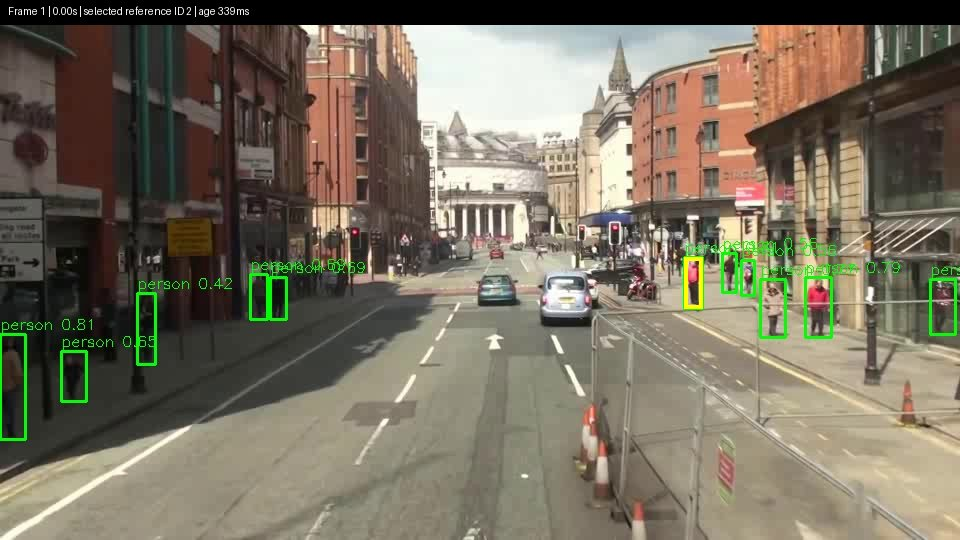
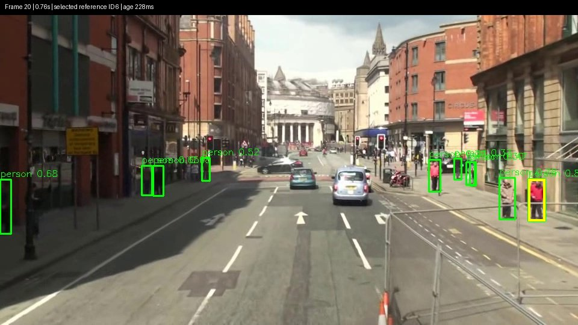
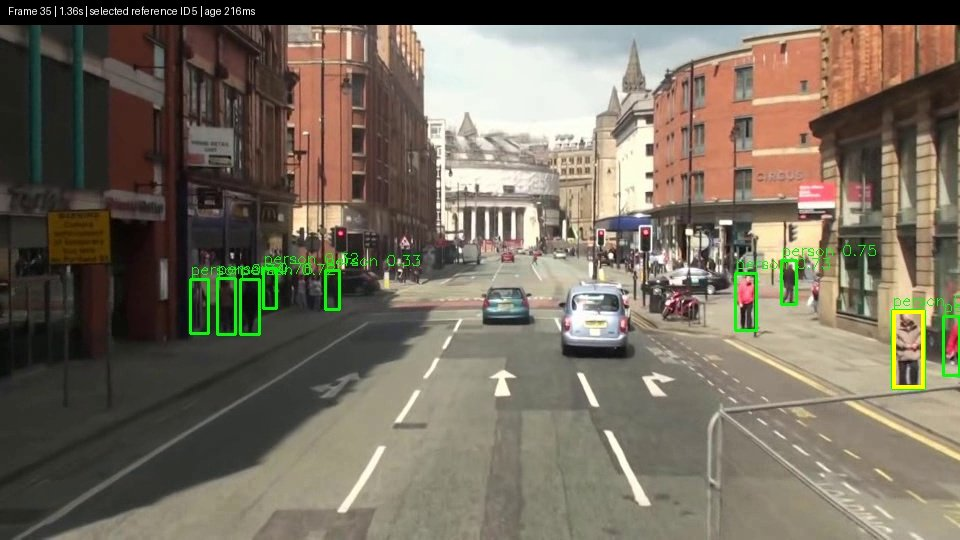
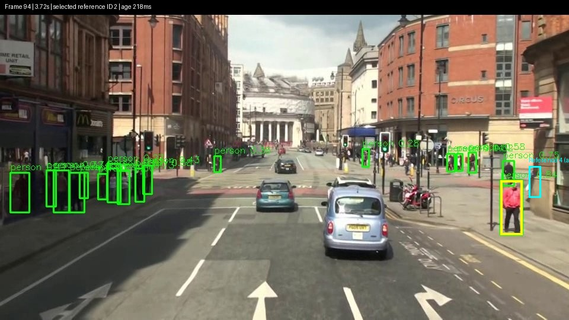
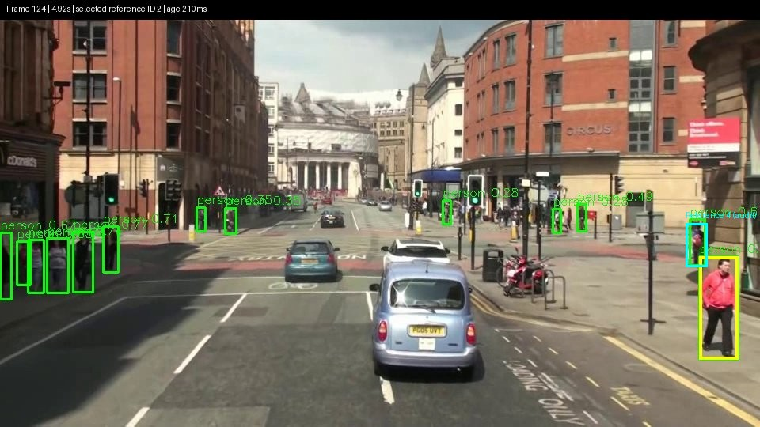
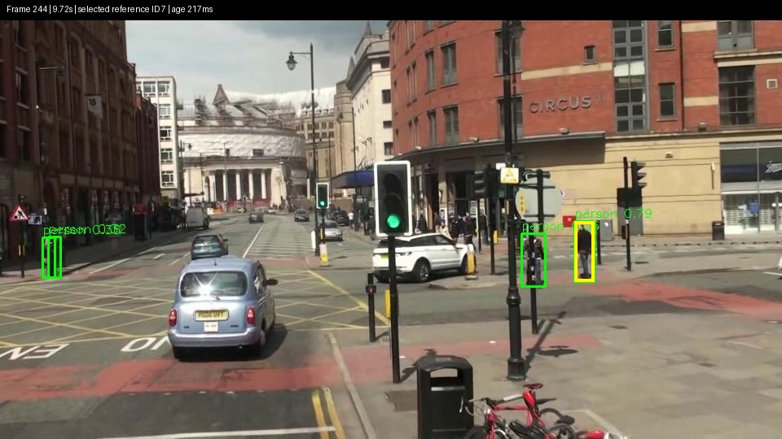

# Natural-video visual-control qualification — 2026-10-08

**The software loop passes; following one selected person fails. No physical qualification or deployment is claimed.**

This report and its images are published at the owner's request. The unchanged
person-class detector and active behavior were exercised against natural recorded
video, with a simulated body and deliberately pending interpretation/conversation.
No controller, planning, training, connectivity or target-loss policy was changed.

## Preserved checkpoint and exact configuration

The controlled-photo checkpoint is Core
[`d0c6bfe3`](https://github.com/Greg-Aster/metahuman-os/commit/d0c6bfe3dc45c8b3c8c6198f331b6aa8b9f44595)
paired with gateway
[`c7f4b52`](https://github.com/Greg-Aster/Ainekio-bot/commit/c7f4b52bf4da08eecebd9d0f0393c8aeaccbb877).
Both remain on `checkpoint/visual-control-replay`; its
[original measured manifest](controlled-checkpoint-summary.json) is preserved.
The natural-video additions are on `qualify/natural-video-replay` in both repos.
[This run's manifest](summary.json) identifies the exact precommit source hashes;
the published commits contain those executable files unchanged plus this report.

- Detector: `person_yolov8m-seg.pt`, SHA256 `c8ab26f517173b1fe8342d336a09f443eb61cb08dcbfc78d53fff4c2547ae81e`.
- Person class only, CPU four threads, inference size 640, confidence 0.25.
- Python 3.12.3; Ultralytics 8.4.36; PyTorch 2.11.0+cu130; OpenCV 4.13.0.
- Same continuous behavior: speed 40, forward 60, base turn 0; person-label steering gain 100.
- One-second observation validity measured from gateway receipt, including inference. No freshness limit was increased.
- Official [MOT17-13 raw preview](https://motchallenge.net/sequenceVideos/MOT17-13-SDP-raw.mp4): 30 seconds, 750 frames, 25 fps, 960×540. Video SHA256 `3c643abd4f37f1c67815c5faaebac6bea98fe536e45d97aa82e9682991e47fae`.
- Source/attribution: [MOTChallenge MOT17](https://motchallenge.net/data/MOT17/), MOT16 dataset, Milan et al., *MOT16: A Benchmark for Multi-Object Tracking* (2016). Images below are reduced JPEG samples with detector and audit overlays; original footage belongs to its original contributors. No new license over the footage is asserted here.

## Results and limits

| Measure | Final natural run |
|---|---:|
| Recognized samples / source frames | 49 / 750 |
| Fresh results including test-driver overhead | 1.54/s |
| Recognition median / maximum | 205 / 335 ms |
| Observation age median / maximum | 219 / 339 ms |
| Ongoing receipt-to-command median / maximum | 438 / 589 ms |
| Maximum gap between sampled source frames | 720 ms |
| Multi-person samples | 49 / 49 |
| Samples with zero people | 0 |
| Expiry to cancellation request | 339 ms |
| Cancellation request to Stop / correlated result | 4 / 5 ms |
| Adjacent independently matched pedestrian-ID switches | **22** |

The first complete natural run had 48 samples, 18 matched-ID switches and a
684 ms maximum receipt-to-command delay. Its [separate manifest](first-natural-run-summary.json)
is retained. Different wall-clock sample positions account for different counts;
these are small trials, not statistical latency bounds or detector benchmarks.
Neither run qualifies fast obstacle avoidance or balance, and neither ran on Q6A.

At EOF, an intentionally stale frame was rejected. The required-feedback deadline
then requested cancellation, and the simulated body's original command returned
its correlated `cancelled` receipt. Both inference jobs remained leased/pending.
After cancellation, their deliberately late completions dispatched no additional
body command. The original gait sequence stayed **1** for all steering updates.
A command terminal is not evidence of physical rest.

The test samples the newest source frame at native wall-clock playback time; it
does not run every video frame or disguise an inference backlog as current input.
The test driver executes the real Coordinator handlers and injects simulated wire
receipts; this is not deployed scheduling or camera-transport latency evidence.
The Python process rejects socket connections/binds/listens and has only the
in-memory actuator destination. No images are sent to an LLM or new endpoint.

## What the target audit found

The existing active-task node selects the **first matching person box** in each
fresh observation. There is no persistent instance identity. A maximum-IoU audit
against marked pedestrian reference boxes (threshold 0.3) associates selected boxes
with **17 different reference tracks** in the final run. All final selections
matched; the first run had two unmatched selections, which are not counted as
proven identity switches. This independent audit runs after execution and cannot
influence the controller. It is not a face/identity model or full tracking metric.

The controller switches from reference person 2 to 6 at 0.76 seconds and then to
5 at 1.36 seconds, while person 2 is still present. A stable selected-person task
therefore fails even before disappearance. Green rectangles below are actual YOLO
outputs; yellow highlights the box consumed by the behavior. Reference IDs are
audit annotations, not detector outputs.

| Source frame / time | Selected reference | Steering | Observation age |
|---|---:|---:|---:|
| 1 / 0.00 s | 2 | -22.26 | 339 ms |
| 20 / 0.76 s | 6 | -42.88 | 228 ms |
| 35 / 1.36 s | 5 | -44.62 | 216 ms |





Reference pedestrian 4 supplies the occlusion/reappearance check: it has visible
reference support and detector overlap at the start, no matching detection from
1.36 through 4.32 seconds, and a matching detection again at 4.92 seconds (IoU
0.66). Its reference visibility reaches 0.05 at 3.72 seconds and later returns to
1.0. It leaves the annotated scene before source frame 244. The final sampled
clip has no frame with zero people: loss of one person is concealed by detections
of others. Do not describe this as a successful target-loss or identity-preserving
reacquisition response. Cyan, where shown below, is the independent reference
box for person 4, not a recognition output.





[Full observation/command/receipt trace](trace.json) · [Per-frame target audit](target-audit.json)

## Existing loss behavior and proposed first-physical policy

The current behavior's forward motion is intentional **for its selected generic
continuous-motion/search semantics**: it copies the selected base controls and
adds a turn correction when a matching class box exists. With no box it retains
speed 40 and forward 60, returning turn to zero. **Zero turn is not stopped
movement.** Expired required observations separately trigger owned cancellation.
This was preserved deliberately for qualification, not endorsed for a physical
person-following test. With multiple people, even loss of the original person
is not represented as “no target.”

Proposed conservative first-physical policy, **not implemented; approval required**:

1. Use an explicitly supervised, single-person scene. On the first processed
   fresh observation with zero people or more than one plausible person, request
   owned cancellation immediately through the existing owner. Do not continue
   blind forward motion or silently select another person. Observation expiry
   and emergency/manual control retain their existing paths.
2. Keep the existing two-second gateway confirmation budget and Core's bounded
   reconciliation. Missing original terminal evidence remains unknown and
   prevents automatic restart; a Stop ACK is insufficient.
3. Allow a fixed three-second observation-only reacquisition window starting at
   loss. Require three successive fresh single-person observations spanning at
   least one second before offering a candidate. These are class observations,
   so the operator must confirm the person and explicitly resume after command
   termination is reconciled. Reappearance alone never resumes the old gait.
4. If the window expires or remains ambiguous, end this attempt as target-lost
   or unresolved, not objective-complete. A later attempt needs explicit input.

This policy trades automatic continuation for an inspectable first bench test.
It does not solve identity tracking, sensing blind spots or physical stopping
latency. A limit is measured from processed evidence, not camera exposure.

## Verification, failures, Q6A

Final natural run: **1 software-invariant test passed**; stable-person qualification
**failed**. Controlled-photo regression on the extended harness: **3 passed**,
including missing-terminal `outcome_unknown` with the production confirmation
budget. Core typecheck and both diff checks passed. Existing 73 gateway and 49
Core/bridge/conversation checks from the unchanged production snapshot are reused.

A repeat during qualification returned no admitted initial recognition and the
old fixture raised a `TypeError` by assuming one existed. That failed run was
preserved; its missing startup metrics do not support an exact latency diagnosis.
The fixture now records startup metrics and explicitly requires fresh recognition
before admitting its selected task. No production behavior or timeout was changed.
The final run passed with that check. This is not evidence of guaranteed startup
availability under load.

Q6A/desktop split testing **was not run**: stable-target qualification failed, and
read-only SSH to the known Q6A address also rejected the available key. No network
latency or loss numbers are claimed. The intended placement remains one Q6A
controller/gateway with desktop recognition, not YOLO forced onto Q6A. Once the
qualification gate and access are resolved, measure timestamp/clock alignment,
network transfer plus inference/command latency, delayed/dropped observations,
and owned termination against the same disconnected simulated body. No live
installation, service restart or connectivity redesign is authorized by this report.

IMU acquisition, language interpretation and completion-contract issues remain
separate and unresolved. No firmware, calibration, live capture, hardware or
historical execution data changed.

## Reproduce

Download the raw clip and reference archive above separately. Put `gt.txt` and
`seqinfo.ini` together, then run from the published Core qualification branch:

```sh
TMPDIR=/dev/shm tests/run-visual-control.sh /path/to/Ainekio \
  /path/to/vision-venv/bin/python /path/to/person_yolov8m-seg.pt \
  /path/to/MOT17-13-raw.mp4 /tmp/natural-video-result /path/to/gt.txt
```

Use the paired gateway qualification branch. The same command with the packaged
`bus.jpg` as input and no sixth argument repeats the three controlled cases.
The command installs nothing and writes its images, HTML, manifest, audit and
logs only to the selected output directory. Model weights and full raw footage
are not committed. Runtime code is unchanged from the frozen checkpoint; this
extension changes replay, evidence generation and documentation only.
