# MetaHuman OS Architecture Diagram

```mermaid
graph TB
    subgraph "MetaHuman OS File System Architecture"
        subgraph "Root System Directories"
            ROOT["📁 metahuman/"]
            APPS["📁 apps/site/"]
            BIN["📁 bin/"]
            BRAIN["📁 brain/"]
            DOCS["📁 docs/"]
            ETC["📁 etc/"]
            LOGS["📁 logs/"]
            OUT["📁 out/"]
            PKGS["📁 packages/"]
            PERSONA["📁 persona/"]
            PROFILES["📁 profiles/"]
            SCRIPTS["📁 scripts/"]
            VEND["📁 vendor/"]
            VENV["📁 venv/"]
        end
        
        subgraph "Brain (Agents & Skills)"
            BRAIN
            AGENTS["📁 agents/"]
            SKILLS["📁 skills/"]
            POLICIES["📁 policies/"]
        end
        
        subgraph "Packages (Core System)"
            PKGS
            CORE["📁 core/"]
            CLI["📁 cli/"]
        end
        
        subgraph "Web UI (Astro App)"
            APPS
            PAGES["📁 src/pages/"]
            MIDDLEWARE["📁 src/middleware/"]
            COMPONENTS["📁 src/components/"]
        end
        
        subgraph "User Profiles System"
            PROFILES
            USER1["📁 alice/"]
            USER2["📁 bob/"]
            USER_N["📁 .../"]
        end
        
        subgraph "Per-User Structure (Example: alice)"
            USER1
            U_PERSONA["📁 persona/"]
            U_MEMORY["📁 memory/"]
            U_ETC["📁 etc/"]
            U_LOGS["📁 logs/"]
            U_OUT["📁 out/"]
        end
        
        subgraph "Per-User Memory"
            U_MEMORY
            EPISODIC["📁 episodic/"]
            SEMANTIC["📁 semantic/"]
            PROCEDURAL["📁 procedural/"]
            PREFERENCES["📁 preferences/"]
            TASKS["📁 tasks/"]
            INBOX["📁 inbox/"]
            AUDIO["📁 audio/"]
            CURIOSITY["📁 curiosity/"]
        end
        
        subgraph "Per-User Config"
            U_ETC
            M_MODELS["models.json"]
            M_TRAINING["training.json"]
            M_COGNITIVE["cognitive-layers.json"]
            M_AUTONOMY["autonomy.json"]
            M_TRUST["trust-coupling.json"]
            M_BOREDOM["boredom.json"]
            M_SLEEP["sleep.json"]
            M_VOICE["voice.json"]
            M_AGENTS["agents.json"]
        end
        
        subgraph "Per-User Logs"
            U_LOGS
            DECISIONS["📁 decisions/"]
            ACTIONS["📁 actions/"]
            SYNC["📁 sync/"]
        end
        
        subgraph "Per-User Generated Content"
            U_OUT
            VOICE_TRAINING["📁 voice-training/"]
            ADAPTERS["📁 adapters/"]
        end
        
        subgraph "Shared System Assets"
            OUT
            VOICES["📁 voices/"]
            DATASETS["📁 datasets/"]
            REPORTS["📁 reports/"]
        end
        
        subgraph "System Logs"
            LOGS
            AUDIT["📁 audit/"]
            RUN["📁 run/"]
        end
        
        subgraph "Core Functionality"
            CORE
            PATHS["paths.ts - User Context Proxy"]
            AUDIT_FUNC["audit.ts - Audit System"]
            IDENTITY["identity.ts - Identity Kernel"]
            MEMORY_FUNC["memory.ts - Memory System"]
            OLLAMA["ollama.ts - LLM Interface"]
            AGENT_SCHED["agent-scheduler.ts"]
        end
        
        subgraph "CLI Interface"
            CLI
            M_CLI["mh-new.ts - CLI Entry Point"]
        end
        
        subgraph "API Endpoints"
            PAGES
            OPERATOR["/api/operator/react - ReAct Loop"]
            PERSONA_CHAT["/api/persona_chat - Persona Interface"]
            MEMORY_API["/api/memory - Memory Access"]
        end
        
        subgraph "User Context Management"
            CTX["Context Manager"]
            AUTH_DB["persona/users.json - Auth DB"]
        end
        
        subgraph "Weak Points & Considerations"
            WP1["⚠️ Context Proxy Complexity"]
            WP2["⚠️ Legacy Fallback Paths"]
            WP3["⚠️ Agent Bootstrap Security"]
            WP4["⚠️ Orphaned Profile Data"]
            WP5["⚠️ Config Consistency"]
            WP6["⚠️ Log Sprawl"]
        end
    end

    %% System Flow
    ROOT --> APPS
    ROOT --> BIN
    ROOT --> BRAIN
    ROOT --> PKGS
    ROOT --> PROFILES
    ROOT --> PERSONA
    
    BRAIN --> AGENTS
    BRAIN --> SKILLS
    BRAIN --> POLICIES
    
    PKGS --> CORE
    PKGS --> CLI
    
    APPS --> PAGES
    APPS --> MIDDLEWARE
    APPS --> COMPONENTS
    
    ROOT --> PROFILES
    PROFILES --> USER1
    PROFILES --> USER2
    PROFILES --> USER_N
    
    USER1 --> U_PERSONA
    USER1 --> U_MEMORY
    USER1 --> U_ETC
    USER1 --> U_LOGS
    USER1 --> U_OUT
    
    U_MEMORY --> EPISODIC
    U_MEMORY --> SEMANTIC
    U_MEMORY --> PROCEDURAL
    U_MEMORY --> PREFERENCES
    U_MEMORY --> TASKS
    U_MEMORY --> INBOX
    U_MEMORY --> AUDIO
    U_MEMORY --> CURIOSITY
    
    U_ETC --> M_MODELS
    U_ETC --> M_TRAINING
    U_ETC --> M_COGNITIVE
    U_ETC --> M_AUTONOMY
    U_ETC --> M_TRUST
    U_ETC --> M_BOREDOM
    U_ETC --> M_SLEEP
    U_ETC --> M_VOICE
    U_ETC --> M_AGENTS
    
    U_LOGS --> DECISIONS
    U_LOGS --> ACTIONS
    U_LOGS --> SYNC
    
    U_OUT --> VOICE_TRAINING
    U_OUT --> ADAPTERS
    
    ROOT --> OUT
    OUT --> VOICES
    OUT --> DATASETS
    OUT --> REPORTS
    
    ROOT --> LOGS
    LOGS --> AUDIT
    LOGS --> RUN
    
    %% Data Flows
    PATHS --"Dynamic Resolution"--> USER1
    PATHS --"Dynamic Resolution"--> USER2
    CTX --"User Context"--> PATHS
    AUTH_DB --"Auth Data"--> CTX
    
    CORE --"Provides Core Functions"--> APPS
    CLI --"CLI Interface"--> CORE
    OPERATOR --"ReAct Loop"--> SKILLS
    SKILLS --"Skill Execution"--> U_MEMORY
    AGENT_SCHED --"Schedules Agents"--> AGENTS
    
    %% API Call Flow
    PAGES --"API Requests"--> MIDDLEWARE
    MIDDLEWARE --"User Context"--> CORE
    MIDDLEWARE --"Security Policy"--> CORE
    
    %% Potential Issues
    WP1 -.-> PATHS
    WP2 -.-> PATHS
    WP3 -.-> AGENTS
    WP4 -.-> PROFILES
    WP5 -.-> U_ETC
    WP6 -.-> LOGS
    
    %% Style Definitions
    classDef directory fill:#e1f5fe
    classDef config fill:#f3e5f5
    classDef userDir fill:#e8f5e8
    classDef system fill:#fff3e0
    classDef weakPoint fill:#ffebee,stroke:#f44336,stroke-width:2px
    
    class ROOT,BIN,BRAIN,DOCS,ETC,LOGS,OUT,PKGS,PERSONA,PROFILES,SCRIPTS,VEND,VENV directory
    class AGENTS,SKILLS,POLICIES directory
    class CORE,CLI directory
    class PAGES,MIDDLEWARE,COMPONENTS directory
    class USER1,USER2,USER_N directory
    class U_PERSONA,U_MEMORY,U_ETC,U_LOGS,U_OUT directory
    class EPISODIC,SEMANTIC,PROCEDURAL,PREFERENCES,TASKS,INBOX,AUDIO,CURIOSITY directory
    class DECISIONS,ACTIONS,SYNC directory
    class VOICE_TRAINING,ADAPTERS directory
    class VOICES,DATASETS,REPORTS directory
    class AUDIT,RUN directory

    class M_MODELS,M_TRAINING,M_COGNITIVE,M_AUTONOMY,M_TRUST,M_BOREDOM,M_SLEEP,M_VOICE,M_AGENTS config

    class USER1,USER2,USER_N,U_PERSONA,U_MEMORY,U_ETC,U_LOGS,U_OUT userDir

    class PATHS,AUDIT_FUNC,IDENTITY,MEMORY_FUNC,OLLAMA,AGENT_SCHED,CORE,M_CLI system
    class OPERATOR,PERSONA_CHAT,MEMORY_API system
    class CTX,AUTH_DB system

    class WP1,WP2,WP3,WP4,WP5,WP6 weakPoint
```

## Overview

This diagram illustrates the complete MetaHuman OS file system architecture with:

- **Multi-user isolation**: Each user has their own profile directory with isolated memory, persona, and configuration
- **Centralized core system**: Shared functionality in packages/core that handles user context switching
- **Agent-based architecture**: Autonomous agents that process user data within their profile context
- **API layer**: Web interface that routes requests through user context middleware
- **Potential weak points**: Areas identified for potential improvement regarding security and architecture

The diagram highlights how the system achieves user isolation while maintaining shared resources like voice models, and shows the data flow between the different system components.